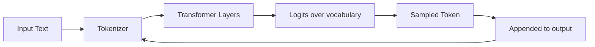

# 01 · AI & LLM Foundations { #foundations }

> **High-level overview of the AI landscape relevant to software development automation.**  
> This section covers what you need to know about LLMs before building agentic systems.

---

## The AI Landscape

| Category | What It Is | Examples |
|:---------|:-----------|:---------|
| **Machine Learning** | Systems that learn from data to make predictions | Scikit-learn, XGBoost, time-series forecasting |
| **Deep Learning** | Neural networks with many layers, especially for perception | Image classification, speech recognition |
| **Large Language Models (LLMs)** | Deep learning models trained on text at massive scale | GPT-4, Claude, Gemini, LLaMA |
| **Generative AI** | AI that generates new content — text, code, images | ChatGPT, Copilot, Stable Diffusion |
| **Agentic AI** | AI that autonomously plans and executes multi-step tasks | AutoGPT, LangGraph agents, Devin |

!!! note "Focus of This Guide"
    This guide focuses on **LLMs and Agentic AI** as applied to software development workflows. ML/deep learning fundamentals are assumed knowledge.

---

## How LLMs Work — The 30-Second Version

An LLM is a **next-token prediction machine** trained on billions of text documents. Given input text (the **prompt**), it predicts the most likely continuation.

What makes LLMs powerful for automation:

- They can **follow instructions** expressed in natural language
- They can **generate structured output** (JSON, code, YAML)
- They have **broad world knowledge** baked in at training time
- They can **reason step by step** when prompted correctly

→ **[Deep Dive: How LLMs Work](01.01-how-llms-work.md)** — Transformer architecture, attention, context windows, temperature

---

## Key Concepts at a Glance

| Concept | What It Means | Why It Matters |
|:--------|:-------------|:--------------|
| **Token** | Unit of text the model processes (~¾ of a word) | Context window = max tokens in + out |
| **Context Window** | How much text the model can "see" at once | Limits how much code/docs an agent can process |
| **Embedding** | Numerical vector representation of text | Enables semantic search and RAG |
| **Temperature** | How random vs. deterministic the output is | Low temp = consistent code, high temp = creative |
| **System Prompt** | The instructions given to the model before user input | Controls agent persona and safety boundaries |
| **Tool / Function Call** | Model outputs a structured function invocation | How agents take actions in the real world |
| **Grounding** | Attaching external context (docs, code) to a prompt | Reduces hallucination, enables RAG |

---

## LLMs in Software Development

LLMs can assist at every phase of the SDLC:

| SDLC Phase | AI Capability | Example |
|:-----------|:-------------|:--------|
| **Requirements** | Understand natural language specs | Read JIRA ticket, extract acceptance criteria |
| **Design** | Suggest architectural patterns | Recommend microservice structure given domain |
| **Implementation** | Generate code, refactor, explain | Write Spring Boot service layer from spec |
| **Testing** | Generate unit tests, analyze failures | Create JUnit tests, RCA a Playwright failure |
| **Review** | Summarize PR diffs, flag issues | Comment on security risks in changed code |
| **Operations** | Analyze logs, suggest fixes | Identify root cause from stack trace |

---

## What LLMs Cannot Do (Without Help)

| Limitation | Solution |
|:-----------|:---------|
| No access to your codebase | RAG + code indexing |
| Can't run code | Tool use (code interpreter, sandbox) |
| Hallucinate facts and APIs | Retrieval grounding + output validation |
| No memory across sessions | External memory stores (Redis, vector DB) |
| Can't call APIs | MCP Servers / function calling |
| Don't know recent events | Real-time retrieval tools |

---

## LLM Provider Landscape

| Provider | Model Family | Strengths | API |
|:---------|:------------|:----------|:----|
| **OpenAI** | GPT-4o, o1, o3 | Code generation, function calling, reasoning | REST, Python SDK |
| **Anthropic** | Claude 3.5 Sonnet, Claude 4 | Long context, precise instruction following, safety | REST, Python SDK |
| **Google** | Gemini 1.5 Pro, 2.0 Flash | Very long context (1M tokens), multimodal | REST, Vertex AI |
| **Meta** | LLaMA 3.x | Open source, self-hosted | Hugging Face, Ollama |
| **Mistral** | Mistral Large, Mixtral | Fast, multilingual, open weights | REST |
| **Cohere** | Command R+ | Strong RAG-optimized, reranking | REST |

!!! tip "Model Selection for Dev Automation"
    For code generation and reasoning tasks (like our JIRA→PR use case), **Claude Sonnet** or **GPT-4o** offer the best balance of instruction following, code quality, and context length. For cost-sensitive CI automation, **Mistral** or **LLaMA 3** self-hosted are viable.

---

→ **[Deep Dive: How LLMs Work](01.01-how-llms-work.md)** — Transformer internals, attention, context windows  
→ **[Deep Dive: Embeddings & Vector Search](01.02-embeddings-and-vector-search.md)** — Semantic search, FAISS, pgvector  
→ **[Deep Dive: Prompt Engineering](01.03-prompt-engineering.md)** — System prompts, few-shot, chain-of-thought

---

--8<-- "_abbreviations.md"
