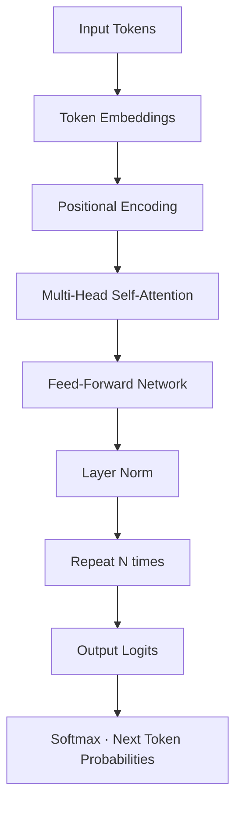
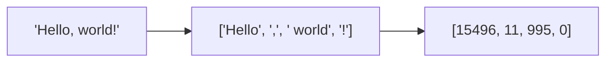
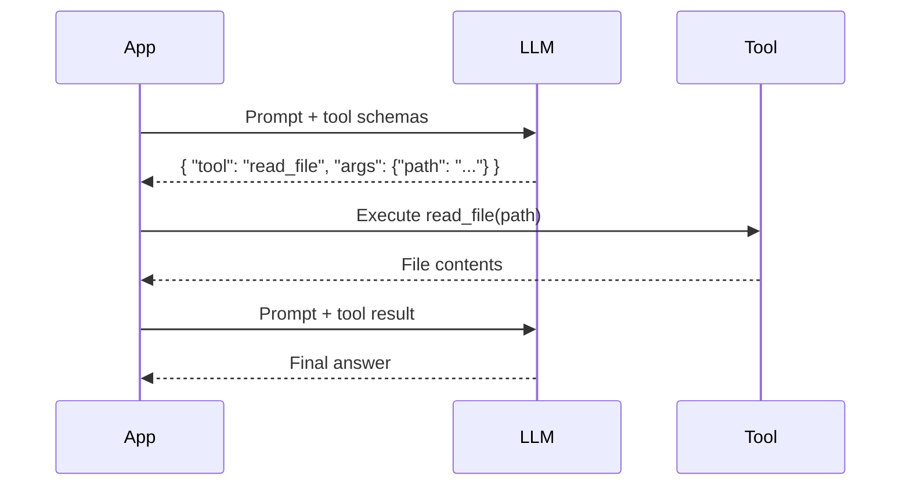

# 01.01 · How LLMs Work — Deep Dive { #how-llms-work }

> **Level:** Intermediate  
> **Pre-reading:** [01 · AI & LLM Foundations](01-foundations.md)

---

## The Transformer Architecture

Every modern LLM is built on the **Transformer** architecture (Vaswani et al., 2017). The key innovation is **self-attention** — every token in the input can "attend to" every other token, allowing the model to capture long-range dependencies.

| Component | Role |
|:----------|:-----|
| **Token Embeddings** | Maps each token ID to a dense vector in high-dimensional space |
| **Positional Encoding** | Encodes position in the sequence (order matters) |
| **Self-Attention** | Each token weighs all other tokens' relevance to itself |
| **Feed-Forward Network** | Per-token transformation after attention |
| **Layer Norm** | Stabilizes training, applied before or after each sub-layer |

---

## Context Window in Practice

The **context window** is the maximum number of tokens the model can process in a single forward pass — inputs + outputs combined.

| Model | Context Window | Practical Implication |
|:------|:-------------|:----------------------|
| GPT-4o | 128K tokens | ~100K words — entire Spring Boot service |
| Claude 3.5 Sonnet | 200K tokens | ~150K words — entire module with tests |
| Gemini 1.5 Pro | 1M tokens | Entire small codebase |
| LLaMA 3 70B | 8K–128K | Varies by deployment |

!!! warning "Context ≠ Memory"
    Sending a long context costs tokens on every request. It does NOT persist between calls. For persistent memory across sessions, you need an external store — see [03 · RAG](03-rag.md).

---

## Tokens Explained

- English text: ~1 token per ¾ word
- Code: more tokens per line (special characters, indentation)
- `@SpringBootApplication` ≈ 4–6 tokens

**Practical rule of thumb:** 1,000 tokens ≈ 750 words ≈ ~30–40 lines of Java code.

---

## Temperature and Sampling

| Setting | Effect | Use Case |
|:--------|:-------|:---------|
| `temperature=0.0` | Fully deterministic, greedy | Code generation, JSON output |
| `temperature=0.2` | Mostly deterministic, minor variation | Tests, structured data |
| `temperature=0.7` | Creative, diverse | Documentation, explanations |
| `temperature=1.0+` | High randomness | Creative writing |
| `top_p=0.9` | Nucleus sampling — only top 90% probability mass | Balances diversity and coherence |

!!! tip "Agent Configuration"
    For the JIRA→PR agent, use `temperature=0` for code changes and `temperature=0.3` for RCA explanations. Deterministic code is reproducible and reviewable.

---

## Function Calling / Tool Use

Modern LLMs expose a **structured function calling** interface. Instead of embedding tool instructions in text, you provide a JSON schema of available tools and the model outputs a structured invocation.

This is the foundation of all agentic systems — the LLM decides *which tool* to call and *with what arguments*, but never executes anything directly.

---

??? question "What is the difference between temperature=0 and top_p=0?"
    Both make the model deterministic, but via different mechanisms. `temperature=0` scales logits to make the highest probability token overwhelmingly dominant. `top_p=0` restricts sampling to only the single most likely token (effectively greedy). In practice, `temperature=0` is the standard approach for reproducible outputs.

??? question "Why does GPT-4 sometimes give different answers for the same prompt?"
    Even at `temperature=0`, system-level non-determinism (floating point rounding, parallel GPU computation) can cause minor output variation. For true reproducibility, capture and cache the first response.

??? question "How does function calling differ from just asking the model to return JSON?"
    Native function calling validates the output against a schema before returning it to your application, and allows the model to signal "I need to call a tool" as a distinct response type — not just text that looks like JSON. This enables the runtime (LangGraph, LangChain, etc.) to intercept and execute tool calls automatically.

---

--8<-- "_abbreviations.md"
