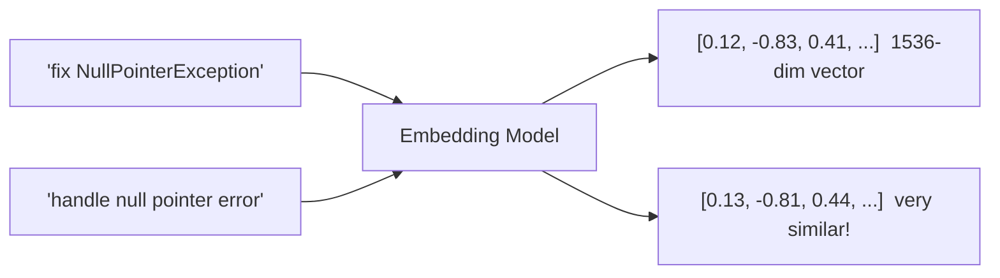
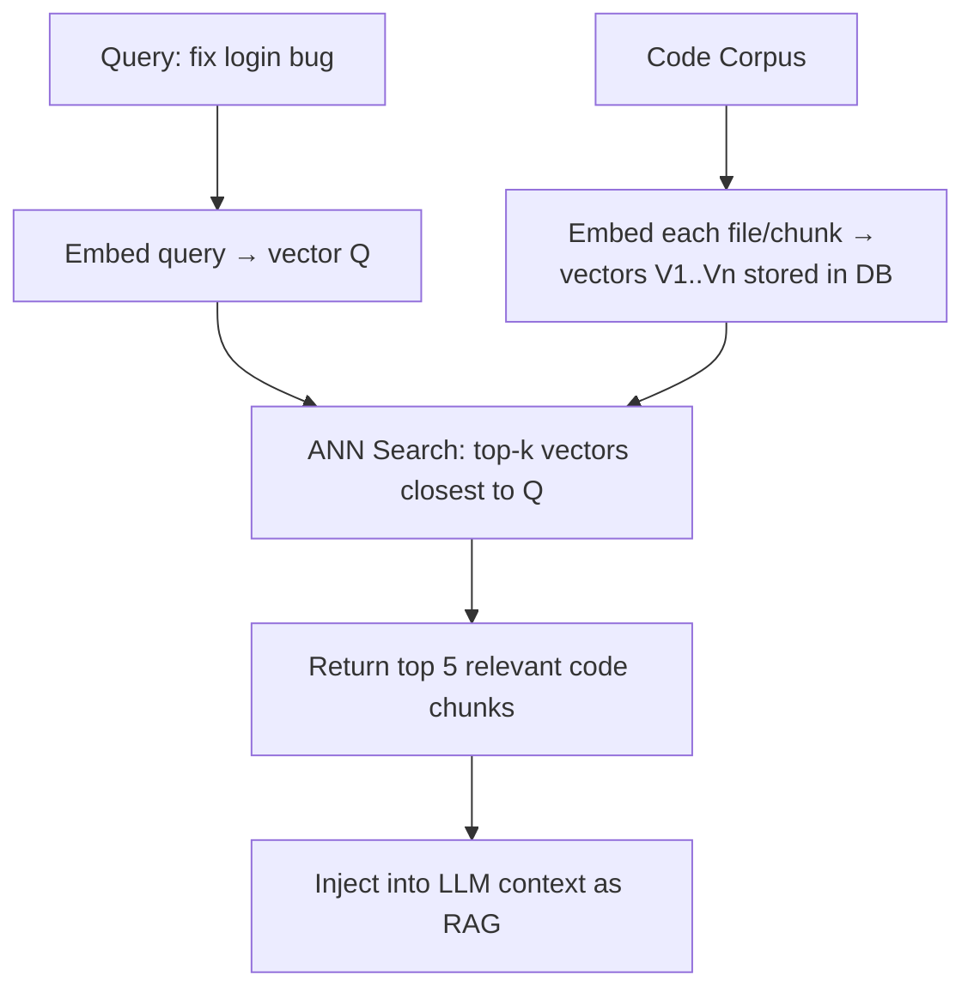

# 01.02 · Embeddings & Vector Search — Deep Dive { #embeddings-and-vector-search }

> **Level:** Intermediate  
> **Pre-reading:** [01 · AI & LLM Foundations](01-foundations.md) · [01.01 · How LLMs Work](01.01-how-llms-work.md)

---

## What Are Embeddings?

An **embedding** is a dense numerical vector that represents text (or code) in a high-dimensional space where **similar meaning = similar direction**.

Two sentences that are semantically related produce vectors with high **cosine similarity**, even if they share no exact words.

---

## Why Embeddings Matter for Dev Automation

| Use Case | How Embeddings Help |
|:---------|:-------------------|
| **Find relevant code** | Embed entire codebase, search by natural language query |
| **JIRA ticket → microservice** | Embed all service READMEs, find closest match to ticket description |
| **Similar bug lookup** | Find past bugs that are semantically similar to a new one |
| **Semantic test deduplication** | Identify test cases testing the same behaviour |
| **Documentation retrieval** | Pull the right Confluence page into the agent's context |

---

## Embedding Models

| Model | Dims | Strengths | Provider |
|:------|:-----|:----------|:---------|
| **text-embedding-3-large** | 3072 | Best quality, code + text | OpenAI |
| **text-embedding-3-small** | 1536 | Cost-efficient, still strong | OpenAI |
| **embed-english-v3.0** | 1024 | Best-in-class for RAG retrieval | Cohere |
| **all-MiniLM-L6-v2** | 384 | Fast, small, self-hosted | Sentence Transformers |
| **nomic-embed-code** | 768 | Optimised for source code | Nomic AI |

!!! tip "Code Embeddings"
    For indexing a Java/Spring Boot codebase, use a code-specific embedding model like `nomic-embed-code` or OpenAI's `text-embedding-3-large`. They produce better similarity scores for function signatures and class names than general-purpose models.

---

## Vector Databases

Vector databases store embeddings and support **approximate nearest neighbour (ANN)** search at scale.

| Database | Hosting | Strengths | Best For |
|:---------|:--------|:---------|:---------|
| **Pinecone** | Managed cloud | Simple API, serverless tier | SaaS products, fast start |
| **Weaviate** | Self-hosted or cloud | GraphQL API, multi-tenancy | Enterprise, complex schemas |
| **Qdrant** | Self-hosted or cloud | Rust-based, very fast | High-perf, self-hosted |
| **ChromaDB** | Self-hosted | Embeddable, zero config | Prototypes, local dev |
| **pgvector** | Postgres extension | Stays in existing DB | When you already use PostgreSQL |
| **Redis Vector** | Redis Stack | Low-latency, in-memory | Session-level search |

---

## How Similarity Search Works

**Cosine similarity** is the standard distance metric:

$$
\text{similarity}(A, B) = \frac{A \cdot B}{\|A\| \cdot \|B\|}
$$

Score ranges from -1 (opposite) to 1 (identical). In practice, relevant results score > 0.7.

---

## Chunking Strategy

How you split documents before embedding significantly affects retrieval quality.

| Strategy | Description | Best For |
|:---------|:-----------|:---------|
| **Fixed-size** | Split every N tokens | Simple, predictable |
| **Sentence** | Split on sentence boundaries | Prose documentation |
| **Recursive character** | Split on `\n\n`, `\n`, `.` in order of preference | Mixed content |
| **Semantic** | Group sentences by meaning similarity | High quality, expensive |
| **Code-aware** | Split on class/method boundaries | Source code indexing |

!!! warning "Chunk Size Trade-off"
    Too small → relevant context split across chunks, loses coherence.  
    Too large → a chunk covers many topics, retrieval becomes noisy.  
    For Java code: split at class boundaries (~500–1500 tokens per class).

---

??? question "When would you use pgvector instead of Pinecone?"
    When your application already uses PostgreSQL and the corpus is under ~10M vectors. pgvector avoids a separate service dependency and keeps retrieval inside your existing ACID transaction boundary. For larger scale or serverless deployments, a dedicated vector DB is better.

??? question "What is the difference between embedding similarity and keyword search?"
    Keyword search (BM25, Elasticsearch) matches exact or stemmed terms — fast but brittle to paraphrasing. Embedding similarity matches by meaning — "fix null pointer" matches "handle missing reference" regardless of word overlap. Production RAG systems often use **hybrid search** (keyword + vector) for the best recall.

---

--8<-- "_abbreviations.md"
