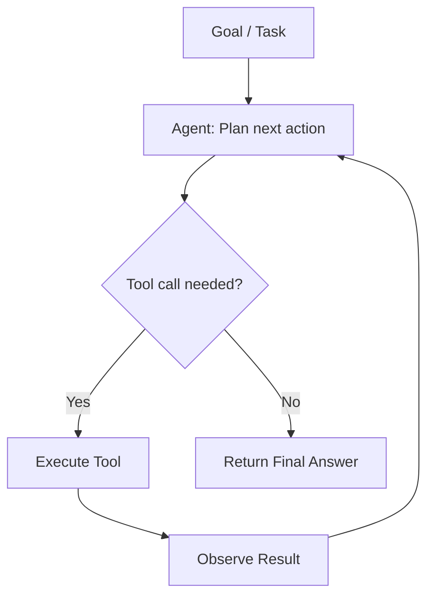
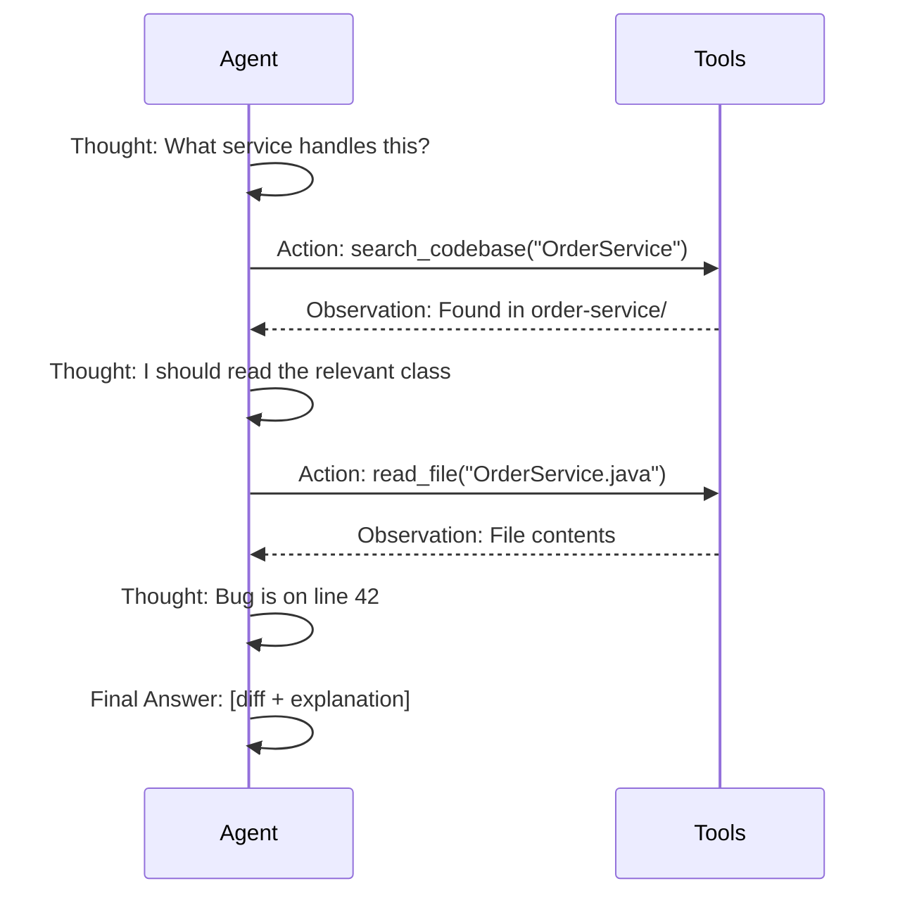
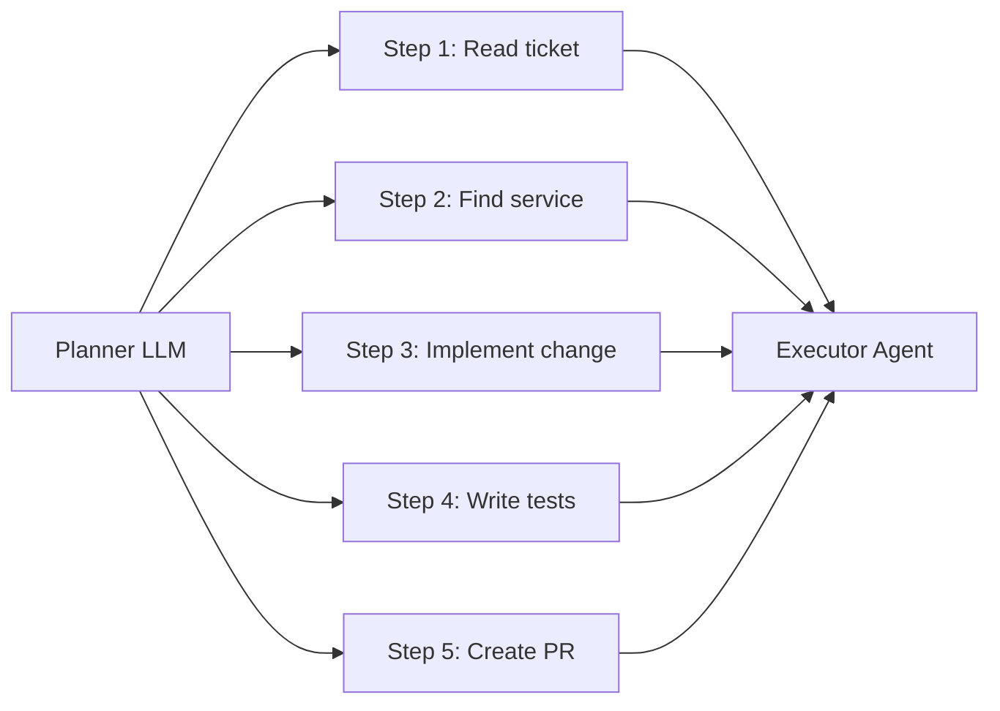

# 02 · Agentic AI Patterns { #agentic-ai }

> **Overview of how AI agents are designed, how they reason, and how they act.**  
> This is the architectural core of every development automation system.

---

## What Is an Agent?

An **AI agent** is a system where an LLM acts as a reasoning engine that can:

1. **Perceive** — receive context (code, tickets, test reports)
2. **Plan** — decide what actions to take and in what order
3. **Act** — invoke tools (APIs, file systems, browsers, compilers)
4. **Observe** — receive tool results and update its reasoning
5. **Repeat** — continue until the goal is achieved

The key distinction from a simple LLM call: an agent runs a **loop** until a stopping condition is met.

---

## Agent Architectures

| Pattern | Description | Best For |
|:--------|:-----------|:---------|
| **ReAct** | Interleave Reasoning and Acting in a loop | General-purpose agents, debugging |
| **Plan-and-Execute** | Generate a full plan first, then execute each step | Long multi-step tasks like JIRA→PR |
| **Reflection** | Agent critiques its own output before finalising | Code review, RCA documents |
| **Multi-Agent** | Specialized agents collaborate, handoff work | Complex pipelines with distinct roles |
| **Supervisor** | One orchestrator agent delegates to worker agents | Parallel sub-tasks, QA + developer agents |

→ **[Deep Dive: ReAct & Planning Loops](02.01-react-and-planning.md)**  
→ **[Deep Dive: Multi-Agent Systems](02.02-multi-agent-systems.md)**

---

## The ReAct Loop

**ReAct** (Reason + Act) is the most widely used single-agent pattern. The model alternates between a `Thought` (reasoning) and an `Action` (tool call) until it reaches a `Final Answer`.

---

## Plan-and-Execute Pattern

For complex, multi-step tasks with clear structure (like a JIRA feature ticket), a planner first decomposes the task, then an executor works through it step by step.

!!! tip "Why Plan First?"
    Planning before acting reduces the chance of an agent going down a wrong path for many tool calls before realising the approach is wrong. The planner can also be a stronger/more expensive model while the executor uses a cheaper one.

---

## Tool Use Best Practices

Agents are only as good as the tools available to them. Well-designed tools:

| Principle | Detail |
|:----------|:-------|
| **Atomic** | Each tool does one thing — read a file, run a test, search code |
| **Idempotent** | Reading is always safe; writes need confirmation gates |
| **Self-describing** | Tool descriptions must be accurate — the LLM decides when to call them |
| **Return structured data** | JSON over plain text — the agent can reason over structure |
| **Fail gracefully** | Return a useful error message, not a stack trace |

---

## Stopping Conditions

Agents need explicit stopping logic or they can loop indefinitely:

| Condition | Description |
|:----------|:-----------|
| **Final answer produced** | Model outputs a structured response with no more tool calls |
| **Max iterations reached** | Hard cap (e.g., 20 steps) to prevent runaway loops |
| **Human-in-the-loop gate** | Pause for approval before irreversible actions (git push, PR create) |
| **Confidence threshold** | Stop and report if agent cannot find a confident answer |
| **Error escalation** | After N retries on a failed tool call, escalate to human |

!!! warning "Always Set a Max Iteration Limit"
    Without a hard limit, a confused agent can spend hundreds of API calls and tokens before timing out. Set `max_iterations=20` as a default and tune per use case.

---

## Agent Memory Types

| Memory Type | Storage | Lifespan | Example |
|:------------|:--------|:---------|:--------|
| **In-context** | Token window | Single run | Conversation history, tool results |
| **External short-term** | Redis, DynamoDB | Session | Agent state across API calls |
| **Episodic** | Vector DB | Permanent | Past bugs fixed, PR patterns |
| **Semantic / Knowledge** | Vector DB or graph | Permanent | Codebase summaries, domain facts |
| **Procedural** | Prompt / fine-tune | Permanent | How to format a PR description |

---

--8<-- "_abbreviations.md"
