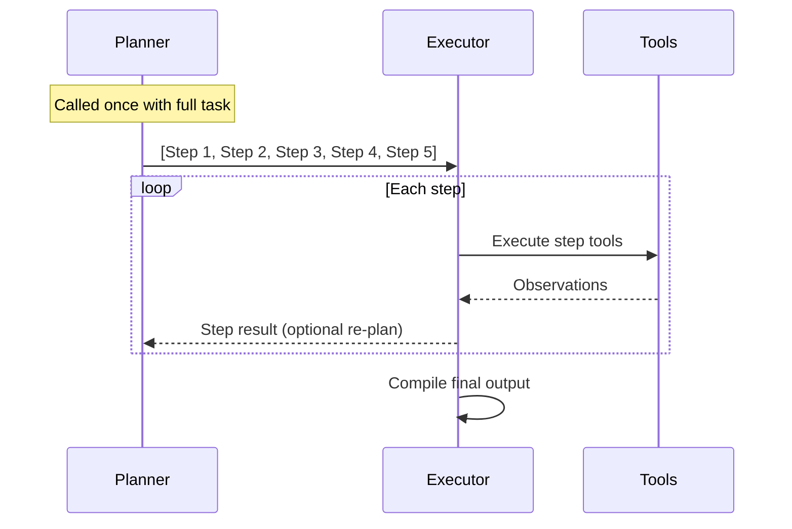
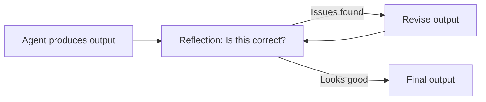

# 02.01 · ReAct & Planning Loops — Deep Dive { #react-and-planning }

> **Level:** Intermediate  
> **Pre-reading:** [02 · Agentic AI Patterns](02-agentic-ai.md) · [01.03 · Prompt Engineering](01.03-prompt-engineering.md)

---

## ReAct in Detail

The ReAct pattern was formalised in the 2022 paper "ReAct: Synergizing Reasoning and Acting in Language Models." It interleaves **chain-of-thought reasoning** with **action execution** to create a traceable, debuggable agent loop.

Each turn of the loop produces exactly one of:

| Output Type | Meaning | Example |
|:------------|:--------|:--------|
| `Thought:` | Internal reasoning, not executed | "The stack trace points to PaymentService line 42" |
| `Action:` | Tool invocation with arguments | `read_file("PaymentService.java")` |
| `Observation:` | Result injected by the runtime | File contents returned from read_file |
| `Final Answer:` | Terminal state, no more actions | The complete diff and PR description |

---

## A Complete ReAct Trace — Bug Fix

This is what a real ReAct trace looks like for Case 1 (bug ticket):

```
System: You are a senior Java developer. Fix bugs in Spring Boot services.

User: Fix JIRA-4821 — NullPointerException in OrderController.createOrder()

Thought: I need to find OrderController in the codebase.
Action: search_codebase(query="OrderController createOrder")
Observation: Found in order-service/src/main/java/.../OrderController.java

Thought: I should read this file to understand the method.
Action: read_file("order-service/src/main/java/.../OrderController.java")
Observation: [file contents showing @PostMapping createOrder method]

Thought: Line 34 calls order.getCustomer().getId() without null check.
  If getCustomer() returns null, this throws NPE.
Action: read_file("order-service/src/test/.../OrderControllerTest.java")
Observation: [test file — no test for null customer case]

Thought: I have enough context. The fix is a null check. I should also add a test.
Final Answer: {
  "root_cause": "No null check on order.getCustomer() in createOrder()",
  "diff": "...",
  "test_added": "shouldReturn400WhenCustomerIsNull",
  "pr_title": "fix(order): add null guard in createOrder [JIRA-4821]"
}
```

---

## Plan-and-Execute in Detail

For longer tasks (new feature implementation), pure ReAct can drift or miss steps. Plan-and-Execute solves this by separating **strategy** from **execution**.



**When to re-plan:** If a step reveals unexpected complexity (e.g., the service doesn't exist yet), the executor can call the planner again with the new information to generate a revised plan.

---

## Reflection Pattern

The **Reflection** pattern adds a self-critique step after the agent produces output. This is especially useful for code review and RCA documents.



The reflection prompt is separate from the generation prompt:

```
Review this code diff. Check for:
1. Does it actually fix the stated bug?
2. Are there edge cases not covered?
3. Are the tests meaningful (not just asserting the change)?
4. Does it introduce any security issues?

If any issues are found, return them as a list. 
If none, return { "approved": true }.
```

---

## Iteration Budgets and Costs

| Task Complexity | Expected Iterations | Typical Token Cost |
|:----------------|:-------------------|--------------------|
| Simple null-fix bug | 4–6 iterations | 5K–15K tokens |
| New REST endpoint | 10–15 iterations | 20K–50K tokens |
| Cross-service feature | 20–30 iterations | 50K–150K tokens |
| Playwright RCA | 6–10 iterations | 10K–30K tokens |

!!! tip "Cost Control"
    Cache tool outputs within a run (e.g., don't re-read the same file twice in one agent session). Use a cheaper model (GPT-4o-mini, Claude Haiku) for tool selection steps and a stronger model for code generation steps.

---

??? question "How is ReAct different from chain-of-thought prompting?"
    Chain-of-thought is pure reasoning in text — the model thinks aloud but takes no external actions. ReAct adds the ability to call tools between reasoning steps, observe real data, and update its reasoning based on evidence. For dev automation, you need ReAct — you can't write a correct bug fix without reading the actual code.

??? question "What happens when an agent gets stuck in a loop?"
    Set `max_iterations` in your LangGraph node config. When the limit is hit, route to an escalation node that returns a structured "I need human help" response with the current agent state. Log all iterations for debugging. See [04 · LangGraph](04-langgraph.md) for implementation patterns.

??? question "Should you use ReAct or Plan-and-Execute for JIRA tickets?"
    Use **Plan-and-Execute** for feature tickets (structured, multi-step work) and **ReAct** for bug tickets (exploratory debugging where you don't know the path upfront). A hybrid approach — plan the investigation steps, then use ReAct for each — works well in practice.

---

--8<-- "_abbreviations.md"
