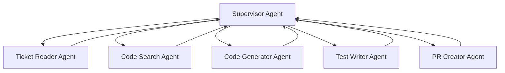
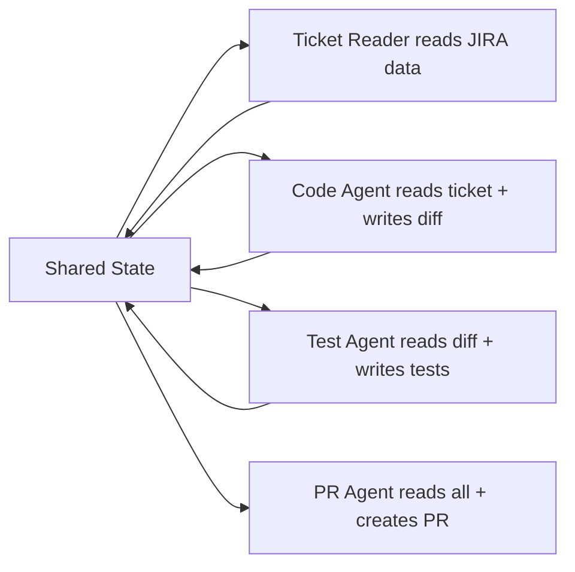
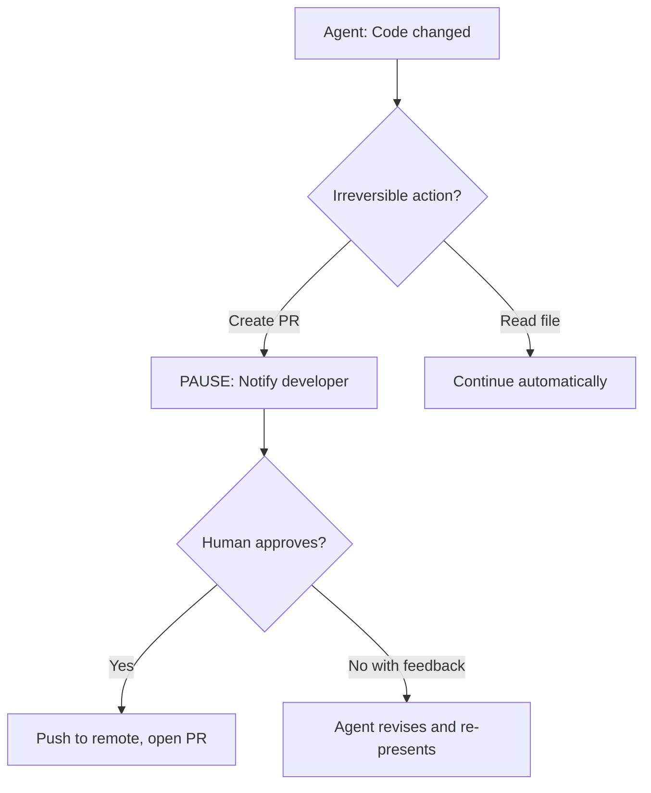

# 02.02 · Multi-Agent Systems — Deep Dive { #multi-agent-systems }

> **Level:** Advanced  
> **Pre-reading:** [02 · Agentic AI Patterns](02-agentic-ai.md) · [02.01 · ReAct & Planning Loops](02.01-react-and-planning.md)

---

## Why Multiple Agents?

A single general-purpose agent has limitations:

- **Context window pressure** — a large task fills the window before completion
- **Competing concerns** — debugging and code generation require different reasoning styles
- **Reliability** — outputs from one agent can be independently verified by another
- **Specialisation** — smaller agents with focused system prompts outperform a jack-of-all-trades agent

Multi-agent architectures solve this by distributing work across **specialised, cooperating agents**.

---

## Multi-Agent Topologies

| Topology | Description | Use Case |
|:---------|:-----------|:---------|
| **Supervisor / Worker** | One orchestrator delegates to specialist workers | JIRA ticket triage → dev agent + test agent |
| **Chain** | Output of agent A feeds into agent B | Ticket reader → code generator → reviewer |
| **Parallel** | Multiple agents run concurrently | Code change + test generation at the same time |
| **Debate / Critic** | Two agents propose and critique each other | High-stakes code review, RCA validation |
| **Hierarchical** | Multi-level supervision (supervisor of supervisors) | Enterprise-scale pipelines |

---

## Supervisor Architecture — JIRA→PR

Each agent:

- Has its own **system prompt** scoped to its role
- Has access to **only the tools it needs** (principle of least privilege)
- Returns a **structured result** the supervisor can act on

The supervisor maintains shared **state** that each agent can read from and write to.

---

## Agent Communication

Agents communicate through a **shared state object**, not direct calls to each other.

The shared state is the single source of truth. This prevents agents from getting confused by chatty agent-to-agent conversation and makes the whole pipeline inspectable.

---

## Handoff Patterns

| Pattern | How It Works | When to Use |
|:--------|:------------|:-----------|
| **Result passing** | Agent A's output is in state; Agent B reads it | Sequential pipelines |
| **Explicit handoff** | Agent A calls `transfer_to_agent_b(context)` | Dynamic routing |
| **Interrupt and resume** | Agent pauses, human approves, agent continues | Human-in-the-loop gates |
| **Broadcast** | Supervisor sends same context to all workers in parallel | Parallel independent tasks |

---

## Human-in-the-Loop Gates

!!! warning "Never auto-merge to main"
    Dev automation agents should always stop before pushing to a protected branch. The human reviewer step is non-negotiable. Design your agent pipeline to **pause and wait** at the PR creation step.

---

## Avoiding Common Multi-Agent Failures

| Failure Mode | Cause | Mitigation |
|:-------------|:------|:-----------|
| **Infinite delegation** | Supervisor keeps delegating instead of acting | Max delegation depth limit |
| **State corruption** | Two agents write conflicting state | Immutable state with snapshots, one writer at a time |
| **Lost context** | Worker agent doesn't have enough context to act | Pass full relevant state slice, not just task ID |
| **Prompt injection via agent output** | Worker agent output is injected into another's prompt | Sanitize all inter-agent data before use as context |
| **Silent failure** | Worker returns empty or malformed result | Validate every agent output before advancing state |

---

??? question "How do you decide when to use multi-agent vs. a single agent with more tools?"
    A single agent is simpler to debug and deploy. Use multi-agent when: (1) the task exceeds a single context window, (2) you need independent verification of outputs, or (3) tasks can run in parallel and the latency saving matters. For most JIRA ticket sizes, a well-designed single agent suffices.

??? question "How do agents share context without exceeding the context window?"
    Use a **shared state store** (not in-context messages). Pass each agent only the slice of state relevant to its task — not the full history. Summarise completed steps into a compact representation before passing to subsequent agents.

---

--8<-- "_abbreviations.md"
