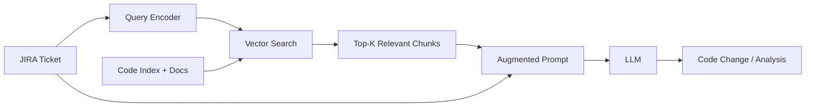

# 03 · Retrieval-Augmented Generation (RAG) { #rag }

> **How agents find relevant context from large codebases, wikis, and documentation without hallucinating.**

---

## The Problem RAG Solves

LLMs have two fundamental limitations for dev automation:

1. **Training cutoff** — they don't know your codebase, your internal APIs, or your team's decisions
2. **Context window limits** — you can't fit an entire codebase into one prompt

**RAG** solves both: instead of baking knowledge into the model, you **retrieve** relevant context at query time and **inject** it into the prompt.

---

## RAG vs. Fine-Tuning

| Approach | Best For | Limitations |
|:---------|:---------|:-----------|
| **RAG** | Frequently changing knowledge (code, docs, tickets) | Retrieval quality depends on chunks and embeddings |
| **Fine-tuning** | Consistent style, patterns, and behaviour | Expensive to retrain, static knowledge snapshot |
| **RAG + Fine-tuning** | Style from fine-tuning, facts from RAG | Most complex, highest quality |

!!! tip "Default to RAG"
    For codebase knowledge, always use RAG. Code changes constantly — fine-tuning on a codebase snapshot is outdated the moment the next PR merges.

---

## The RAG Pipeline

| Stage | What Happens | Tools |
|:------|:------------|:------|
| **1. Indexing** | Split documents → embed → store in vector DB | LangChain, LlamaIndex, custom |
| **2. Retrieval** | Embed query → similarity search → top-K chunks | Pinecone, Weaviate, pgvector |
| **3. Reranking** | Re-score top-K chunks for relevance to the query | Cohere Rerank, cross-encoder |
| **4. Augmentation** | Inject retrieved chunks into the LLM prompt | LangChain PromptTemplate |
| **5. Generation** | LLM answers grounded in retrieved context | OpenAI, Anthropic, Ollama |

---

## What to Index for Dev Automation

| Corpus | Content | Value |
|:-------|:--------|:------|
| **Source code** | Java classes, interfaces, Spring beans | Find the right service and method |
| **Test code** | JUnit tests, Playwright scripts | Understand expected behaviour |
| **OpenAPI specs** | Swagger YAML/JSON | Understand API contracts |
| **JIRA history** | Past bugs, resolutions, ADRs | Find similar past issues |
| **Confluence / docs** | Architecture docs, runbooks | Understand system design |
| **Git history** | Commit messages, PR descriptions | Understand change intent |

---

## Retrieval Quality Factors

Good RAG is mostly about retrieval quality, not generation quality. The LLM is only as good as the context it receives.

| Factor | Impact |
|:-------|:-------|
| **Chunk size** | Too small → context fragmented; too large → irrelevant content included |
| **Chunk overlap** | Overlap prevents splitting important context across boundaries |
| **Embedding model quality** | Code-specific models outperform general ones for source code |
| **Metadata filtering** | Filter by service name, language, file type before vector search |
| **Hybrid search** | Keyword + vector combined — best recall for uncommon identifiers |
| **Reranking** | A cross-encoder reranker dramatically improves top-5 relevance |

→ **[Deep Dive: RAG Pipeline](03.01-rag-pipeline.md)** — Indexing strategies, chunking code, hybrid search  
→ **[Deep Dive: Advanced RAG Patterns](03.02-advanced-rag.md)** — HyDE, self-query, multi-hop retrieval

---

## RAG for Code: Special Considerations

Code is not prose. Naive text chunking breaks class and method boundaries.

| Language Construct | Recommended Chunk Boundary |
|:-------------------|:--------------------------|
| Java class | One chunk per class file (or per public method for large classes) |
| Interface + implementations | Keep interface and its primary implementation in the same chunk |
| Spring Boot controller | One chunk per controller with all its endpoint methods |
| Playwright test | One chunk per `test()` or `describe()` block |

!!! note "AST-Based Chunking"
    Production code indexers parse the AST (Abstract Syntax Tree) to split at method/class boundaries rather than character count. Tools like Tree-sitter support this for Java, TypeScript, Python.

---

--8<-- "_abbreviations.md"
