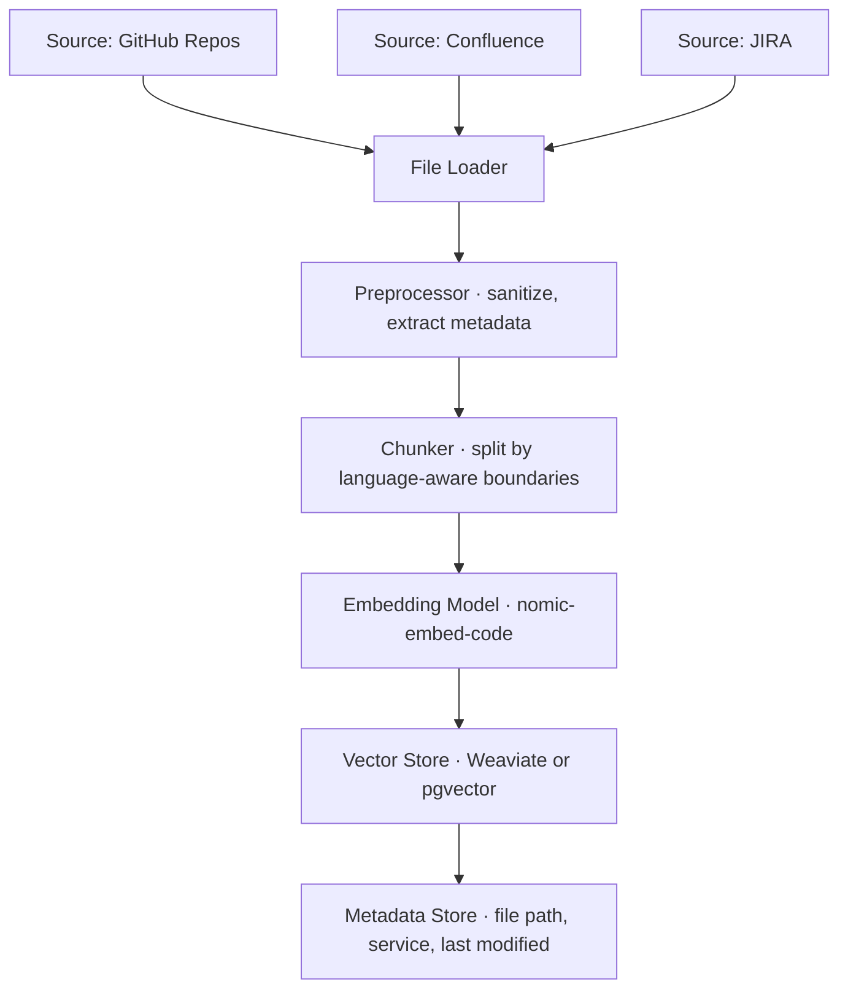
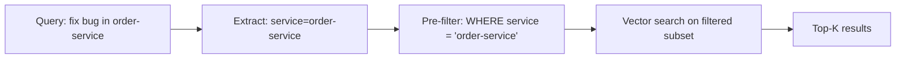
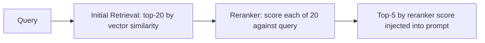

# 03.01 · RAG Pipeline Deep Dive { #rag-pipeline }

> **Level:** Intermediate  
> **Pre-reading:** [03 · RAG](03-rag.md) · [01.02 · Embeddings & Vector Search](01.02-embeddings-and-vector-search.md)

---

## Indexing Pipeline

The indexing pipeline runs **offline** (or on change events) to keep the vector index fresh.



**Trigger strategies:**

| Trigger | When | Tradeoff |
|:--------|:-----|:---------|
| **Full re-index** | Weekly scheduled job | Simple but stale between runs |
| **PR merge webhook** | On every merged PR | Always fresh, more complex |
| **File change watcher** | On local save during development | Only useful for local dev agents |
| **On-demand** | Agent requests fresh index for a service | Accurate but adds latency to first run |

---

## Chunking Strategies in Practice

### Code Chunking — Java / Spring Boot

Parse `.java` files with Tree-sitter and emit one chunk per class member:

```
Chunk 1:
  content: "public class OrderController { ... }"
  metadata: { file: "OrderController.java", class: "OrderController", service: "order-service" }

Chunk 2:
  content: "@PostMapping createOrder(@RequestBody OrderRequest req) { ... }"
  metadata: { file: "OrderController.java", method: "createOrder", line: 34 }
```

### Documentation Chunking — Confluence / Markdown

Use recursive character splitting with 512-token chunks and 64-token overlap:

```
Chunk 1: First 512 tokens of the page
Chunk 2: Tokens 448–960 (64-token overlap with Chunk 1)
...
```

Overlap ensures that context at chunk boundaries is not lost.

---

## Metadata Filtering

Before embedding similarity search, filter the corpus to reduce noise:



!!! tip "Metadata Is Critical"
    In a large codebase with 50+ microservices, searching all embeddings returns irrelevant results from other services. Always tag chunks with `service`, `language`, `file_type`, and `last_modified` for effective pre-filtering.

---

## Hybrid Search

Combine vector similarity (semantic) with keyword matching (BM25) for better recall.

| Query Type | Best Search |
|:-----------|:-----------|
| `"fix NullPointerException in payment flow"` | Vector (semantic) |
| `"PaymentServiceImpl.processRefund"` | Keyword (exact identifier) |
| `"slow checkout caused by DB lock"` | Hybrid (semantic description + technical term) |

LangChain's `EnsembleRetriever` and Weaviate's hybrid search mode both support this out of the box.

---

## Reranking

After retrieval, a **cross-encoder reranker** re-scores each chunk against the query with higher accuracy than embedding similarity alone.



| Reranker | Provider | Notes |
|:---------|:---------|:------|
| **Rerank-3** | Cohere | Best-in-class, API-based |
| **cross-encoder/ms-marco** | HuggingFace | Open source, self-hosted |
| **ColBERT** | HuggingFace | Token-level matching, strong on code |

The cost of reranking ~20 documents is small; the quality improvement is large.

---

## Prompt Augmentation Pattern

Once chunks are retrieved, inject them into the prompt with clear delimiters:

```
You are a Java developer fixing a bug in the order-service.

=== RELEVANT CODE CONTEXT ===
File: order-service/src/main/java/.../OrderController.java (lines 28-55)
[chunk content]

File: order-service/src/test/.../OrderControllerTest.java (lines 10-45)
[chunk content]
=== END CONTEXT ===

Using only the code above, diagnose and fix the following bug:
[JIRA ticket description]
```

The explicit delimiters help the model distinguish retrieved context from instructions.

---

??? question "How do you handle stale embeddings when code changes?"
    Use a PR merge webhook to trigger re-indexing of only the changed files. Store `last_modified` as metadata on each chunk and periodically run a staleness check. For critical services, consider re-indexing on every commit to main.

??? question "What is the right chunk size for Java code?"
    For method-level chunks: aim for 200–800 tokens. Include the method signature, body, and immediately relevant context (class-level annotations, fields referenced). For controller classes, one chunk per endpoint method works well. Avoid chunking in the middle of a method body.

---

--8<-- "_abbreviations.md"
