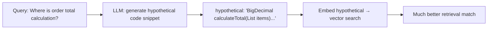
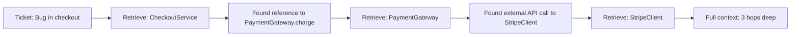
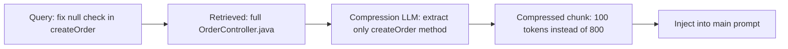
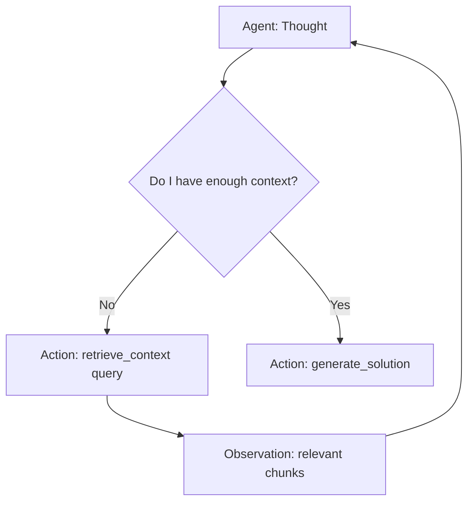

# 03.02 · Advanced RAG Patterns { #advanced-rag }

> **Level:** Advanced  
> **Pre-reading:** [03 · RAG](03-rag.md) · [03.01 · RAG Pipeline](03.01-rag-pipeline.md)

---

## Naive RAG Limitations

Basic RAG (embed → search → inject) degrades in several scenarios:

| Scenario | Problem | Advanced Solution |
|:---------|:--------|:-----------------|
| Query is vague | Embeddings don't match relevant code | HyDE — generate hypothetical answer first |
| Multi-hop reasoning | Answer requires reading 3+ connected files | Multi-hop retrieval / graph RAG |
| Code generates wrong query | Identifier mismatch (camelCase vs spaced) | Self-query with structured filters |
| Retrieved chunks are too noisy | Low signal-to-noise ratio | Contextual compression |
| Agent needs to verify a fact | Single chunk insufficient | Iterative retrieval |

---

## HyDE — Hypothetical Document Embeddings

Instead of embedding the raw query, ask the LLM to generate what the *ideal* answer might look like, then embed and search for *that*.



**Why it works:** The hypothetical document shares vocabulary (class names, method names) with actual code — producing a much closer embedding to the real files than the natural language query would.

---

## Multi-Hop Retrieval

Some bug investigations require following a chain of references:



The agent iteratively retrieves, reads, identifies cross-references, and retrieves again. LangGraph makes this loop easy to express as a graph with conditional edges.

---

## Self-Query Retrieval

For structured codebases with rich metadata, let the LLM generate a structured filter query instead of relying purely on vector search.

```
User query: "Find all Kafka consumer methods in the notification service"

LLM generates:
{
  "filter": { "service": "notification-service", "annotation": "@KafkaListener" },
  "semantic_query": "Kafka consumer message processing"
}
```

The filter drastically narrows the search space; the semantic query handles the content match.

---

## Contextual Compression

Retrieved chunks often contain boilerplate that adds noise. Before injecting into the prompt, compress each chunk to keep only the relevant portion.



Use a cheap, fast model (GPT-4o-mini) for compression. This reduces the tokens sent to the expensive model while improving signal quality.

---

## RAPTOR — Recursive Abstractive Processing for Tree-Organised Retrieval

For very large codebases (1000+ files), standard flat retrieval can miss high-level patterns.

RAPTOR builds a **tree** of summaries:

```
Level 0: Raw code chunks (leaf nodes)
Level 1: Method-level summaries
Level 2: Class-level summaries  
Level 3: Service-level summaries
Level 4: Domain/architecture summary
```

Retrieval can happen at any level, then drill down. Useful for answering "what service handles payments?" (level 3–4) vs. "how is the payment amount validated?" (level 0–1).

---

## Agentic RAG

The natural evolution: instead of RAG being a fixed pre-processing step, the agent decides **when and what** to retrieve as part of its ReAct loop.



This is more flexible but requires careful loop budgeting to avoid excessive retrieval calls.

---

??? question "When should you use HyDE vs. standard embedding search?"
    Use HyDE when your users ask natural language questions that are semantically far from technical code (e.g., "where is the billing logic?" vs. `BillingService.calculateInvoice()`). In practice, HyDE adds ~1 LLM call of latency — acceptable for interactive queries, potentially too slow for batch pipeline steps.

??? question "How do you evaluate RAG quality?"
    Use RAGAS (Retrieval-Augmented Generation Assessment) — a framework that measures: Faithfulness (does the answer match the retrieved context?), Answer Relevancy (is the answer relevant to the query?), Context Recall (did retrieval find everything needed?). Set minimum threshold scores as a CI gate on your RAG pipeline.

---

--8<-- "_abbreviations.md"
