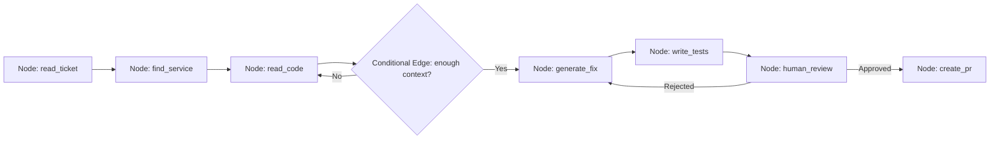

# 04 · LangGraph & LangChain { #langgraph }

> **How orchestration frameworks compose LLM calls, tool use, and data flow into reliable, stateful pipelines.**

---

## Why Orchestration Frameworks?

A raw LLM API call is just a function: `prompt → completion`. Complex agents require:

- **State management** across multiple LLM calls
- **Conditional branching** (if the agent is confused, ask for clarification)
- **Loop control** (retry failed tool calls, max iteration limits)
- **Human-in-the-loop** integration (pause and wait for approval)
- **Streaming and observability** (trace every step)

**LangChain** and **LangGraph** are the dominant Python frameworks for this. Java alternatives include **Spring AI** and **Semantic Kernel**.

---

## LangChain vs. LangGraph

| Aspect | LangChain | LangGraph |
|:-------|:---------|:---------|
| **Core abstraction** | Linear chains and pipelines | Directed graphs with state |
| **Control flow** | Sequential, limited branching | Full graph: loops, conditionals, parallel |
| **State** | Implicit, hard to inspect | Explicit `TypedDict` state object |
| **Human-in-the-loop** | Complex to add | First-class via `interrupt()` |
| **Observability** | LangSmith tracing | LangSmith tracing + graph visualisation |
| **Best for** | Simple RAG chains, single-shot tasks | Agents, multi-step workflows, multi-agent |

!!! note "The Ecosystem Reality"
    LangGraph is built on LangChain — it uses LangChain's model integrations, tools, and document loaders. Think of LangGraph as "LangChain with a control flow engine." Most new agentic projects start with LangGraph directly.

---

## LangGraph Core Concepts



| Concept | Description |
|:--------|:-----------|
| **Node** | A Python function that reads from and writes to the graph state |
| **Edge** | A directed connection between nodes |
| **Conditional Edge** | A function that decides which node to route to next |
| **State** | A typed dictionary shared across all nodes in the graph |
| **Interrupt** | Pause execution and wait for external input (human approval) |
| **Checkpointer** | Persists graph state to a store for long-running or resumable workflows |

→ **[Deep Dive: LangGraph](04.01-langgraph-deep-dive.md)** — Node patterns, state design, tool integration  
→ **[Deep Dive: State Machines & Workflows](04.02-state-machines.md)** — Complex flow control, parallel branches

---

## The State Object

All data flows through a single state object. Every node receives the full state and returns a *partial update*.

```python
class AgentState(TypedDict):
    jira_ticket: dict
    service_name: str
    relevant_files: List[str]
    code_diff: str
    tests_added: List[str]
    review_status: str  # "pending" | "approved" | "rejected"
    pr_url: str
    messages: List[BaseMessage]  # LLM conversation history
```

This design makes the entire agent state **inspectable, serialisable, and resumable**.

---

## Spring AI — Java-Native Alternative

For teams building Spring Boot backends who want agent logic in Java:

| Feature | Spring AI |
|:--------|:---------|
| **LLM clients** | OpenAI, Anthropic, Ollama, Azure OpenAI |
| **RAG support** | VectorStore abstraction, Advisors API |
| **Tool calling** | `@Tool` annotated methods |
| **Structured output** | `BeanOutputConverter` for mapping to Java objects |
| **Memory** | `ChatMemory` with in-memory or JDBC backends |

!!! tip "Spring AI vs. LangGraph"
    Spring AI is excellent for embedding AI into existing Spring Boot services. LangGraph (Python) is better for complex multi-agent orchestration. A common pattern: Spring Boot service exposes a REST endpoint that the Python LangGraph agent calls as a tool.

---

## Observability with LangSmith

LangSmith is the tracing and evaluation platform for LangChain/LangGraph. Every run produces:

- Full trace of every LLM call with inputs/outputs
- Token counts and latency per step
- Tool call inputs and results
- Graph visualisation of which nodes executed

This is essential for debugging agent loops and detecting prompt regressions.

---

--8<-- "_abbreviations.md"
