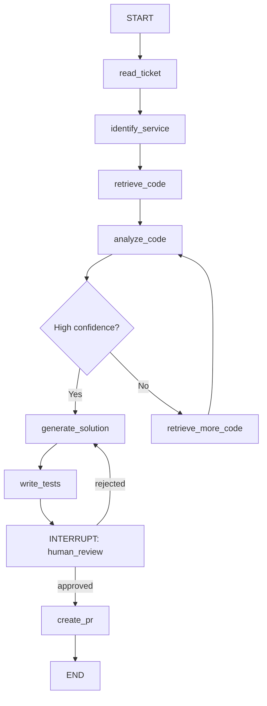
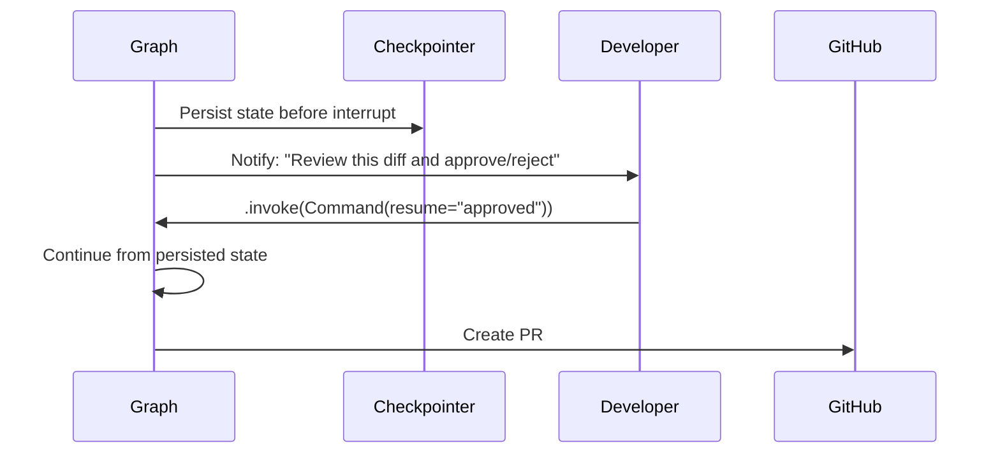
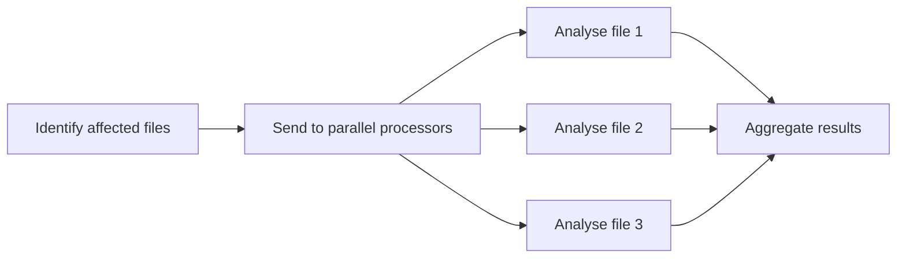
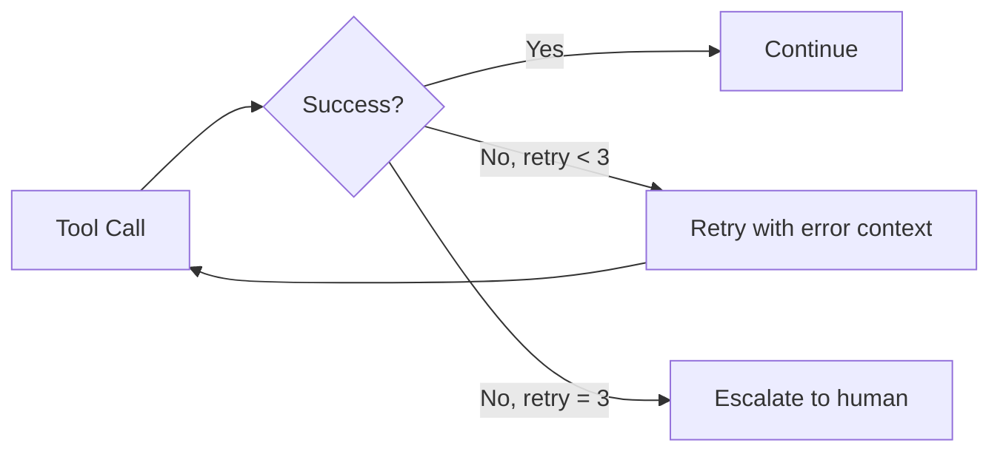
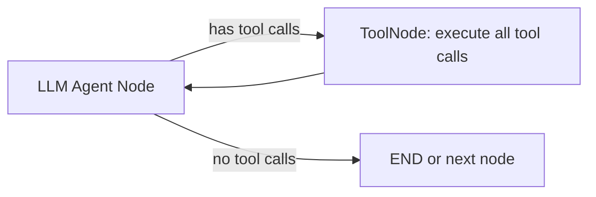

# 04.01 · LangGraph Deep Dive { #langgraph-deep-dive }

> **Level:** Advanced  
> **Pre-reading:** [04 · LangGraph & LangChain](04-langgraph.md) · [02 · Agentic Patterns](02-agentic-ai.md)

---

## Graph Structure

A LangGraph graph is a **StateGraph** — a directed graph where every node is a function and edges can be conditional. The graph compiles to a runnable that manages execution order.



---

## Node Design Patterns

### Tool Node
A node that executes registered tools based on the last LLM message:

```python
# Tools are bound to the LLM model
tools = [read_file, search_codebase, run_tests, create_pr]
llm_with_tools = llm.bind_tools(tools)

def agent_node(state: AgentState) -> dict:
    response = llm_with_tools.invoke(state["messages"])
    return {"messages": [response]}
```

### RAG Node
A node that retrieves context and injects it:

```python
def retrieve_code_context(state: AgentState) -> dict:
    query = f"{state['jira_ticket']['summary']} {state['service_name']}"
    docs = vector_store.similarity_search(query, k=5, filter={"service": state["service_name"]})
    context = "\n\n".join([d.page_content for d in docs])
    return {"retrieved_context": context}
```

### Conditional Edge Function
Decides routing based on state:

```python
def should_continue(state: AgentState) -> str:
    last_message = state["messages"][-1]
    if last_message.tool_calls:
        return "tools"          # route to tool execution node
    if state.get("confidence", 0) < 0.7:
        return "retrieve_more"  # route back to retrieval
    return "generate"           # route to solution generation
```

---

## Interrupt and Human-in-the-Loop

LangGraph's `interrupt()` function pauses execution, persists state, and waits for a human response. This is how you implement approval gates.



!!! tip "Checkpointing Backends"
    For production, use **PostgreSQL** or **Redis** as the checkpointer backend (not in-memory). This means agents can be interrupted and resumed across server restarts — critical for long-running JIRA ticket implementations.

---

## Parallel Subgraphs

LangGraph supports **Send API** for fan-out parallelism:



Use this to analyse multiple files concurrently, or to run the test writer and documentation updater in parallel with the code generator.

---

## Error Handling Patterns

| Error | LangGraph Pattern |
|:------|:-----------------|
| **Tool call fails** | Conditional edge routes to retry node (max 3 attempts) |
| **LLM returns invalid structured output** | Validation node, re-prompt with error message |
| **Max iterations reached** | Fallback edge to escalation node |
| **External API timeout** | State flag `retry_count`, exponential backoff in tool impl |



---

## The ToolNode Pattern

LangGraph provides a pre-built `ToolNode` that executes all tool calls in the last AI message automatically:



This eliminates the need to write tool routing logic manually in most single-agent scenarios.

---

??? question "What is the difference between LangGraph and CrewAI?"
    LangGraph is a low-level graph execution framework — you define the graph explicitly. CrewAI is a higher-level framework that hides the graph and defines agents by role (e.g., "Researcher", "Writer"). LangGraph gives more control and is better for production systems with complex state; CrewAI is faster to prototype with.

??? question "How do you persist a LangGraph agent state across HTTP requests?"
    Use a `PostgresSaver` or `RedisSaver` checkpointer and a `thread_id` as the conversation identifier. Each HTTP request passes the `thread_id` to `.invoke()` — LangGraph loads the saved state and continues from where it left off. This is how you build a stateful JIRA ticket agent that can be interrupted and resumed.

??? question "How do you test a LangGraph agent without calling the LLM?"
    Mock the LLM node by injecting a deterministic function in its place. Pass a pre-populated state with known data directly to downstream nodes. LangGraph lets you invoke individual nodes in isolation — use this for unit tests of your state transformation logic.

---

--8<-- "_abbreviations.md"
