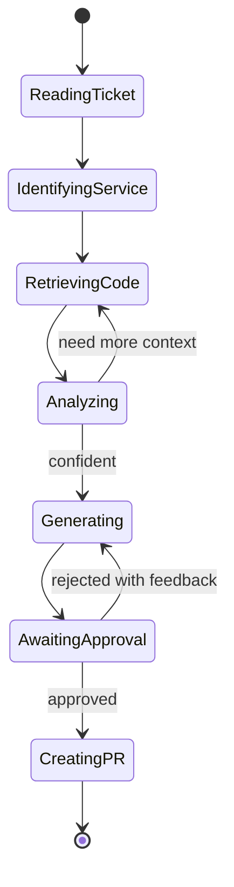
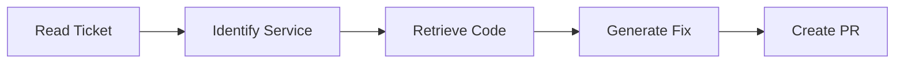
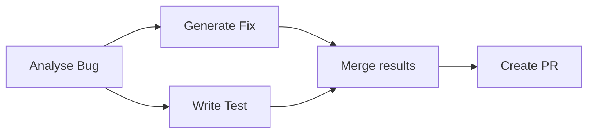
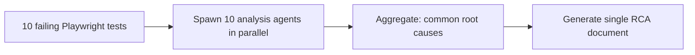
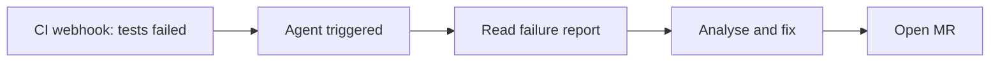

# 04.02 · State Machines & Workflows { #state-machines }

> **Level:** Advanced  
> **Pre-reading:** [04 · LangGraph](04-langgraph.md) · [04.01 · LangGraph Deep Dive](04.01-langgraph-deep-dive.md)

---

## Agent as a State Machine

Every agentic workflow is fundamentally a **state machine** — a system with explicit states and transitions that are triggered by conditions or events.

Modelling your agent as a state machine first makes the LangGraph implementation obvious.

---

## Workflow Patterns

### Sequential Workflow
Each node completes before the next starts. Simple, predictable, easy to debug.

### Parallel Workflow
Independent tasks run concurrently. Reduces total latency.

### Map-Reduce Workflow
Fan out to process many items; reduce results into a single output.

### Event-Driven Workflow
Agent is triggered by external events rather than a direct call.

---

## Long-Running Workflows

Some JIRA tickets require hours of agent work. Design for interruption:

| Concern | Solution |
|:--------|:---------|
| **Server restart** | Checkpointed state in PostgreSQL |
| **Token budget exceeded mid-run** | State snapshots, resume from last checkpoint |
| **Dependent external event** | `interrupt()` until webhook arrives (e.g., CI build completes) |
| **Human feedback latency** | Async interrupt, agent resumes when developer clicks approve |

---

## Idempotency and Retries

| Rule | Why |
|:-----|:----|
| All tool calls should be idempotent | Retrying a failed step shouldn't create duplicate PRs |
| Use unique IDs for all resources created | PR description includes JIRA ticket ID to prevent duplicates |
| Check if a resource already exists before creating | Query GitHub API for existing PRs on the same branch |
| Write state before acting, not after | If the action fails, state shows the intent and retry is safe |

---

## Workflow Observability

Each state transition should emit a structured event:

| Event | Payload |
|:------|:--------|
| `node.started` | `{ node: "retrieve_code", state_snapshot, timestamp }` |
| `node.completed` | `{ node: "retrieve_code", duration_ms, tokens_used }` |
| `tool.called` | `{ tool: "read_file", args, result_size }` |
| `interrupt.raised` | `{ reason: "human_review", diff_preview }` |
| `workflow.completed` | `{ pr_url, total_tokens, total_duration_ms }` |

Feed these to your observability platform (Datadog, OpenTelemetry) for cost tracking and anomaly detection.

---

??? question "How do you handle a workflow where the agent discovers it needs to change multiple services?"
    This is a scope expansion — the agent should NOT silently expand its blast radius. Add a scope validation node that checks if proposed changes cross service boundaries. If yes, interrupt and ask the JIRA ticket creator to confirm scope. Never let the agent autonomously modify multiple microservices without human sign-off.

---

--8<-- "_abbreviations.md"
