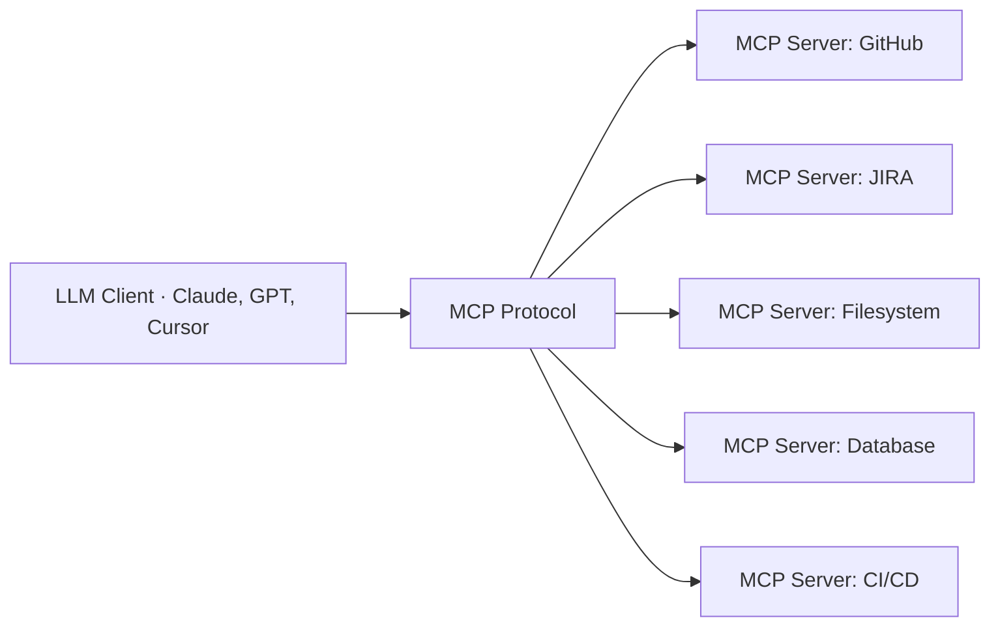
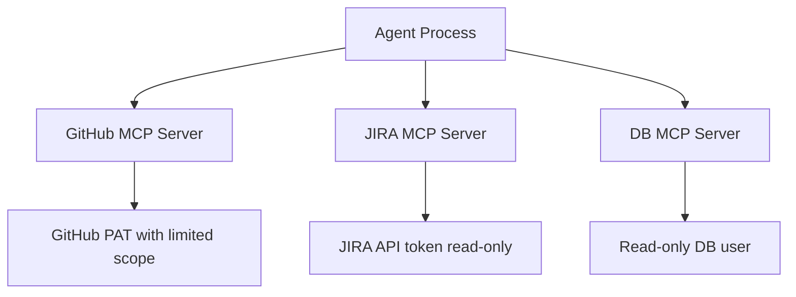

# 05 · MCP Servers & Tool Use { #mcp-servers }

> **How the Model Context Protocol standardises the way AI agents connect to external tools, APIs, and data sources.**

---

## What Is MCP?

**Model Context Protocol (MCP)** is an open standard (introduced by Anthropic in 2024) that defines how AI models communicate with **tool servers**. It separates the AI reasoning layer from the tool execution layer, making tools reusable across any MCP-compatible client.

Before MCP, every agent framework had its own way of defining tools. MCP provides a **universal interface** — any LLM client can use any MCP server.

---

## MCP Architecture

| Component | Role |
|:----------|:-----|
| **MCP Host** | The application embedding the LLM (VS Code, custom agent) |
| **MCP Client** | Protocol client inside the host that connects to servers |
| **MCP Server** | Exposes tools, resources, and prompts over MCP |
| **Transport** | How client and server communicate: stdio (local) or HTTP/SSE (remote) |

---

## What MCP Servers Expose

MCP servers expose three types of capabilities:

| Capability | Description | Example |
|:-----------|:-----------|:--------|
| **Tools** | Functions the LLM can call | `create_pull_request`, `run_jira_query` |
| **Resources** | Data the LLM can read | File contents, database rows, API responses |
| **Prompts** | Pre-built prompt templates | "Summarise this PR", "Classify this ticket" |

---

## Key MCP Servers for Dev Automation

| MCP Server | What It Does | Use In Our Pipeline |
|:-----------|:------------|:-------------------|
| **GitHub MCP** | Repos, PRs, issues, branches, file contents | Read code, create PRs, check CI status |
| **JIRA MCP** | Tickets, sprints, acceptance criteria, comments | Read ticket, post progress updates |
| **Filesystem MCP** | Local file read/write operations | Agent reads/writes code locally |
| **PostgreSQL MCP** | Query databases | Check schema for data model questions |
| **Playwright MCP** | Control browser, capture screenshots | Run E2E tests, capture failure evidence |
| **Slack MCP** | Post/read messages | Notify team of PR creation, ask for approval |
| **Docker MCP** | Build and run containers | Validate that code changes compile and run |

→ **[Deep Dive: MCP Protocol](05.01-mcp-protocol.md)** — Protocol internals, transports, security  
→ **[Deep Dive: Building MCP Integrations](05.02-mcp-integrations.md)** — Custom JIRA and GitHub MCP servers

---

## MCP vs. LangChain Tools

| Aspect | LangChain Tools | MCP Tools |
|:-------|:--------------|:---------|
| **Portability** | Framework-specific | Any MCP client (Cursor, Claude Desktop, custom) |
| **Deployment** | In-process with the agent | Separate server process or remote service |
| **Reusability** | Rewrite per framework | Write once, use from any client |
| **Standard** | No universal standard | Open standard with growing ecosystem |
| **Latency** | Lower (in-process) | Higher (IPC or HTTP) |

!!! tip "Use Both"
    In practice: use **MCP** for integrations that span multiple clients (GitHub, JIRA) and **LangChain tools** for pipeline-specific logic (custom prompt builders, output formatters). LangChain can call MCP servers as tools via adapters.

---

## Security Boundaries in MCP

Each MCP server is a separate process with its own credentials:

**Principle of least privilege:** Each MCP server should use credentials scoped to exactly what it needs. The GitHub MCP server for PR creation does not need write access to production databases.

---

--8<-- "_abbreviations.md"
