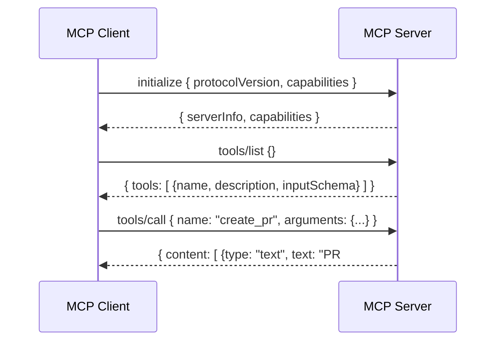
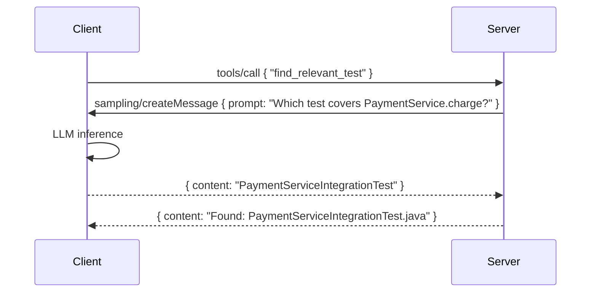

# 05.01 · MCP Protocol Deep Dive { #mcp-protocol }

> **Level:** Advanced  
> **Pre-reading:** [05 · MCP Servers & Tool Use](05-mcp-servers.md)

---

## Protocol Design

MCP uses **JSON-RPC 2.0** as the message format. All messages (requests, responses, notifications) conform to the standard JSON-RPC envelope.



---

## Transport Mechanisms

| Transport | When to Use | How It Works |
|:----------|:-----------|:-------------|
| **stdio** | Local servers on same machine | Client spawns server as subprocess; communicates via stdin/stdout |
| **HTTP + SSE** | Remote or containerised servers | Client sends POST requests; server streams responses via Server-Sent Events |
| **WebSocket** | Bidirectional, low-latency | Experimental, not yet standard |

**stdio** is the dominant transport for IDE integrations (VS Code, Cursor). **HTTP+SSE** is used for shared cloud-hosted MCP servers in CI/CD pipelines.

---

## Tool Schema

Each tool is described via a JSON Schema `inputSchema`. This is exactly what the LLM sees when deciding whether to call the tool.

```json
{
  "name": "create_pull_request",
  "description": "Creates a pull request in a GitHub repository. Use when you have finished code changes and tests and need developer review.",
  "inputSchema": {
    "type": "object",
    "properties": {
      "owner": { "type": "string", "description": "Repository owner or organisation" },
      "repo": { "type": "string", "description": "Repository name" },
      "title": { "type": "string", "description": "PR title — concise, include JIRA ID" },
      "body": { "type": "string", "description": "PR description with changes summary and test evidence" },
      "head": { "type": "string", "description": "Branch with changes" },
      "base": { "type": "string", "description": "Target branch — usually 'main' or 'develop'" }
    },
    "required": ["owner", "repo", "title", "body", "head", "base"]
  }
}
```

!!! warning "Description Quality Is Critical"
    The LLM uses the `description` field to decide when to call this tool. Vague descriptions lead to wrong tool selection. Be explicit about *when* the tool should be called, not just *what* it does.

---

## Resources

MCP resources represent data the LLM can **read** (not execute). They follow a URI scheme:

| URI Pattern | Example | Content |
|:------------|:--------|:--------|
| `github://repo/owner/name/path` | `github://repo/acme/order-service/src/OrderService.java` | File content |
| `jira://ticket/PROJ-123` | `jira://ticket/ORDER-4821` | Ticket JSON |
| `postgres://schema/orders` | `postgres://schema/orders` | Table DDL and sample rows |

Resources can be:
- **Static** — requested once and cached
- **Dynamic** — re-fetched on each access  
- **Subscribed** — client receives push notifications when resource changes

---

## Sampling (Server → Client LLM Calls)

MCP supports a **sampling** capability: the server can ask the client to make an LLM call on its behalf. This is used by smart MCP servers that need to reason about their own tool results.



This enables MCP servers to be **intelligent** without embedding an LLM themselves.

---

## MCP Security Considerations

| Risk | Mitigation |
|:-----|:-----------|
| **Tool scope creep** | Only expose tools the agent needs — separate servers per use case |
| **Prompt injection via tool results** | Sanitise all MCP server responses before injecting into LLM context |
| **Credential exposure** | MCP server process handles credentials; agent process never touches them |
| **Unauthorised tool invocation** | Authenticate MCP client-to-server connections with API keys or mTLS |
| **Data exfiltration via resources** | Restrict resource URIs to read-only, relevant data only |

See [08 · AI Security](08-security.md) for the full security model.

---

??? question "Can a single MCP server expose both GitHub and JIRA tools?"
    Yes, but it's better practice to separate them. Separate processes with separate credentials mean a compromised GitHub token doesn't expose JIRA data. The MCP client (your agent) can connect to multiple servers simultaneously.

??? question "How do you version an MCP server API?"
    MCP itself is versioned (`protocolVersion` in the initialize handshake). For your tool schemas, include a version in the server name or use semantic versioning in the server description. Avoid breaking changes to `inputSchema` of existing tools — add new tools instead.

---

--8<-- "_abbreviations.md"
