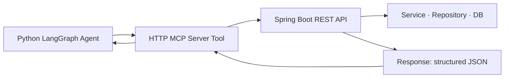

# 05.02 · Building MCP Integrations { #mcp-integrations }

> **Level:** Advanced  
> **Pre-reading:** [05 · MCP Servers](05-mcp-servers.md) · [05.01 · MCP Protocol](05.01-mcp-protocol.md)

---

## Custom JIRA MCP Server Design

For the JIRA→PR use case, a JIRA MCP server needs to expose:

| Tool | Description | Auth Required |
|:-----|:-----------|:-------------|
| `get_ticket` | Retrieve full ticket: summary, description, acceptance criteria, labels | JIRA API key (read) |
| `search_tickets` | JQL search — find related bugs or past resolutions | JIRA API key (read) |
| `add_comment` | Post agent progress update to ticket | JIRA API key (write) |
| `transition_ticket` | Move ticket to "In Progress" or "Review" status | JIRA API key (write) |

!!! warning "Separate Read and Write Credentials"
    Use two different JIRA API tokens: one read-only (for ticket search and retrieval) and one write-scoped (for comments and transitions). The agent should only be granted the write token after human confirmation is obtained.

---

## Custom GitHub MCP Server Design

For code reading and PR creation:

| Tool | Description | Scope Required |
|:-----|:-----------|:--------------|
| `list_repositories` | Find repos matching a service name | `repo:read` |
| `get_file_contents` | Read a file at a path and ref | `repo:read` |
| `search_code` | GitHub code search within an org | `repo:read` |
| `create_branch` | Create a feature branch | `repo:write` |
| `push_file` | Push a file change to a branch | `repo:write` |
| `create_pull_request` | Open a PR with title, body, reviewers | `pull_request:write` |
| `get_workflow_run` | Check CI status for a branch | `actions:read` |

**Token design:** Use a GitHub App (not a PAT) for production. GitHub Apps have fine-grained permissions per repository and generate short-lived tokens.

---

## Playwright MCP Server Design

For the CI test failure use case (Case 2):

| Tool | Description |
|:-----|:-----------|
| `get_test_report` | Read JUnit XML or Playwright HTML report from CI artifact |
| `get_failed_tests` | Extract failing test names and error messages from report |
| `get_test_code` | Read the Playwright test file for a given test name |
| `navigate_to_url` | Open a URL in a Playwright browser (for screenshot/replay) |
| `take_screenshot` | Capture current page state for RCA evidence |
| `get_network_log` | Extract API calls made during a test run |

---

## Spring Boot Integration Pattern

The Python agent calling a Spring Boot service is a common pattern:

The Spring Boot service exposes the domain logic cleanly; the agent uses it as a data source or action executor. This is the **human→machine** interface repurposed for **agent→service** use.

---

## Securing MCP Servers in CI/CD

| Environment | Auth Method |
|:-----------|:-----------|
| **Local dev** | User's `.env` file, stdio transport (no network exposure) |
| **CI/CD pipeline** | Short-lived GitHub Actions OIDC tokens, injected as env vars |
| **Cloud agent service** | Secrets manager (AWS Secrets Manager, Vault), rotated every 24h |
| **Multi-tenant SaaS** | Per-tenant API keys stored encrypted, passed at agent invocation |

Never hardcode credentials in MCP server source code. Never commit them to git. See [08 · Security](08-security.md).

---

??? question "Should everyone in the team have their own MCP server instance?"
    For development: yes, each developer runs their own local MCP server connecting to dev JIRA/GitHub. For CI/CD: a shared, hardened MCP server with a service account. For production automation: isolated per-workflow instances with minimal blast radius.

---

--8<-- "_abbreviations.md"
