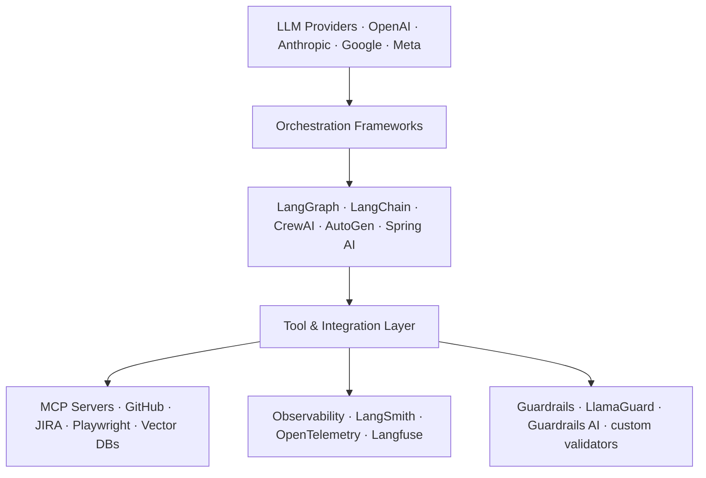

# 06 · AI Tool Ecosystem { #tool-ecosystem }

> **A landscape survey of the tools, platforms, and frameworks that make up the modern AI engineering stack.**

---

## The Full Stack

---

## LLM Provider Comparison

| Provider | Best Models | Context | Function Calling | Self-hosted |
|:---------|:-----------|:--------|:----------------|:-----------|
| **OpenAI** | GPT-4o, o3-mini | 128K | Yes, structured outputs | No |
| **Anthropic** | Claude 3.5 Sonnet, Claude 4 | 200K | Yes, tool use | No |
| **Google** | Gemini 1.5 Pro | 1M | Yes | Via Vertex AI |
| **Meta** | LLaMA 3.3 70B | 128K | Yes (via llama.cpp) | Yes |
| **Mistral** | Mistral Large 2 | 128K | Yes | Yes |
| **Cohere** | Command R+ | 128K | Yes, RAG-optimised | No |

---

## Orchestration Frameworks

| Framework | Language | Style | Best For |
|:----------|:---------|:------|:---------|
| **LangGraph** | Python | Explicit graph | Production agents, complex flow |
| **LangChain** | Python | Chain/pipe | RAG pipelines, simple agents |
| **CrewAI** | Python | Role-based agents | Multi-agent prototyping |
| **AutoGen** | Python | Conversational multi-agent | Research, prototyping |
| **Semantic Kernel** | C# / Python | Plugin-based | .NET ecosystem integration |
| **Spring AI** | Java | Spring-native | Java dev teams, Spring Boot |
| **Haystack** | Python | Pipeline-focused | Enterprise RAG, search |

---

## Vector Databases

| Database | Hosting | Max Scale | Spring / Java SDK |
|:---------|:--------|:---------|:-----------------|
| **Pinecone** | Managed | Billions | REST API |
| **Weaviate** | Self/cloud | Hundreds of millions | Java client |
| **Qdrant** | Self/cloud | Hundreds of millions | REST/gRPC |
| **ChromaDB** | Self | Millions (dev only) | REST API |
| **pgvector** | Postgres | Tens of millions | JDBC (Spring Data) |
| **OpenSearch/kNN** | Self/cloud | Billions | Spring Data OpenSearch |

→ **[Deep Dive: Coding Agents](06.01-coding-agents.md)**  
→ **[Deep Dive: JIRA Integration](06.02-jira-integration.md)**  
→ **[Deep Dive: CI/CD Integration](06.03-cicd-integration.md)**

---

## Evaluation & Observability Tools

| Tool | Purpose |
|:-----|:--------|
| **LangSmith** | Tracing, evaluation, prompt management for LangChain/LangGraph |
| **Langfuse** | Open-source LLM tracing, works with any framework |
| **Phoenix (Arize)** | LLM observability, prompt evaluation |
| **RAGAS** | RAG pipeline evaluation (faithfulness, relevance, recall) |
| **Braintrust** | Evaluation framework with human feedback loop |
| **Helicone** | LLM proxy with logging, cost tracking |

---

## Guardrails & Safety

| Tool | What It Checks |
|:-----|:--------------|
| **Guardrails AI** | Output schema validation, content filters, custom validators |
| **LlamaGuard** | LLM-based safety classifier for inputs and outputs |
| **NeMo Guardrails** | Conversational guardrails for topic and behaviour control |
| **PromptArmor** | Prompt injection detection |
| **Custom validators** | Post-process output, check diff size, validate syntax before applying |

---

## Dev Tooling (IDE Integration)

| Tool | What It Does | MCP Support |
|:-----|:------------|:-----------|
| **GitHub Copilot** | In-editor code completion and chat | Yes (Agent mode) |
| **Cursor** | AI-first IDE, context-aware editing | Yes (native MCP client) |
| **Aider** | CLI coding agent using git diff approach | Limited |
| **Continue.dev** | VS Code / JetBrains extension, custom models | MCP via config |
| **Codeium** | Free Copilot alternative, fast completions | No |

---

--8<-- "_abbreviations.md"
