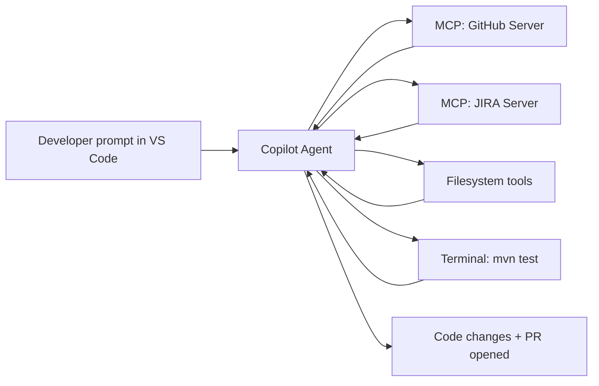
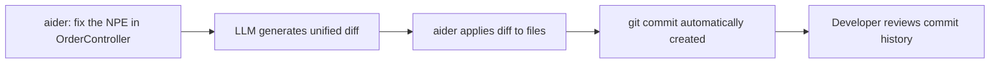

# 06.01 · GitHub Copilot & Coding Agents { #coding-agents }

> **Level:** Intermediate  
> **Pre-reading:** [06 · AI Tool Ecosystem](06-tool-ecosystem.md) · [05 · MCP Servers](05-mcp-servers.md)

---

## GitHub Copilot — Beyond Autocomplete

GitHub Copilot has evolved from line-by-line autocomplete into a full coding agent:

| Mode | What It Does |
|:-----|:------------|
| **Code completion** | Next-line and next-block suggestions in the editor |
| **Chat** | Ask questions about selected code, explain, refactor |
| **Inline chat** | Edit code in-place with natural language instructions |
| **Agent mode** | Multi-step tasks with MCP tool use, file creation, command running |
| **Code review** | PR-level review and suggestion generation |

---

## Copilot Agent Mode Architecture

In agent mode, Copilot is a full ReAct agent with access to:

- **Filesystem tools** — read, write, create files in the workspace
- **Terminal tools** — run commands (build, test, lint)
- **MCP tools** — any MCP server you configure in VS Code settings
- **GitHub tools** — search repos, read PRs, check issues



---

## Configuring MCP Servers in VS Code

```json
// .vscode/mcp.json
{
  "servers": {
    "github": {
      "command": "npx",
      "args": ["-y", "@modelcontextprotocol/server-github"],
      "env": { "GITHUB_PERSONAL_ACCESS_TOKEN": "${env:GITHUB_PAT}" }
    },
    "jira": {
      "command": "uvx",
      "args": ["mcp-jira"],
      "env": {
        "JIRA_URL": "${env:JIRA_URL}",
        "JIRA_TOKEN": "${env:JIRA_TOKEN}"
      }
    }
  }
}
```

!!! warning "Never commit tokens to git"
    Always use `${env:VAR_NAME}` syntax which reads from your shell environment, not hardcoded values in the JSON file. Add `.vscode/mcp.json` to `.gitignore` if it may contain environment references tied to your user.

---

## Coding Agent Patterns for Spring Boot

| Task | Agent Prompt Pattern |
|:-----|:--------------------|
| **Implement endpoint** | "Implement a POST /orders endpoint in order-service that validates the request against OrderRequest DTO and persists via OrderRepository" |
| **Fix failing test** | "Test OrderControllerTest.shouldCreateOrder is failing with NullPointerException. Find the root cause and fix it." |
| **Refactor service** | "Refactor PaymentService to use the Strategy pattern for payment method handling. Keep existing tests passing." |
| **Add observability** | "Add OpenTelemetry spans to all public methods in OrderService. Name spans with PRODUCT_NAME.SERVICE_METHOD format." |

---

## Aider — Git-Native CLI Agent

**Aider** is an open-source alternative that works entirely through git diffs:



**Why it's interesting:** Aider uses the git history as its state store — every change is a trackable commit. The developer can easily `git revert` if the agent went wrong. This aligns well with code review practices.

---

→ Deep Dive: [Custom Agent Workflows — `/analyze-requirement`, `/dev-agent`, `/review-pr`](06.04-custom-agent-workflows.md)

??? question "When should you use Copilot agent mode vs. a custom LangGraph agent?"
    Copilot agent mode is excellent for developer-interactive tasks in the IDE (implement a feature, fix a test, explain code). Custom LangGraph agents are better for fully automated pipelines triggered by CI/CD events, because you have full control over the loop, state, and human-in-the-loop gates. They're complementary: Copilot for developer workflow, LangGraph for automation pipelines.

---

--8<-- "_abbreviations.md"
