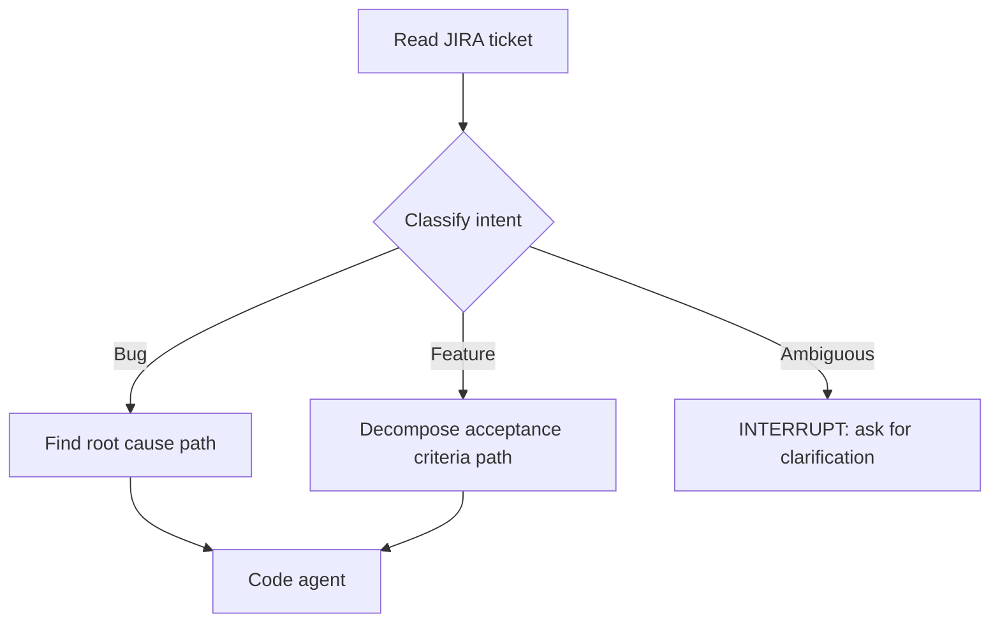
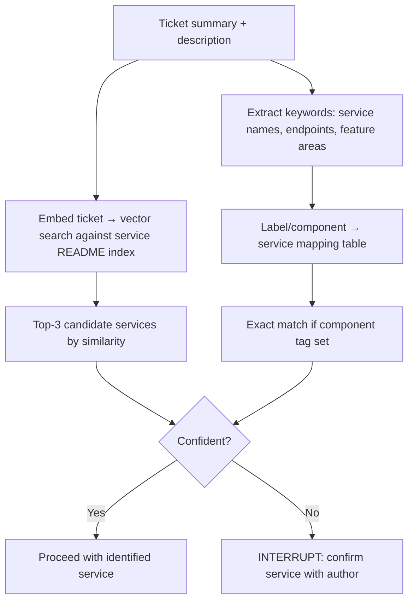

# 06.02 · JIRA & Issue Tracker Integration { #jira-integration }

> **Level:** Intermediate  
> **Pre-reading:** [06 · AI Tool Ecosystem](06-tool-ecosystem.md) · [05.02 · MCP Integrations](05.02-mcp-integrations.md)

---

## Why JIRA Integration Is Non-Trivial

JIRA tickets are written for humans — natural language, ambiguous phrasing, embedded context. A "bug" ticket might actually describe a feature request. "Not working" could mean 50 different things. A critical skill for the JIRA agent is **intent classification and clarification**.



---

## Ticket Information Model

| Field | How Agent Uses It |
|:------|:----------------|
| **Summary** | Quick classification, service identification |
| **Description** | Full context, reproduction steps, observed vs expected |
| **Acceptance Criteria** | Test case generation targets for features |
| **Labels / Components** | Direct mapping to microservice/team |
| **Priority** | Determines urgency of human escalation |
| **Linked issues** | Find related bugs, prior art, dependencies |
| **Comments** | May contain prior investigation hints |
| **Attachments** | Screenshots, log files, stack traces |

---

## Service Identification Strategy

Given a JIRA ticket, how does the agent identify which microservice to change?



---

## Acceptance Criteria Extraction

For feature tickets, the agent extracts structured acceptance criteria to generate test stubs:

```
Input description:
"As a user I want to be able to filter orders by date range.
AC1: Given date range, return orders with createdAt within range
AC2: Invalid date format returns 400
AC3: End date before start date returns 400"

Agent extracts:
[
  { "id": "AC1", "type": "happy_path", "test_name": "shouldReturnOrdersWithinDateRange" },
  { "id": "AC2", "type": "validation", "test_name": "shouldReturn400ForInvalidDateFormat" },
  { "id": "AC3", "type": "validation", "test_name": "shouldReturn400WhenEndDateBeforeStartDate" }
]
```

Each extracted criterion becomes a test method stub.

---

## JIRA Workflow Integration

| Agent Action | JIRA API | When |
|:-------------|:--------|:-----|
| Read ticket | `GET /rest/api/3/issue/{key}` | Start of agent run |
| Post progress | `POST /rest/api/3/issue/{key}/comment` | After each major step |
| Transition to "In Progress" | `POST /rest/api/3/issue/{key}/transitions` | When agent starts work |
| Link PR to ticket | `POST /rest/api/3/issue/{key}/remotelink` | After PR created |
| Transition to "In Review" | `POST /rest/api/3/issue/{key}/transitions` | After PR opened |

!!! tip "Remote Links"
    JIRA's Remote Links API lets you attach a GitHub PR link to a ticket with a status icon. This gives the product team visibility into where the agent left things without leaving JIRA.

---

??? question "How do you handle JIRA tickets written in poor quality — no reproduction steps, vague description?"
    The agent should evaluate ticket quality before proceeding. If critical fields (reproduction steps for bugs, acceptance criteria for features) are missing, interrupt the workflow and post a comment on the ticket listing exactly what information is needed. Never guess at requirements — a wrong assumption costs more to undo than to ask.

---

--8<-- "_abbreviations.md"
