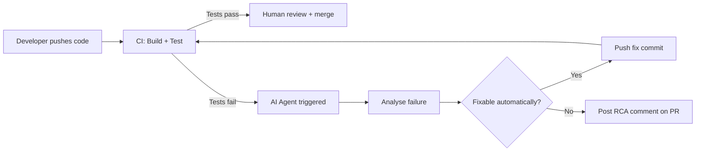

# 06.03 · CI/CD Integration { #cicd-integration }

> **Level:** Intermediate  
> **Pre-reading:** [06 · AI Tool Ecosystem](06-tool-ecosystem.md) · [05 · MCP Servers](05-mcp-servers.md)

---

## AI in the CI/CD Pipeline

CI/CD pipelines are where agent automation delivers the most value — failures are structured, outputs are deterministic, and the feedback loop is tight.



---

## GitHub Actions Integration Pattern

An AI agent can be triggered as a GitHub Actions workflow step:

```yaml
# .github/workflows/ai-fix-tests.yml
name: AI Test Failure Analysis
on:
  workflow_run:
    workflows: ["CI"]
    types: [completed]

jobs:
  analyze:
    if: ${{ github.event.workflow_run.conclusion == 'failure' }}
    runs-on: ubuntu-latest
    steps:
      - uses: actions/checkout@v4
      - name: Download test artifacts
        uses: actions/download-artifact@v4
        with:
          name: test-results
      - name: Run AI analysis agent
        env:
          ANTHROPIC_API_KEY: ${{ secrets.ANTHROPIC_API_KEY }}
          GITHUB_TOKEN: ${{ secrets.GITHUB_TOKEN }}
        run: |
          python scripts/analyze_failures.py \
            --report test-results/playwright-report.json \
            --pr ${{ github.event.workflow_run.pull_requests[0].number }}
```

---

## Test Report Parsing

The agent's first step is reading a structured test report:

| Report Format | Framework | Key Fields |
|:-------------|:---------|:-----------|
| JUnit XML | Maven Surefire, Spring Boot tests | `testcase[failure]`, `classname`, `name`, `message` |
| Playwright JSON | Playwright | `suites[].specs[].tests[].results[].status`, `error.message`, `error.stack` |
| Playwright HTML | Playwright | Human-readable, needs HTML parsing |
| Allure JSON | Multi-framework | Rich metadata including steps and attachments |

!!! tip "Structure Over Screenshots"
    Prefer JSON/XML test reports over HTML screenshots for agent input. Structured data is cheaper to process (fewer tokens) and more reliably parseable than HTML.

---

## Playwright-Specific Integration

| Failure Type | Agent Response |
|:-------------|:-------------|
| **Selector not found** | Check if UI component was renamed/restructured; update selector or report UI change |
| **API call returned 4xx/5xx** | Check service logs, identify if it's a test data issue or a real regression |
| **Timeout** | Check if page load regression, network issue, or flaky animation causing delay |
| **Assertion failure** | Compare expected vs actual, check if spec changed or feature regressed |
| **Network error** | Check if the service is up, inspect environment config |

The Playwright MCP server provides `get_network_log` and `take_screenshot` to gather evidence for each failure type.

---

## Scope Constraints for CI Agents

!!! warning "CI agents should never auto-merge"
    A CI agent can push a fix commit to the PR branch, but the PR merge must remain a human action. Configure branch protection rules to require at least one human reviewer approval before any merge, even for "AI-assisted" PRs.

| Action | Agent | Human |
|:-------|:------|:------|
| Analyse test failure | ✓ | |
| Post RCA comment on PR | ✓ | |
| Push fix commit to feature branch | ✓ | |
| Request PR review | ✓ | |
| Approve PR | | ✓ |
| Merge to main | | ✓ |
| Hotfix to production | | ✓ |

---

??? question "How do you prevent the AI agent from creating an infinite fix loop?"
    Track the number of AI-generated fix commits per PR. After 3 attempts without human approval, automatically comment "Unable to auto-fix — needs human investigation" and remove the agent from the loop. Store the attempt count in PR labels or a database keyed on the PR ID.

---

--8<-- "_abbreviations.md"
