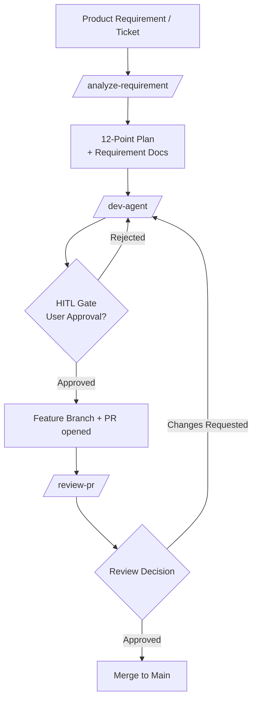
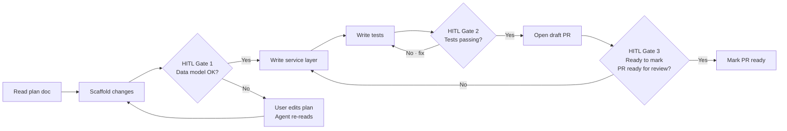
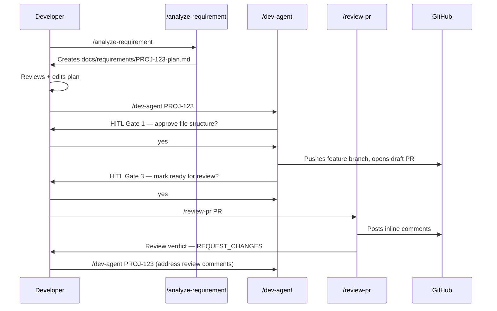
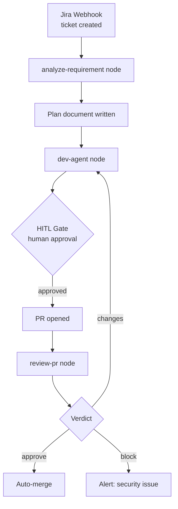

# 06.04 · Custom Agent Workflows — `/analyze-requirement`, `/dev-agent`, `/review-pr`

> **Level:** Intermediate · Advanced
> **Pre-reading:** [06 · AI Tool Ecosystem](06-tool-ecosystem.md) · [06.01 · GitHub Copilot & Coding Agents](06.01-coding-agents.md) · [02.01 · ReAct & Planning Loops](02.01-react-and-planning.md)

---

## What Are Custom Agent Workflows?

Modern AI-powered engineering teams split the software delivery lifecycle into specialised **agent modes**, each invoked as a slash command directly inside the IDE (e.g., GitHub Copilot Agent Mode or Cursor). Each mode is defined by a `.agent.md` or `.prompt.md` file that encodes a focused system prompt, tool permissions, and an expected output contract.

| Slash Command | Role | Primary Output |
|:--------------|:-----|:--------------|
| `/analyze-requirement` | Requirement analyst · Scrum Master | 12-point analysis plan + structured documents |
| `/dev-agent` | Senior developer · HITL orchestrator | Feature branch + PR + human approval gates |
| `/review-pr` | Code reviewer · Quality gatekeeper | Inline PR comments + approval/rejection verdict |

These three agents form a **pipeline**: the output of each stage is the primary input of the next.

---

## High-Level Pipeline Architecture



Every node in this graph is an independent agent that can be triggered manually — or wired together in an automated LangGraph / CI pipeline.

---

## Stage 1 · `/analyze-requirement`

### What It Does

This agent acts as a **requirements analyst**. When you pass it a raw Jira ticket, a feature request, or a design document, it produces a structured analysis artefact — typically a 12-point plan covering:

1. Problem statement (re-phrased in engineering terms)
2. Acceptance criteria (from PM language → testable assertions)
3. Affected services / modules
4. Data model changes
5. API contract additions / changes
6. Edge cases and error conditions
7. Security considerations
8. Performance / scalability implications
9. Test strategy (unit · integration · E2E)
10. Rollout and feature-flag strategy
11. Observability additions (logs, metrics, traces)
12. Open questions requiring human decision

### Agent Definition Pattern (`.agent.md`)

```markdown
---
name: analyze-requirement
description: Reads a requirement and produces a 12-point engineering analysis plan
tools: ["read_file", "fetch_webpage", "semantic_search"]
---

You are a senior staff engineer acting as a requirements analyst.

Given a requirement (Jira ticket text, Word doc, or free-text description):
1. Re-state the problem in precise engineering terms.
2. Extract explicit + implicit acceptance criteria as testable bullet points.
3. Identify all affected services, modules, and shared libraries in the codebase.
4. List every data model change required.
5. Define new or modified API contracts (REST, gRPC, events).
6. Enumerate edge cases and failure modes.
7. Flag security risks (auth, injection, PII exposure).
8. Estimate performance impact (latency, throughput, DB load).
9. Specify a test strategy covering unit, integration, and end-to-end.
10. Recommend a rollout strategy (feature flag, canary, blue-green).
11. List observability additions needed.
12. Surface open questions that require a human decision before coding starts.

Output each section as its own markdown heading.
Write the plan to `docs/requirements/{{ticket-id}}-plan.md`.
```

### Key Design Principle

The agent is **read-only with respect to production code** — it searches the existing codebase for context but never writes source files. This keeps Stage 1 safe and reversible.

---

## Stage 2 · `/dev-agent`

### What It Does

This agent is the **coding engine**. It reads the plan document produced in Stage 1 and implements the feature end-to-end:

- Creates or switches to a feature branch
- Writes source code, tests, and configuration
- Runs the build and test suite
- Pauses at **human-in-the-loop (HITL) gates** for critical decisions
- Opens a draft PR when complete

### HITL Gate Pattern

The dev-agent doesn't run blind. It stops and asks for confirmation at pre-defined decision points:



### Typical HITL Checkpoints

| Gate | What the Agent Shows | Human Decision |
|:-----|:--------------------|:--------------|
| **After scaffold** | Proposed file tree + data model diff | Approve structure before writing logic |
| **After first test run** | Test results summary | Approve to proceed or redirect |
| **Before PR** | Diff summary + coverage report | Approve PR creation |
| **Security flag** | Any secret / PII found in output | Must explicitly approve or reject |

### Agent Definition Pattern (`.agent.md`)

```markdown
---
name: dev-agent
description: Implements a feature from a requirements plan with HITL approval gates
tools: ["read_file", "create_file", "replace_string_in_file", "run_in_terminal",
        "ask_user", "github_create_branch", "github_create_pr"]
---

You are a senior software engineer implementing a feature from a plan document.

Workflow:
1. Read `docs/requirements/{{ticket-id}}-plan.md`.
2. Create feature branch: `feature/{{ticket-id}}-<short-name>`.
3. Scaffold the file structure. STOP and ask the user: "Does this structure look correct? (yes/no/edit)"
4. Implement service logic, repositories, controllers in order.
5. Write unit and integration tests. Run them. STOP if tests fail — show output and ask: "Should I fix these failures or adjust the plan?"
6. Run `mvn verify` (or equivalent). STOP if build fails.
7. STOP before creating PR: show a diff summary and ask: "Ready to open a draft PR? (yes/no)"
8. Open a draft PR with the ticket ID in the title and a generated description.
9. Ask: "Shall I mark this PR ready for review? (yes/no)"

Never push to main directly. Never suppress test failures silently.
```

---

## Stage 3 · `/review-pr`

### What It Does

This agent is a **code reviewer**. It checks out the feature branch, reads the diff, and produces a structured review that mirrors what a senior engineer would write:

- Summary of what changed and why
- Correctness issues (logic bugs, race conditions, missing null checks)
- Security issues (OWASP Top 10 scan against the diff)
- Test coverage gaps
- Style and naming inconsistencies
- Inline GitHub PR comments (posted via GitHub MCP)
- Final verdict: **Approve / Request Changes / Block**

### Agent Definition Pattern (`.agent.md`)

```markdown
---
name: review-pr
description: Reviews a feature branch PR and posts structured inline comments
tools: ["read_file", "semantic_search", "github_get_pr_diff",
        "github_post_review_comment", "github_submit_review"]
---

You are a senior code reviewer with expertise in security and distributed systems.

Given a PR number or branch name:
1. Fetch the full diff via the GitHub MCP tool.
2. Read the related plan doc in `docs/requirements/` for acceptance criteria.
3. For each changed file, check:
   - Logic correctness against acceptance criteria
   - Security (injection, broken auth, sensitive data exposure)
   - Test coverage (is every branch covered?)
   - Naming, readability, consistency with the rest of the codebase
4. Post inline comments on specific lines for each finding.
5. Write a review summary covering: what's good, what must change, what's optional.
6. Submit the review with verdict: APPROVE, REQUEST_CHANGES, or BLOCK (for security issues).

Block (do not approve) if any OWASP Top 10 violation is found.
```

---

## How the Three Agents Are Wired Together

### Manual Invocation (Developer-Driven)

The simplest wiring: each agent is triggered manually in sequence by the developer. The requirement document is the contract that passes between stages.



### Automated Pipeline (LangGraph Orchestration)

For fully automated flows (triggered by Jira webhook), the same three agents become LangGraph nodes:



---

## Design Principles Behind This Pattern

| Principle | How It's Applied |
|:----------|:----------------|
| **Separation of concerns** | Each agent has one clear job — no agent both analyses and codes |
| **Artefact-based handoff** | The plan document is the interface contract between stages — agents don't share memory |
| **HITL at risk boundaries** | Human approval gates are placed before irreversible actions (branch creation, PR, merge) |
| **Read-before-write** | Every agent reads the codebase for context before making any change |
| **Stateless agents** | Each agent can be re-run independently — idempotent where possible |
| **Tool minimisation** | `/analyze-requirement` has no write tools; `/review-pr` has no file-write tools — minimal blast radius |

---

## Implementing This Pattern in Your Team

### Step 1 — Define agent files

Create a `.github/agents/` or `.vscode/prompts/` directory with one `.agent.md` per command. Use the templates above as a starting point.

### Step 2 — Establish the requirements document schema

Agree on the 12-point plan structure as a team standard. Store plans in `docs/requirements/<ticket-id>-plan.md` in the repo so they're version-controlled alongside the code.

### Step 3 — Set HITL gate policy

Decide which gates are mandatory vs. skippable. Recommended minimums:

- Approve data model changes before code is written
- Approve PR creation before pushing
- Never auto-merge without review-pr passing

### Step 4 — Connect to your ticketing system

Use a JIRA or GitHub Issues MCP server so `/analyze-requirement` can read acceptance criteria directly from the ticket rather than requiring the developer to paste text.

### Step 5 — Tune per team / language

Customise the agent prompts for your tech stack (Spring Boot, Node, Python), naming conventions, and test frameworks. The agent definition files should live in the repo so they evolve with the codebase.

---

??? question "Why use three separate agents instead of one large agent?"
    One large agent would need to hold the entire software lifecycle in a single context window, making it harder to debug, tune, and trust. Separating concerns means each agent is focused, its outputs are predictable, and you can improve one stage without destabilising the others. The artefact-based handoff (the plan document) also forces a discipline checkpoint between stages.

??? question "What prevents the dev-agent from generating insecure code?"
    Two controls: (1) the `/review-pr` agent scans the diff for OWASP Top 10 violations and will block the PR, and (2) the HITL gates ensure a human reviews the structure and the PR summary before merge. For high-risk repos, you can also add a Guardrails AI output validator step after each code write in the dev-agent loop.

??? question "How do HITL gates map to LangGraph's interrupt mechanism?"
    Each HITL gate is implemented as a LangGraph `interrupt()` call inside the dev-agent node. The graph pauses, persists its state to a checkpointer (PostgreSQL or Redis), and resumes when the human sends an approval signal. This means the agent can survive process restarts between human interaction steps.

--8<-- "_abbreviations.md"
