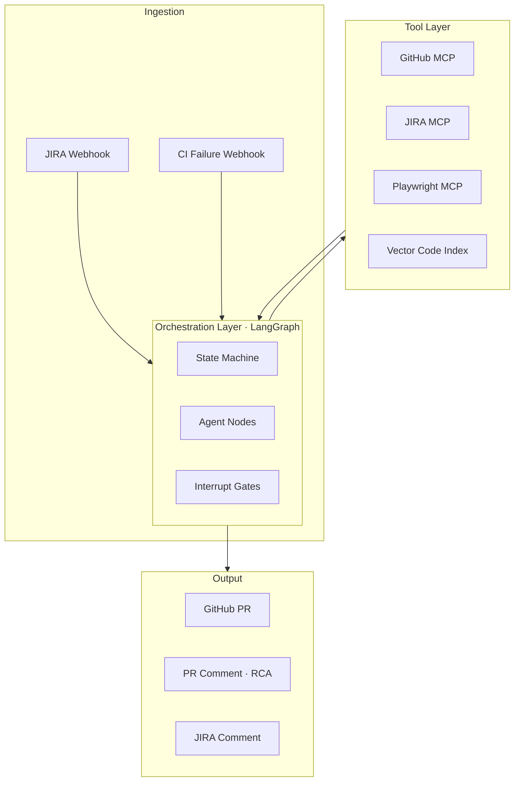

# 07 · Real-World Use Cases { #use-cases }

> **How the components from earlier sections combine to address real engineering workflow automation.**

---

## Use Case Overview

| Use Case | Trigger | Output | Human Gate |
|:---------|:--------|:-------|:-----------|
| **JIRA → Pull Request** | New ticket assigned to AI agent | GitHub PR with code + tests | PR review before merge |
| **Playwright RCA & Fix** | CI test failure | Fix commit or RCA document on PR | Developer reviews fix |
| **Spring Boot Code Generation** | Architect provides OpenAPI spec | Scaffold controller + service + tests | PR review |

---

## Architecture Overview — Both Cases

---

## Key Design Decisions

| Decision | Recommendation | Reason |
|:---------|:--------------|:-------|
| **LLM provider** | Claude 3.5 Sonnet or GPT-4o | Best instruction following for code tasks |
| **Orchestration** | LangGraph | Stateful, interrupt support, parallel branches |
| **Code index** | pgvector + nomic-embed-code | Simple, stays in existing Postgres |
| **Ticket integration** | JIRA MCP server | Portable, reusable across projects |
| **Human gate** | LangGraph interrupt before PR create | Non-negotiable safety constraint |
| **Storage** | PostgreSQL checkpointer | Resumable across server restarts |

---

→ **[Deep Dive: JIRA to Pull Request (Case 1)](07.01-jira-to-pr.md)**  
→ **[Deep Dive: Playwright RCA & Auto-Fix (Case 2)](07.02-playwright-rca.md)**  
→ **[Deep Dive: Spring Boot Code Generation](07.03-springboot-codegen.md)**

---

## What Else Can AI Automate?

Beyond the two primary use cases, the same stack supports:

| Capability | Trigger | Agent Output |
|:-----------|:--------|:------------|
| **Code review assistance** | PR opened | Inline review comments on security, style, coverage |
| **Documentation generation** | Code merged | Updated Confluence / README from code changes |
| **Dependency upgrade** | Security advisory | PR bumping dependency version with test validation |
| **On-call runbook execution** | PagerDuty alert | Diagnose, apply known fix, post incident summary |
| **API contract testing** | Spec changed | Generate and run contract tests between services |
| **Test gap detection** | Weekly scheduled | Identify code paths without test coverage, generate tests |
| **Sprint retrospective summary** | End of sprint | Read completed tickets, generate engineer-readable summary |

---

--8<-- "_abbreviations.md"
