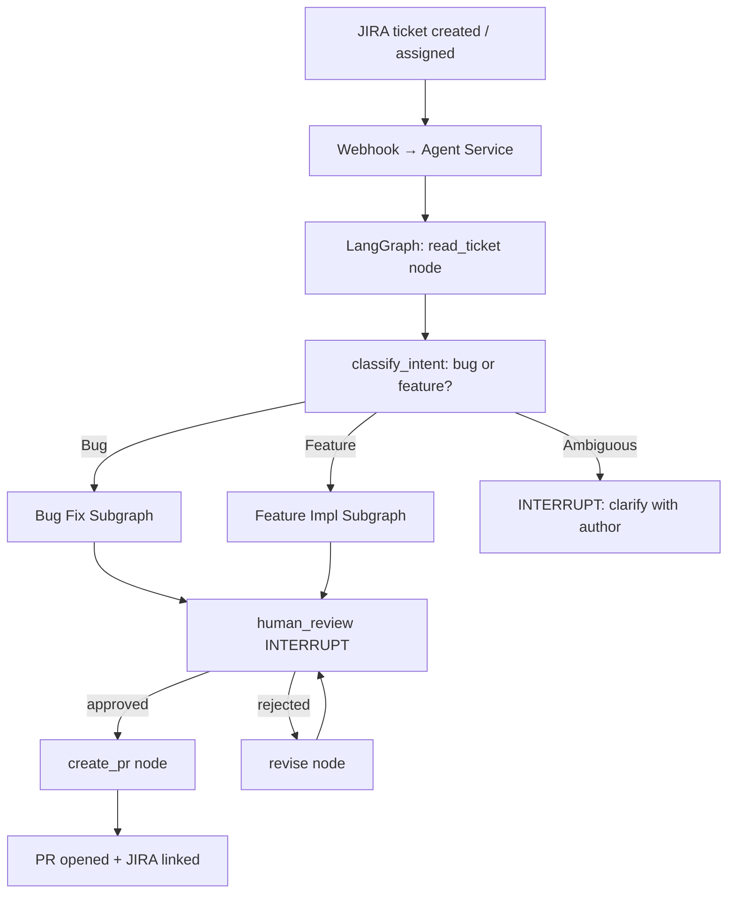
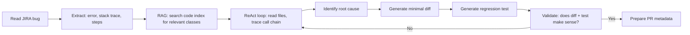
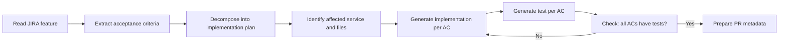

# 07.01 · JIRA to Pull Request — Deep Dive (Case 1) { #jira-to-pr }

> **Level:** Advanced  
> **Pre-reading:** [07 · Use Cases](07-use-cases.md) · [04.01 · LangGraph Deep Dive](04.01-langgraph-deep-dive.md) · [06.02 · JIRA Integration](06.02-jira-integration.md)

---

## Full System Architecture



---

## Bug Fix Subgraph



**Key constraint:** The diff must be **minimal**. Refactoring unrelated code in the same PR is a common agent failure mode. Add a diff size validator: if > 50 lines changed, flag for human review.

---

## Feature Implementation Subgraph



---

## State Design

```python
class JiraAgentState(TypedDict):
    # Input
    ticket_key: str
    ticket_data: dict   # full JIRA API response

    # Classification
    intent: str         # "bug" | "feature" | "ambiguous"
    service_name: str
    confidence: float

    # Retrieval
    retrieved_files: List[str]
    retrieved_context: str

    # Generation
    implementation_plan: List[str]
    code_diff: str
    tests_added: List[str]

    # Review
    review_status: str  # "pending" | "approved" | "rejected"
    reviewer_feedback: str

    # Output
    pr_url: str
    branch_name: str

    # Conversation
    messages: List[BaseMessage]
    iteration_count: int
```

---

## PR Structure

Every agent-generated PR should contain:

| Section | Content |
|:--------|:--------|
| **Title** | `fix(service): short description [JIRA-KEY]` or `feat(service): ...` |
| **Summary** | 2–3 sentences: what changed and why |
| **Root Cause** (bugs) | Explanation of why the bug occurred |
| **Changes Made** | Bullet list of files and what changed in each |
| **Tests Added** | Name and purpose of each new test |
| **Acceptance Criteria Coverage** (features) | Table: AC → test method mapping |
| **AI Generated Notice** | "This PR was generated by an AI agent. Please review carefully." |

---

## Failure Modes and Mitigations

| Failure | Cause | Mitigation |
|:--------|:------|:-----------|
| Wrong service identified | Ticket description vague, no component label | Ask for confirmation before proceeding |
| Diff touches unrelated code | Agent refactored opportunistically | Diff scope validator, max line change limit |
| Test only asserts the change, not the contract | Shallow test generation | Reflection: "Does this test actually verify the requirement?" |
| Agent hallucinates a method that doesn't exist | Weak RAG retrieval | Validate all referenced methods exist in retrieved code |
| PR created with a compilation error | No build validation | Run `mvn compile` as a tool before creating PR |

---

??? question "Should the agent run the tests before creating the PR?"
    Yes — if your CI infrastructure allows. Running `mvn test -pl order-service` before opening the PR catches obvious regressions. However, this requires the agent to have a working local build environment (Docker container with the right JDK and Maven). Add a `run_tests` tool and make the build result a gate before the `human_review` interrupt.

??? question "How do you handle tickets that require changes across multiple microservices?"
    Multi-service changes are high risk for an agent operating autonomously. The agent should detect cross-service scope (by checking if the implementation plan references more than one service) and immediately route to an interrupt: "This change spans multiple services. Human architect sign-off required before proceeding."

---

--8<-- "_abbreviations.md"
