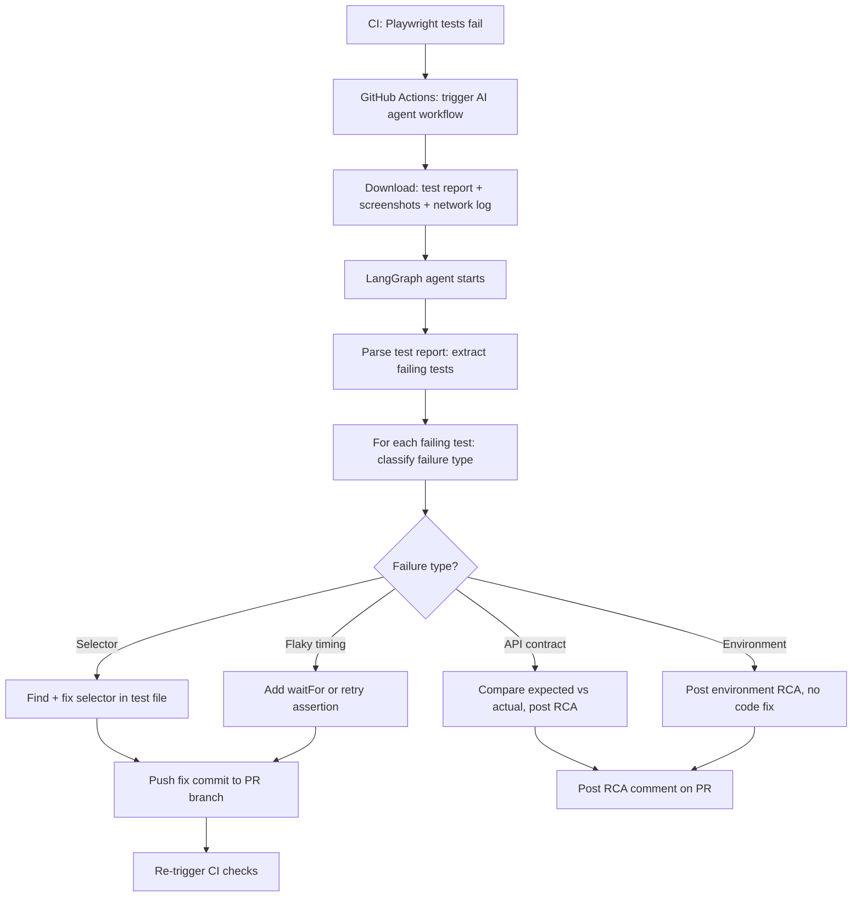
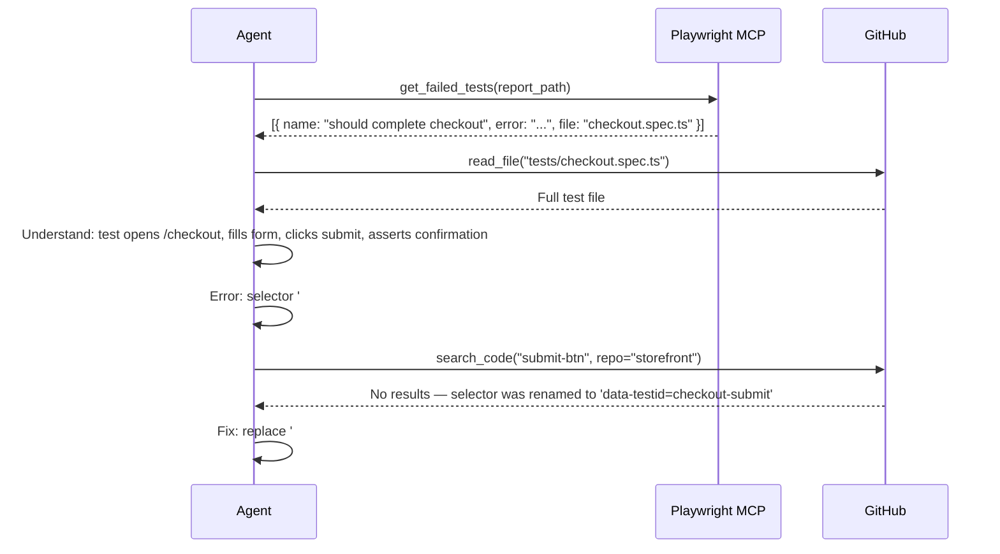

# 07.02 · Playwright RCA & Auto-Fix — Deep Dive (Case 2) { #playwright-rca }

> **Level:** Advanced  
> **Pre-reading:** [07 · Use Cases](07-use-cases.md) · [06.03 · CI/CD Integration](06.03-cicd-integration.md)

---

## The Problem

End-to-end tests written in Playwright are expensive to maintain. When they fail in CI, the investigation cycle is:
1. Developer sees failure in GitHub Actions
2. Clicks through to the report
3. Tries to reproduce locally
4. Traces back to root cause

This cycle takes 30–120 minutes per failure. An AI agent can do the analysis in < 2 minutes.

---

## Full Architecture



---

## Failure Classification

The agent reads the failure message and classifies before choosing a response:

| Failure Pattern | Classification | Agent Action |
|:----------------|:-------------|:------------|
| `locator.click: Timeout 30000ms exceeded` | Flaky / timing | Add explicit `waitFor`, then push fix |
| `expect(locator).toHaveText('...')` | Assertion failure | Check if feature regressed or spec changed |
| `net::ERR_CONNECTION_REFUSED` | Environment | Post env issue RCA, alert DevOps |
| `Response status: 404` | API change | Check endpoint, update test or report broken API |
| `Response status: 500` | Backend error | Pull service logs, generate RCA |
| `strict mode violation: ... resolved to 3 elements` | Selector ambiguous | Fix selector to be more specific |

---

## Playwright Test Code Analysis

The agent reads the failing test to understand intent:



---

## RCA Document Structure

When the agent can identify but not automatically fix the root cause, it generates an RCA document posted as a PR comment:

```markdown
## 🤖 AI Test Failure Analysis — checkout.spec.ts

**Failing Test:** `should complete checkout flow`  
**Failure Type:** API Contract Break  
**Confidence:** High

### Root Cause
The `/api/v2/orders` endpoint now returns `orderReference` in the response body
instead of `orderId`. The Playwright test asserts `response.orderId` which is undefined.

### Evidence
- Network log shows `POST /api/v2/orders` → 201 response: `{ "orderReference": "ORD-123" }`
- Test assertion: `expect(response.orderId).toBeDefined()` → fails

### Contributing Factor
No contract test between checkout-ui and order-service. API change in PR #847 was not
reflected in the E2E test.

### Recommended Fix
1. Update Playwright test to use `orderReference` instead of `orderId`
2. Add a Pact contract test for this API response schema to prevent future regressions

### Linked PR
The API change was introduced in: #847
```

---

## Metrics and Continuous Improvement

Track agent performance over time:

| Metric | Target |
|:-------|:-------|
| Failures correctly classified | > 90% |
| Auto-fixes that pass CI | > 70% |
| RCA documents rated useful by developer | > 80% |
| Average time from CI failure to agent response | < 3 minutes |
| Reduction in developer investigation time | > 60% |

---

??? question "How do you prevent the agent from masking real bugs by just updating test assertions?"
    Add a rule to the system prompt: "Never change an assertion to match a broken application behaviour. Only fix test selectors, wait conditions, and test data issues. If an assertion mismatch suggests a potential regression, classify as 'assertion failure' and generate an RCA instead." Enforce this with an output validator that flags assertion changes for human review.

??? question "Can the agent replay a failed Playwright test to gather more evidence?"
    Yes — using the Playwright MCP server, the agent can navigate to the URL, interact with the page, and capture screenshots and network logs in a sandboxed environment. This is more expensive (requires a browser environment) but provides much richer evidence, especially for timing-sensitive failures.

---

--8<-- "_abbreviations.md"
