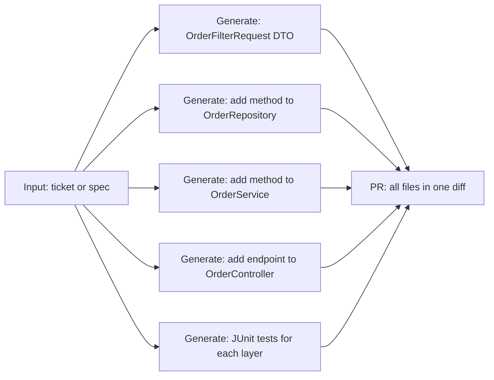

# 07.03 · Spring Boot Code Generation { #springboot-codegen }

> **Level:** Advanced  
> **Pre-reading:** [07 · Use Cases](07-use-cases.md) · [06.01 · Coding Agents](06.01-coding-agents.md)

---

## The Opportunity

For backend teams, the most repetitive and mechanical coding work is scaffolding new features:

- Controller → Service → Repository → DTO pattern is identical across features
- JUnit test structure is highly consistent
- Spring annotations are well-documented and predictable

AI excels at this level of repetition. The developer's value is in **design decisions**, not in typing `@RestController`.

---

## Generation Triggers

| Trigger | Input | What Gets Generated |
|:--------|:------|:------------------|
| **OpenAPI spec** | YAML/JSON spec file | Full Spring Boot CRUD implementation |
| **JIRA feature ticket** | Ticket with acceptance criteria | Targeted feature implementation |
| **Existing endpoint** | "Add endpoint similar to X but for Y" | New endpoint following existing patterns |
| **Database schema** | SQL DDL | JPA entity + repository + basic CRUD service |

---

## Code Generation Scope

For a new feature (e.g., "Add date range filter to GET /orders"):



---

## Spring Boot–Specific Prompt Patterns

The system prompt must encode your team's Spring Boot conventions:

```
You generate Spring Boot 3.x code following these conventions:
- Use @RestController with explicit @RequestMapping
- Service layer returns Page<T> for paginated results
- Use @Validated on request body parameters, not in the service layer
- Repository methods use QueryDSL predicates, not JPQL strings
- Exception handling via @ControllerAdvice in a shared module — never in controllers
- All tests use @SpringBootTest with @ActiveProfiles("test")
- Test data management via @Sql annotation with TestContainers
- Logging via SLF4J — never use System.out.println

When generating test cases:
- One @Test method per acceptance criterion
- Use Mockito, never manual mock classes
- Assert both happy path and error cases
```

The more precise your conventions, the less the agent drifts into styles you don't use.

---

## Validation Steps Before PR

The agent should locally validate generated code before raising a PR:

| Check | Tool | Pass Condition |
|:------|:-----|:-------------|
| Compilation | `mvn compile` | Zero errors |
| Static analysis | `mvn checkstyle:check` | Zero violations |
| Unit tests | `mvn test` | All tests pass |
| Code coverage | `mvn jacoco:report` | > 80% line coverage on new code |

!!! tip "Use a Docker Container"
    Run these validation steps inside a Docker container with the right JDK, Maven, and test DB (TestContainers). This prevents the agent from being blocked by local environment differences and enables the same validation step in CI.

---

## What the Agent Should NOT Generate

| Concern | Rule |
|:--------|:----|
| **Security** | Never generate endpoints without authentication annotations |
| **Data access** | Never generate native SQL queries — use JPA or QueryDSL |
| **Credentials** | Never generate code with hardcoded tokens, passwords, or keys |
| **Architecture** | Never generate a new microservice from scratch — only add to existing ones |
| **Schema changes** | Generate Flyway migration scripts, never modify schema directly |

These should be expressed as explicit constraints in the system prompt AND validated in the output validator node.

---

??? question "How do you keep the agent's generated code aligned with pattern changes over time?"
    Your system prompt encoding conventions must be kept up to date. Treat it like production documentation — review quarterly and update when the team adopts new patterns. Consider storing conventions in a versioned file (`conventions.md`) that is injected into the system prompt from the RAG index, so it auto-updates as the team documents changes.

---

--8<-- "_abbreviations.md"
