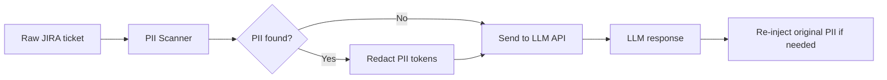
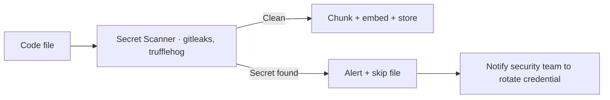

# 08.02 · Data Privacy in AI Pipelines { #data-privacy }

> **Level:** Advanced  
> **Pre-reading:** [08 · AI Security](08-security.md)

---

## What Data Flows Through Your AI Pipeline?

Before building, audit every data type your agent touches:

| Data Type | Sensitivity | Where It Goes |
|:----------|:-----------|:-------------|
| JIRA ticket description | Low–Medium | Sent to LLM API |
| Source code | High (IP) | Sent to LLM API |
| Test code | Medium | Sent to LLM API |
| Stack traces | Medium (architecture exposure) | Sent to LLM API |
| API credentials in code | Critical | Must NEVER reach LLM API |
| PII in JIRA tickets | High (GDPR) | Must be redacted before LLM API |
| Customer data in test payloads | Critical | Must NEVER be in test fixtures |

---

## PII Detection and Redaction

Before sending any data to an external LLM API, scan for PII:

**PII categories to detect and redact:**

- Email addresses → `[EMAIL]`
- Phone numbers → `[PHONE]`
- Names in bug descriptions → `[NAME]`
- Customer IDs that might imply personal data → `[CUSTOMER_ID]`
- IP addresses → `[IP_ADDRESS]`

Tools: **Microsoft Presidio** (open source), **AWS Comprehend** (managed PII detection).

---

## Credential Scanning Before RAG Indexing

Your codebase may contain accidentally committed secrets. Scan before indexing:

**Never index a file with a detected credential** — it would be embedded and potentially surfaced to the LLM in retrieved context.

---

## Data Residency and Model Selection

| Scenario | Recommended Approach |
|:---------|:--------------------|
| Public/open source codebase | Any cloud LLM API |
| Internal codebase, no compliance constraints | Cloud LLM with enterprise API agreement |
| Financial or healthcare regulated codebase | Self-hosted LLM (LLaMA, Mistral) or Azure OpenAI with data residency |
| Code containing military or government IP | Air-gapped, fully self-hosted |

---

## Self-Hosted LLM Stack

For organisations that cannot send code to external APIs:

| Component | Open Source Option |
|:----------|:-----------------|
| **LLM inference** | Ollama (local), vLLM (GPU server), llama.cpp |
| **Model** | LLaMA 3.3 70B, Mistral Large, DeepSeek Coder |
| **Embedding** | nomic-embed-text (Ollama), sentence-transformers |
| **Vector DB** | Qdrant (self-hosted), pgvector |
| **Orchestration** | LangGraph (no cloud dependency in the framework itself) |

!!! warning "Quality Trade-off"
    Self-hosted models at the 7B–70B parameter range are noticeably weaker than GPT-4o or Claude for complex code reasoning tasks. Test your specific use cases thoroughly before committing to self-hosted. A hybrid approach (self-hosted for context retrieval, cloud API only for code generation with redacted context) can be a middle ground.

---

??? question "Does OpenAI train on API call data?"
    As of their current data usage policy, OpenAI does not use API data to train models by default. This can be confirmed via their zero-data-retention agreement available to enterprise customers. Always check the current policy before relying on this — it can change.

??? question "How do you handle sensitive customer data that appears in bug reproduction steps?"
    Add an explicit check in the ticket ingestion node: if the ticket description contains what appears to be real customer data (PII scanner hit), interrupt the workflow and ask the ticket author to replace it with anonymised test data. Post a JIRA comment explaining why. Never pass real customer data to the LLM pipeline.

---

--8<-- "_abbreviations.md"
