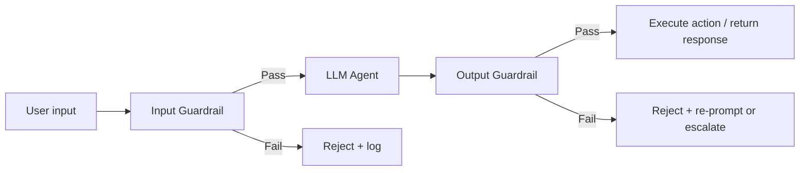
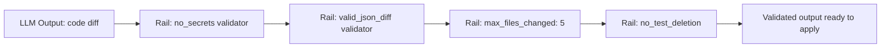

# 08.03 · Guardrails & Policy Enforcement { #guardrails }

> **Level:** Advanced  
> **Pre-reading:** [08 · AI Security](08-security.md) · [08.01 · Prompt Injection](08.01-prompt-injection.md)

---

## What Are Guardrails?

**Guardrails** are validation layers that inspect agent inputs and outputs before they cause effects. They enforce your organisation's policies programmatically, not by trusting the LLM to behave correctly.



Never assume the LLM will follow your system prompt instructions perfectly. Guardrails are independent validators.

---

## Input Guardrails

| Guard | What It Checks | Action |
|:------|:--------------|:-------|
| **PII detector** | JIRA/ticket contains customer PII | Block + ask for anonymised replacement |
| **Secret detector** | Input contains API key / password pattern | Block immediately + alert security |
| **Injection detector** | Known prompt injection patterns in text | Block + log as potential attack |
| **Scope validator** | Ticket references a service the agent can't touch | Block + escalate to human |
| **Language filter** | Input language match (English-only agents) | Reject non-matching language |

---

## Output Guardrails

| Guard | What It Checks | Action |
|:------|:--------------|:-------|
| **Diff scope validator** | Code changes outside allowed service directories | Reject + re-prompt with stricter constraints |
| **Secret output detector** | Generated code contains hardcoded secrets | Reject immediately |
| **Diff size limiter** | Diff > N lines (threshold for review) | Route to human review instead of auto-PR |
| **Build validator** | Code change compiles successfully | Reject if compilation fails |
| **Security linter** | OWASP-category issues in generated code (via SpotBugs, SonarQube) | Flag for human review |
| **Test coverage** | New code has adequate test coverage | Reject if < threshold |

---

## Guardrails AI Framework

**Guardrails AI** is a Python library for defining structured validators on LLM outputs:



Each validator returns `pass`, `fix` (automatic correction), or `fail` (reject and re-prompt). String up multiple validators in a pipeline.

---

## Human Escalation Tiers

| Condition | Escalation Path |
|:----------|:---------------|
| Injection attempt detected | → Security team alert (email + Slack) |
| Diff scope violation | → Tech lead for ticket's team |
| Compilation failure after 3 retries | → Ticket author + agent team lead |
| Cross-service change detected | → Architect sign-off required |
| Sensitive file access (secrets, config) | → Security team + DevOps |
| Cost anomaly (> 10x normal token usage) | → Platform engineering alert |

---

## Policy as Code

Define agent behaviour policy in a versioned config file, not hardcoded in prompts:

```yaml
# agent-policy.yaml
max_iterations: 20
max_diff_lines: 100
max_files_changed: 10
allowed_service_dirs:
  - order-service/
  - notification-service/
forbidden_file_patterns:
  - "**/*.env"
  - "**/secrets/**"
  - "**/.github/workflows/**"
require_tests: true
min_test_coverage: 0.80
require_human_approval_for_pr: true
auto_merge_enabled: false
```

Load this config at agent startup and use it in both the system prompt construction and output validators.

---

??? question "How do you handle a guardrail that keeps blocking legitimate code changes?"
    Treat guardrails like application tests — if they emit false positives, tune them rather than disabling them. For the diff size limiter: if legitimate refactors regularly exceed the limit, raise the threshold and add a "large change" label to the resulting PR instead of blocking. Document all guardrail tuning decisions with rationale.

---

--8<-- "_abbreviations.md"
