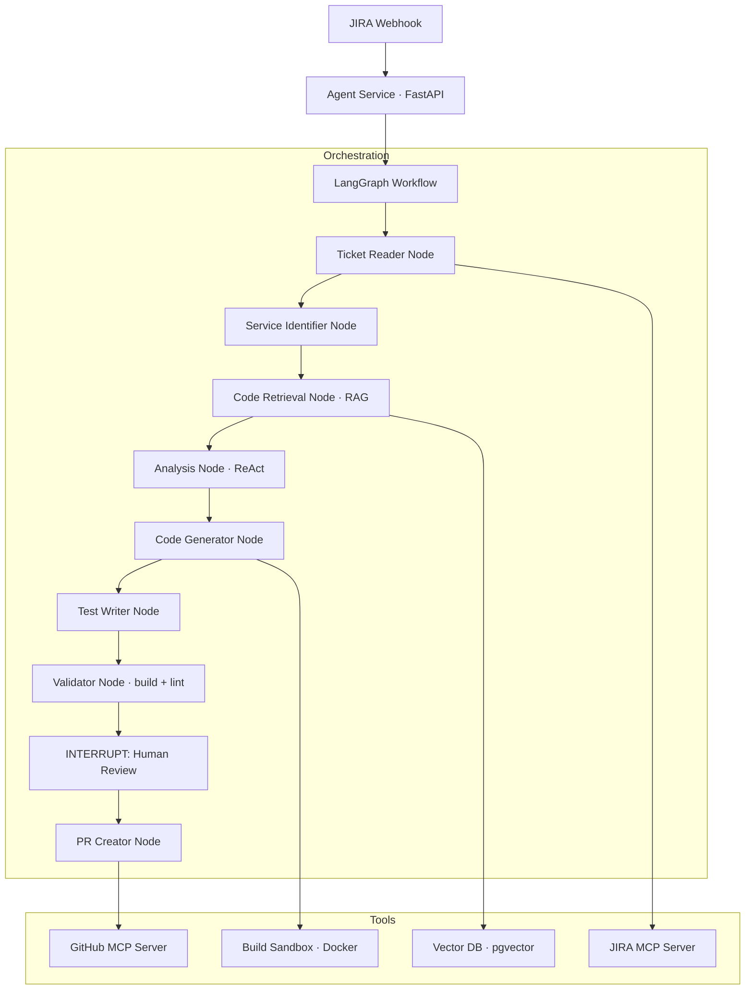
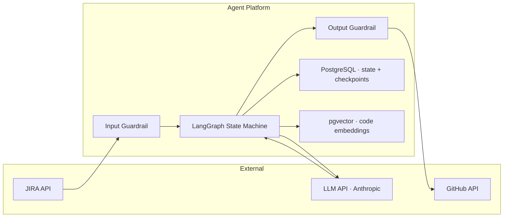

# 09 · Architecture Patterns Reference { #architecture-patterns-reference }

> **Quick reference for the architectural patterns that underpin production AI systems.**

---

## System Architecture Patterns

| Pattern | Description | When to Use |
|:--------|:-----------|:-----------|
| **Agentic Loop** | LLM + tools in a perception-plan-act cycle | Any multi-step autonomous task |
| **RAG Pipeline** | Retrieval-augmented generation with vector search | Knowledge that changes frequently |
| **Human-in-the-Loop (HITL)** | Interrupt workflow for human approval | Irreversible actions |
| **Plan-and-Execute** | Separate planning from execution agents | Long, structured tasks |
| **Reflection** | Agent critiques and revises its own output | High-stakes generation |
| **Supervisor-Worker** | Orchestrator delegates to specialist agents | Multi-domain pipelines |
| **Event-Driven Agent** | Agent triggered by webhooks (CI, JIRA) | Automation pipelines |
| **Offline RAG Indexing** | Background process keeps vector index fresh | Large, changing codebases |

---

## Component Selection Matrix

| Need | Recommended Component |
|:-----|:---------------------|
| LLM for code generation | Claude 3.5 Sonnet or GPT-4o |
| LLM for fast/cheap tasks | GPT-4o-mini or Claude Haiku |
| Self-hosted LLM | LLaMA 3.3 70B via Ollama or vLLM |
| Orchestration / graph | LangGraph |
| Java-native AI integration | Spring AI |
| Vector DB (simple) | pgvector (Postgres extension) |
| Vector DB (scale) | Weaviate or Qdrant |
| Code embedding | nomic-embed-code |
| Text embedding | text-embedding-3-large (OpenAI) |
| Reranking | Cohere Rerank-3 |
| JIRA integration | JIRA MCP Server |
| GitHub integration | GitHub MCP Server |
| Tracing/observability | LangSmith or Langfuse |
| Guardrails | Guardrails AI |
| PII detection | Microsoft Presidio |
| Secret detection | gitleaks or TruffleHog |

---

## End-to-End Architecture: JIRA → PR

---

## Data Flow Diagram

---

## Capacity Planning

| Component | Key Metric | Typical Values |
|:----------|:----------|:--------------|
| **LLM API** | Tokens per run | 20K–100K tokens per JIRA ticket |
| **Vector DB** | Documents indexed | 100K–10M chunks for large codebases |
| **RAG retrieval** | Tokens per retrieval call | 500–2000 tokens per chunk |
| **Build validation** | Docker execution time | 1–5 minutes per service |
| **Full run time** | End-to-end latency | 3–15 minutes per JIRA ticket |
| **Cost per run** | API costs | $0.05–$2.00 per ticket (model-dependent) |

---

--8<-- "_abbreviations.md"
