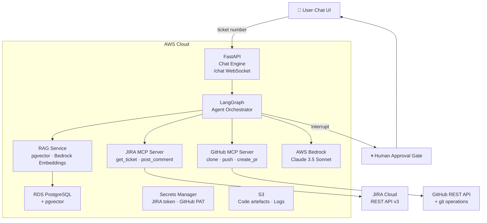

# TaskMaster AI Demo — Project Overview

> **Level:** Intermediate · Advanced
> **Pre-reading:** [02 · Agentic AI](../02-agentic-ai.md) · [04 · LangGraph](../04-langgraph.md) · [05 · MCP Servers](../05-mcp-servers.md)

This section documents a **fully working demo** of the AI-Powered Development Automation platform. A conversational chat agent accepts a JIRA ticket number, clones a GitHub repository, identifies the correct module to modify, generates and commits code changes, and opens a Pull Request — with human approval gates at every critical step.

---

## What This Demo Builds

```
User types: "Work on TASK-42"
    ↓
Agent fetches JIRA ticket, classifies it (bug / story)
    ↓
Agent RAG-searches the codebase → identifies affected module
    ↓
Agent generates code diff + tests
    ↓
⏸ HUMAN GATE: "Here's the proposed change. Approve to proceed?"
    ↓
Agent commits to branch, pushes, opens GitHub PR
    ↓
Agent posts summary back to JIRA ticket
    ↓
User sees: "PR #17 created → https://github.com/..."
```

---

## Demo Project: "TaskMaster"

A minimal but realistic multi-module Java project hosted on GitHub with three modules:

| Module | Type | Purpose |
|---|---|---|
| `taskmaster-core` | Spring Boot library | Domain entities, repository interfaces, service layer |
| `taskmaster-api` | Spring Boot web app | REST controllers, DTOs, OpenAPI spec |
| `taskmaster-e2e` | Playwright (Node.js) | End-to-end CTF/smoke test suite |

Two pre-configured JIRA tickets drive the demo:

| Ticket | Type | Title |
|---|---|---|
| `TASK-101` | 🐛 Bug | Fix NullPointerException in TaskService when task has no assignee |
| `TASK-102` | ✨ Story | Add `dueDate` field to Task entity and expose via REST API |

---

## End-to-End Architecture



---

## Cloud Services: AWS, GCP, Azure

### AWS (Primary Example)

| Service | Role |
|---|---|
| **Amazon Bedrock** | LLM inference (Claude 3.5 Sonnet) + Titan Embeddings for RAG |
| **Amazon RDS (PostgreSQL + pgvector)** | Vector store for code embeddings + LangGraph checkpoint state |
| **Amazon ECS (Fargate)** | Containerised FastAPI chat engine + MCP sidecar servers |
| **AWS Lambda** | JIRA webhook receiver, re-indexing trigger on push events |
| **Amazon API Gateway** | Public HTTPS endpoint for webhooks + chat WebSocket |
| **AWS Secrets Manager** | JIRA API token, GitHub PAT, DB credentials |
| **Amazon S3** | Code artefact storage, diff snapshots, log archive |
| **AWS IAM** | Role-based access control for all service-to-service calls |
| **Amazon CloudWatch** | Logs, metrics, alarms |

### GCP Equivalent Stack

| Service | Role | AWS Equivalent |
|---|---|---|
| **Vertex AI (Gemini)** | LLM inference + embeddings | Bedrock |
| **Cloud SQL (PostgreSQL + pgvector)** | Vector store + checkpoints | RDS |
| **Google Kubernetes Engine (GKE)** | Container orchestration | ECS |
| **Cloud Functions** | Serverless compute | Lambda |
| **Cloud Load Balancing** | HTTP/WebSocket endpoints | API Gateway |
| **Secret Manager** | Credentials storage | Secrets Manager |
| **Cloud Storage** | Object storage | S3 |
| **Cloud IAM** | Access control | IAM |
| **Cloud Logging** | Logs, metrics, alerts | CloudWatch |

### Azure Equivalent Stack

| Service | Role | AWS Equivalent |
|---|---|---|
| **Azure OpenAI (GPT-4)** | LLM inference | Bedrock |
| **Azure OpenAI (Ada)** | Embeddings | Titan Embeddings |
| **Azure Database for PostgreSQL** | Vector store + checkpoints | RDS |
| **Azure Kubernetes Service (AKS)** | Container orchestration | ECS |
| **Azure Functions** | Serverless compute | Lambda |
| **Azure App Service** | WebSocket endpoints | API Gateway |
| **Azure Key Vault** | Credentials storage | Secrets Manager |
| **Azure Blob Storage** | Object storage | S3 |
| **Azure RBAC** | Access control | IAM |
| **Azure Monitor** | Logs, metrics, alerts | CloudWatch |

### Cost Comparison (Estimated monthly for typical workload)

| Component | AWS | GCP | Azure |
|---|---:|---:|---:|
| **LLM inference** (1M tokens) | $3–5 | $2–4 | $4–6 |
| **Embeddings** (1M vectors) | $0.50–1 | $0.20–0.50 | $0.50–1.50 |
| **Vector DB** (100K vectors) | $50–100 | $40–80 | $60–120 |
| **Secrets** (2 secrets) | $1 | $0.12 | $1 |
| **Compute (ECS/GKE/AKS)** | $100–200 | $80–150 | $100–220 |
| **Total (base)** | **$154–307** | **$122–235** | **$165–348** |

**Recommendation:** GCP is typically 15–20% cheaper for this workload. All three are suitable for production.

---

## Documentation Index

### Decision Guides (Start Here)
| File | What It Covers |
|---|---|
| **[MCP Servers vs. Direct API Calls](MCP-vs-Direct-API-Comparison.md)** | **MUST READ:** Pros/cons comparison, security, performance, credentials management |
| **[Implementation Quick-Start](Implementation-Quickstart.md)** | **YOUR ROADMAP:** Option A (direct), Option B (MCP), Option C (hybrid). Code examples included. |

### Multi-Cloud Implementation (No Vendor Lock-In)
| File | What It Covers |
|---|---|
| **[Multi-Cloud MCP Servers](06-multi-cloud-mcp.md)** | **AWS/GCP/Azure code — credentials, embeddings, LLM abstraction** |
| **[Multi-Cloud Deployment](06.01-multicloud-deployment.md)** | **Step-by-step: Deploy to AWS, GCP, Azure with identical agent code** |
| **[Cloud Equivalency Reference](Cloud-Equivalency-Reference.md)** | **Quick lookup: AWS ↔ GCP ↔ Azure service mapping** |

### Technical Deep-Dives (Cloud-Specific)
| # | File | What It Covers |
|---|---|---|
| 01 | [AWS Infrastructure Setup](01-aws-infra.md) | Step-by-step AWS resource provisioning |
| 02 | [TaskMaster Repo Structure](02-taskmaster-repo.md) | Spring Boot + Playwright module layout and key files |
| 03 | [JIRA Setup](03-jira-setup.md) | Personal JIRA Cloud account, tickets, webhooks |
| 04 | [GitHub Setup](04-github-setup.md) | Repo, branch protection, PAT, PR templates |
| 05 | [RAG Code Indexing](05-rag-indexing.md) | Embedding pipeline, pgvector schema, retrieval |
| 06 | [LangGraph Agent Design](06-langgraph-agent.md) | State machine, nodes, edges, interrupts |
| 07 | [MCP Servers](07-mcp-servers.md) | JIRA MCP + GitHub MCP server setup (AWS reference) |
| 08 | [Chat Engine](08-chat-engine.md) | FastAPI WebSocket, session management, streaming |
| 09 | [Human-in-the-Loop Design](09-hitl-design.md) | Interrupt triggers, approval flows, transcripts |
| 10 | [End-to-End Flow Walkthrough](10-e2e-flow.md) | Full sequence for bug fix + story implementation |
| 11 | [Demo Script](11-demo-script.md) | Facilitator guide, exact inputs, fallback talking points |

---

## Prerequisites

Before starting:

- [ ] AWS account with Bedrock access enabled (Claude 3.5 Sonnet)
- [ ] Personal JIRA Cloud account (free tier is fine: `https://yourname.atlassian.net`)
- [ ] GitHub account with a new empty repository
- [ ] Docker Desktop installed locally
- [ ] Python 3.11+ and Node.js 20+ installed
- [ ] AWS CLI configured (`aws configure`)

---

??? question "Why use AWS Bedrock instead of the OpenAI API directly?"
    Bedrock keeps all LLM traffic inside the AWS network — no data leaves your VPC. It also means you can use IAM roles for auth instead of managing API keys. For enterprise demos this is a significant security and compliance argument.

??? question "Why three modules instead of a single Spring Boot app?"
    Multi-module projects test the agent's ability to correctly identify *which* module needs to change. A bug in the service layer (`taskmaster-core`) should not touch the API layer (`taskmaster-api`). This is a key real-world skill the agent must demonstrate.

??? question "Can this demo run without AWS? Locally only?"
    Yes — swap Bedrock for Ollama (local LLM), swap RDS for a local PostgreSQL instance, and swap ECS/Lambda for local Docker Compose. The LangGraph agent code is identical. See [10 · End-to-End Flow](10-e2e-flow.md) for the local runbook.

--8<-- "_abbreviations.md"

