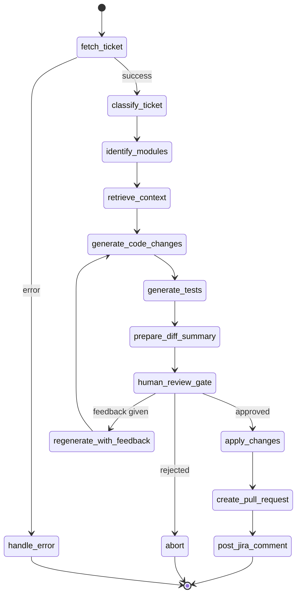

# LangGraph Agent Design

> **Level:** Advanced
> **Pre-reading:** [00 · Demo Overview](00-overview.md) · [04.01 · LangGraph Deep Dive](../04.01-langgraph-deep-dive.md)

This document details the LangGraph state machine that orchestrates the entire JIRA-to-PR automation flow — from ticket fetch through code generation to PR creation.

---

## Agent State Schema

```python
from typing import TypedDict, Annotated, Optional
from langgraph.graph.message import add_messages

class AgentState(TypedDict):
    # Input
    ticket_key: str
    thread_id: str
    
    # Ticket info (fetched from JIRA)
    ticket_summary: str
    ticket_description: str
    ticket_type: str           # "Bug" | "Story"
    ticket_labels: list[str]
    acceptance_criteria: list[str]
    
    # Analysis results
    affected_modules: list[str]   # e.g., ["taskmaster-core"]
    affected_files: list[str]     # e.g., ["taskmaster-core/src/.../TaskService.java"]
    root_cause: Optional[str]     # bugs only
    
    # RAG context
    retrieved_chunks: list[dict]  # from pgvector
    
    # Code generation
    proposed_changes: list[dict]  # [{file_path, new_content, description}]
    proposed_tests: list[dict]    # [{file_path, new_content, description}]
    diff_summary: str             # human-readable summary of all changes
    
    # Human gate
    human_approved: Optional[bool]
    human_feedback: Optional[str]
    
    # GitHub outputs
    branch_name: str
    pr_url: Optional[str]
    
    # Conversation
    messages: Annotated[list, add_messages]
    
    # Control
    error: Optional[str]
    iteration_count: int         # guard against infinite loops
```

---

## State Machine — Full Graph



---

## Node Implementations

### Node 1: `fetch_ticket`

```python
from langgraph.types import interrupt
from langgraph.graph import StateGraph, END

def fetch_ticket(state: AgentState) -> AgentState:
    """Fetch JIRA ticket details via MCP."""
    try:
        ticket = jira_mcp_client.get_ticket(state['ticket_key'])
        return {
            **state,
            'ticket_summary': ticket['summary'],
            'ticket_description': ticket['description'],
            'ticket_type': ticket['type'],
            'ticket_labels': ticket['labels'],
            'acceptance_criteria': ticket.get('acceptance_criteria', []),
            'messages': [AIMessage(content=f"✅ Fetched ticket {state['ticket_key']}: *{ticket['summary']}*")]
        }
    except Exception as e:
        return {**state, 'error': f"Failed to fetch ticket: {e}"}
```

### Node 2: `classify_ticket`

```python
def classify_ticket(state: AgentState) -> AgentState:
    """Use LLM to confirm ticket type and extract structured info."""
    prompt = f"""Classify this JIRA ticket and extract key information.

Ticket Type from JIRA: {state['ticket_type']}
Summary: {state['ticket_summary']}
Description: {state['ticket_description']}

Return JSON:
{{
  "confirmed_type": "Bug" | "Story",
  "technical_summary": "one sentence technical description",
  "affected_components": ["list of suspected classes/modules"],
  "complexity": "low" | "medium" | "high"
}}"""

    response = bedrock_client.invoke(prompt)
    parsed = json.loads(response)
    
    return {
        **state,
        'ticket_type': parsed['confirmed_type'],
        'messages': [AIMessage(content=f"📋 Classified as **{parsed['confirmed_type']}** — complexity: {parsed['complexity']}")]
    }
```

### Node 3: `identify_modules`

```python
def identify_modules(state: AgentState) -> AgentState:
    """Determine which modules need to change, with minimal-scope reasoning."""
    prompt = f"""Given this ticket, which modules in the TaskMaster project need to change?

Ticket: {state['ticket_summary']}
Description: {state['ticket_description']}
Type: {state['ticket_type']}

Modules available:
- taskmaster-core: domain entities (Task), repository, service (TaskService)
- taskmaster-api: REST controllers (TaskController), DTOs (TaskRequest/TaskResponse)
- taskmaster-e2e: Playwright E2E tests

Rules:
1. For bug fixes in service layer → only taskmaster-core (and its tests)
2. For stories adding new fields → taskmaster-core + taskmaster-api + taskmaster-e2e
3. NEVER modify modules that don't need to change

Return JSON:
{{
  "affected_modules": ["list of module names"],
  "reasoning": "why each module is included",
  "files_likely_to_change": ["list of likely file paths"]
}}"""

    response = bedrock_client.invoke(prompt)
    parsed = json.loads(response)
    
    return {
        **state,
        'affected_modules': parsed['affected_modules'],
        'affected_files': parsed['files_likely_to_change'],
        'messages': [AIMessage(content=f"🎯 Modules affected: **{', '.join(parsed['affected_modules'])}**\n\n_{parsed['reasoning']}_")]
    }
```

### Node 4: `retrieve_context`

```python
def retrieve_context(state: AgentState) -> AgentState:
    """RAG retrieval: get relevant code chunks for each affected module."""
    query = f"{state['ticket_summary']} {state['ticket_description']}"
    
    all_chunks = []
    for module in state['affected_modules']:
        chunks = retrieve_relevant_code(
            query=query,
            conn=db_conn,
            module_filter=module,
            top_k=4  # 4 chunks per module → max ~16 total
        )
        all_chunks.extend(chunks)
    
    # Sort by similarity and keep top 10 overall
    all_chunks.sort(key=lambda x: x['similarity'], reverse=True)
    top_chunks = all_chunks[:10]
    
    context_summary = "\n".join(
        f"- `{c['file_path']}` (similarity: {c['similarity']:.2f})"
        for c in top_chunks
    )
    
    return {
        **state,
        'retrieved_chunks': top_chunks,
        'messages': [AIMessage(content=f"🔍 Retrieved {len(top_chunks)} relevant code chunks:\n{context_summary}")]
    }
```

### Node 5: `generate_code_changes`

```python
def generate_code_changes(state: AgentState) -> AgentState:
    """Generate the actual code changes using LLM + RAG context."""
    
    code_context = "\n\n".join([
        f"// FILE: {c['file_path']}\n{c['chunk_text']}"
        for c in state['retrieved_chunks']
    ])
    
    if state['ticket_type'] == 'Bug':
        prompt = f"""You are fixing a bug in the TaskMaster Java project.

BUG: {state['ticket_summary']}
DESCRIPTION: {state['ticket_description']}

RELEVANT CODE:
{code_context}

Instructions:
1. Identify the exact root cause
2. Generate the minimal fix — do not refactor unrelated code
3. Only modify files in modules: {state['affected_modules']}

Return JSON:
{{
  "root_cause": "exact explanation of what causes the bug",
  "changes": [
    {{
      "file_path": "relative path from repo root",
      "description": "what changed and why",
      "new_content": "complete new file content"
    }}
  ]
}}"""
    else:
        ac_text = "\n".join(f"- {ac}" for ac in state['acceptance_criteria'])
        prompt = f"""You are implementing a story in the TaskMaster Java project.

STORY: {state['ticket_summary']}
DESCRIPTION: {state['ticket_description']}
ACCEPTANCE CRITERIA:
{ac_text}

RELEVANT CODE:
{code_context}

Instructions:
1. Implement all acceptance criteria
2. Follow existing code patterns exactly
3. Maintain backward compatibility

Return JSON:
{{
  "changes": [
    {{
      "file_path": "relative path from repo root",
      "description": "what changed and why",
      "new_content": "complete new file content"
    }}
  ]
}}"""

    response = bedrock_client.invoke(prompt)
    parsed = json.loads(response)
    
    return {
        **state,
        'root_cause': parsed.get('root_cause'),
        'proposed_changes': parsed['changes'],
        'messages': [AIMessage(content=f"💡 Generated {len(parsed['changes'])} file change(s)")]
    }
```

### Node 6: `generate_tests`

```python
def generate_tests(state: AgentState) -> AgentState:
    """Generate or update unit and E2E tests."""
    changes_summary = "\n".join(
        f"- {c['file_path']}: {c['description']}"
        for c in state['proposed_changes']
    )
    
    prompt = f"""Generate tests for the following code changes to TaskMaster.

TICKET: {state['ticket_summary']}
CHANGES MADE:
{changes_summary}

EXISTING TEST CODE:
{next((c['chunk_text'] for c in state['retrieved_chunks'] if 'Test' in c['file_path']), 'No test context found')}

Generate:
1. JUnit 5 unit tests for any Java changes (using AssertJ assertions)
2. Playwright TypeScript tests if the REST API contract changed

Return JSON:
{{
  "tests": [
    {{
      "file_path": "path to test file",
      "description": "what is being tested",
      "new_content": "complete test file content",
      "is_new_file": true/false
    }}
  ]
}}"""

    response = bedrock_client.invoke(prompt)
    parsed = json.loads(response)
    
    return {
        **state,
        'proposed_tests': parsed['tests'],
        'messages': [AIMessage(content=f"🧪 Generated {len(parsed['tests'])} test file(s)")]
    }
```

### Node 7: `prepare_diff_summary`

```python
def prepare_diff_summary(state: AgentState) -> AgentState:
    """Prepare a human-readable summary of all proposed changes for the HITL gate."""
    all_changes = state['proposed_changes'] + state['proposed_tests']
    
    lines = [f"## Proposed Changes for {state['ticket_key']}: {state['ticket_summary']}\n"]
    
    if state.get('root_cause'):
        lines.append(f"**Root Cause:** {state['root_cause']}\n")
    
    lines.append("### Files to be changed:\n")
    for change in all_changes:
        lines.append(f"**`{change['file_path']}`** — {change['description']}")
    
    # Scope guard: flag if >50 lines changed or >1 module touched
    total_lines = sum(len(c['new_content'].splitlines()) for c in all_changes)
    if total_lines > 300:
        lines.append(f"\n⚠️ **Large diff detected:** ~{total_lines} lines across {len(all_changes)} files. Extra review recommended.")
    if len(state['affected_modules']) > 2:
        lines.append(f"\n⚠️ **Multi-module change:** {', '.join(state['affected_modules'])}. Verify scope is appropriate.")
    
    return {
        **state,
        'diff_summary': '\n'.join(lines),
        'messages': [AIMessage(content='\n'.join(lines))]
    }
```

### Node 8: `human_review_gate` (HITL Interrupt)

```python
def human_review_gate(state: AgentState) -> AgentState:
    """
    INTERRUPT: pause execution and surface the diff to the user.
    Resumes when the user calls /threads/{thread_id}/resume with their decision.
    """
    # This interrupt suspends the graph — execution halts here.
    # The chat engine persists state to PostgreSQL via checkpointer.
    # The user sees the diff_summary and types "approve", "reject", or provides feedback.
    
    user_response = interrupt({
        "prompt": f"{state['diff_summary']}\n\n**Do you approve these changes?** (type `approve`, `reject`, or provide feedback for revision)",
        "diff_summary": state['diff_summary'],
        "ticket_key": state['ticket_key']
    })
    
    if user_response.lower().strip() == 'approve':
        return {**state, 'human_approved': True}
    elif user_response.lower().strip() == 'reject':
        return {**state, 'human_approved': False}
    else:
        # User provided feedback — loop back for regeneration
        return {**state, 'human_approved': None, 'human_feedback': user_response}
```

### Node 9: `apply_changes`

```python
def apply_changes(state: AgentState) -> AgentState:
    """Create a branch and commit all approved changes via GitHub API."""
    branch_name = make_branch_name(state['ticket_key'], state['ticket_summary'])
    
    # Create the branch
    create_branch(
        owner=github_secret['repo_owner'],
        repo=github_secret['repo_name'],
        token=github_secret['token'],
        branch_name=branch_name
    )
    
    # Commit each file
    all_changes = state['proposed_changes'] + state['proposed_tests']
    for change in all_changes:
        commit_file_change(
            owner=github_secret['repo_owner'],
            repo=github_secret['repo_name'],
            token=github_secret['token'],
            branch=branch_name,
            file_path=change['file_path'],
            new_content=change['new_content'],
            commit_message=f"fix({state['ticket_key']}): {change['description']}"
        )
    
    return {
        **state,
        'branch_name': branch_name,
        'messages': [AIMessage(content=f"📤 Pushed {len(all_changes)} file(s) to branch `{branch_name}`")]
    }
```

### Node 10: `create_pull_request`

```python
def create_pull_request(state: AgentState) -> AgentState:
    """Open a GitHub PR with the agent-generated changes."""
    jira_url = f"{jira_secret['base_url']}/browse/{state['ticket_key']}"
    
    pr_body = build_pr_body(
        ticket_key=state['ticket_key'],
        ticket_url=jira_url,
        ticket_type=state['ticket_type'],
        summary=state['ticket_summary'],
        changes=[c['description'] for c in state['proposed_changes'] + state['proposed_tests']],
    )
    
    pr_url = create_pull_request(
        owner=github_secret['repo_owner'],
        repo=github_secret['repo_name'],
        token=github_secret['token'],
        branch=state['branch_name'],
        title=f"[{state['ticket_key']}] {state['ticket_summary']}",
        body=pr_body
    )
    
    return {
        **state,
        'pr_url': pr_url,
        'messages': [AIMessage(content=f"🚀 Pull Request created: {pr_url}")]
    }
```

---

## Graph Assembly

```python
from langgraph.graph import StateGraph, END
from langgraph.checkpoint.postgres import PostgresSaver

def build_agent_graph():
    workflow = StateGraph(AgentState)
    
    # Add nodes
    workflow.add_node("fetch_ticket", fetch_ticket)
    workflow.add_node("classify_ticket", classify_ticket)
    workflow.add_node("identify_modules", identify_modules)
    workflow.add_node("retrieve_context", retrieve_context)
    workflow.add_node("generate_code_changes", generate_code_changes)
    workflow.add_node("generate_tests", generate_tests)
    workflow.add_node("prepare_diff_summary", prepare_diff_summary)
    workflow.add_node("human_review_gate", human_review_gate)
    workflow.add_node("apply_changes", apply_changes)
    workflow.add_node("create_pull_request", create_pull_request)
    workflow.add_node("post_jira_comment", post_jira_comment)
    
    # Define flow
    workflow.set_entry_point("fetch_ticket")
    workflow.add_edge("fetch_ticket", "classify_ticket")
    workflow.add_edge("classify_ticket", "identify_modules")
    workflow.add_edge("identify_modules", "retrieve_context")
    workflow.add_edge("retrieve_context", "generate_code_changes")
    workflow.add_edge("generate_code_changes", "generate_tests")
    workflow.add_edge("generate_tests", "prepare_diff_summary")
    workflow.add_edge("prepare_diff_summary", "human_review_gate")
    
    # Conditional: after HITL gate
    workflow.add_conditional_edges("human_review_gate", route_after_human_gate, {
        "apply":    "apply_changes",
        "revise":   "generate_code_changes",  # loop back with feedback
        "abort":    END
    })
    
    workflow.add_edge("apply_changes", "create_pull_request")
    workflow.add_edge("create_pull_request", "post_jira_comment")
    workflow.add_edge("post_jira_comment", END)
    
    # PostgreSQL checkpointer for state persistence + HITL resume
    checkpointer = PostgresSaver.from_conn_string(build_pg_conn_string())
    
    return workflow.compile(checkpointer=checkpointer)

def route_after_human_gate(state: AgentState) -> str:
    if state.get('human_approved') is True:
        return "apply"
    elif state.get('human_feedback'):
        if state['iteration_count'] >= 3:
            return "abort"  # prevent infinite revision loops
        return "revise"
    else:
        return "abort"
```

---

??? question "How does the checkpointer enable the HITL interrupt to work?"
    When `interrupt()` is called, LangGraph serialises the entire `AgentState` to PostgreSQL and suspends execution. The thread ID is returned to the chat engine. When the user responds, the chat engine calls `graph.invoke(Command(resume=user_response), config={'thread_id': thread_id})` which reloads state from PostgreSQL and continues from the interrupt point.

??? question "What prevents the agent from looping forever on regeneration?"
    `iteration_count` is incremented on each pass through `generate_code_changes`. The `route_after_human_gate` function hard-caps revisions at 3 iterations. After 3 unsuccessful attempts the flow aborts and notifies the user.

??? question "How does the agent know to only change taskmaster-core for TASK-101?"
    The `identify_modules` node reasons explicitly about the project structure. The prompt includes the module descriptions and a rule: "for service-layer bugs, only touch taskmaster-core." This is then enforced in `generate_code_changes` which constrains the file paths to the identified modules.

--8<-- "_abbreviations.md"

