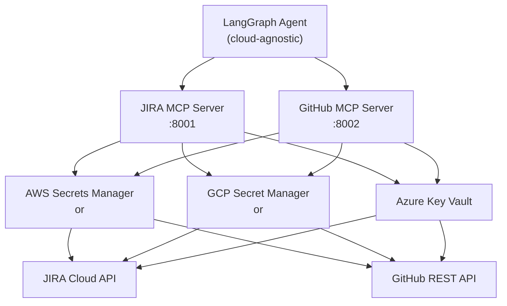

# Multi-Cloud MCP Servers: AWS, GCP, Azure

> **Level:** Advanced
> **Pre-reading:** [05 · MCP Servers](../05-mcp-servers.md) · [07 · MCP Servers Demo](07-mcp-servers.md)

This document shows how to implement JIRA and GitHub MCP servers across **AWS, GCP, and Azure** with no vendor lock-in. Use the same agent code with any cloud provider.

---

## Multi-Cloud Architecture



**Key principle:** MCP servers stay the same. Only the credentials provider changes.

---

## Credential Management: Side-by-Side

| Operation | AWS | GCP | Azure |
|:----------|:---|:---|:-----|
| **Fetch secret** | `boto3.client('secretsmanager')` | `google.cloud.secret_manager` | `azure.identity.DefaultAzureCredential` |
| **Price per secret** | $0.40/month | $0.06/month | $0.50/month |
| **Audit logging** | CloudTrail (free) | Cloud Audit Logs (free) | Azure Monitor (free) |
| **Auto-rotation** | ✅ Yes (Lambda) | ✅ Yes (Cloud Functions) | ✅ Yes (Logic Apps) |
| **HA/Replication** | ✅ Multi-region | ✅ Multi-region | ✅ Multi-region |

---

## 1. Abstract Credentials Layer

Create a cloud-agnostic interface:

```python
# mcp_common/secrets.py
from abc import ABC, abstractmethod
from typing import Dict
import os

class SecretsProvider(ABC):
    """Abstract interface for all clouds."""
    
    @abstractmethod
    def get_secret(self, secret_id: str) -> Dict:
        """Fetch a secret by ID. Returns a dictionary."""
        pass

class AWSSecretsManager(SecretsProvider):
    """AWS Secrets Manager backend."""
    
    def __init__(self, region: str = 'us-east-1'):
        import boto3
        self.client = boto3.client('secretsmanager', region_name=region)
    
    def get_secret(self, secret_id: str) -> Dict:
        """Get secret from AWS Secrets Manager."""
        import json
        response = self.client.get_secret_value(SecretId=secret_id)
        return json.loads(response['SecretString'])

class GCPSecretManager(SecretsProvider):
    """Google Cloud Secret Manager backend."""
    
    def __init__(self, project_id: str):
        from google.cloud import secretmanager
        self.client = secretmanager.SecretManagerServiceClient()
        self.project_id = project_id
    
    def get_secret(self, secret_id: str) -> Dict:
        """Get secret from GCP Secret Manager."""
        import json
        name = f"projects/{self.project_id}/secrets/{secret_id}/versions/latest"
        response = self.client.access_secret_version(request={"name": name})
        return json.loads(response.payload.data.decode('UTF-8'))

class AzureKeyVault(SecretsProvider):
    """Azure Key Vault backend."""
    
    def __init__(self, vault_url: str):
        from azure.identity import DefaultAzureCredential
        from azure.keyvault.secrets import SecretClient
        
        credential = DefaultAzureCredential()
        self.client = SecretClient(vault_url=vault_url, credential=credential)
        self.vault_url = vault_url
    
    def get_secret(self, secret_id: str) -> Dict:
        """Get secret from Azure Key Vault."""
        import json
        secret = self.client.get_secret(secret_id)
        return json.loads(secret.value)

def get_secrets_provider() -> SecretsProvider:
    """Factory: return appropriate provider based on env."""
    provider = os.getenv('SECRETS_PROVIDER', 'aws').lower()
    
    if provider == 'aws':
        return AWSSecretsManager(region=os.getenv('AWS_REGION', 'us-east-1'))
    elif provider == 'gcp':
        return GCPSecretManager(project_id=os.getenv('GCP_PROJECT_ID'))
    elif provider == 'azure':
        return AzureKeyVault(vault_url=os.getenv('AZURE_VAULT_URL'))
    else:
        raise ValueError(f"Unknown provider: {provider}")

# Global instance
secrets = get_secrets_provider()
```

---

## 2. Cloud-Agnostic JIRA MCP Server

```python
# jira_mcp/server.py
from fastapi import FastAPI
from pydantic import BaseModel
import requests
import base64
import os

from mcp_common.secrets import secrets

app = FastAPI(title="JIRA MCP Server")

class ToolCall(BaseModel):
    name: str
    arguments: dict

@app.get("/health")
def health():
    return {"status": "ok", "provider": os.getenv('SECRETS_PROVIDER', 'aws')}

@app.get("/tools")
def list_tools():
    return {"tools": [
        {
            "name": "get_ticket",
            "description": "Fetch a JIRA ticket by issue key",
            "inputSchema": {
                "type": "object",
                "properties": {
                    "issue_key": {"type": "string", "description": "JIRA issue key, e.g. TASK-101"}
                },
                "required": ["issue_key"]
            }
        },
        {
            "name": "post_comment",
            "description": "Post a comment to a JIRA ticket",
            "inputSchema": {
                "type": "object",
                "properties": {
                    "issue_key": {"type": "string"},
                    "comment": {"type": "string"}
                },
                "required": ["issue_key", "comment"]
            }
        },
        {
            "name": "transition_ticket",
            "description": "Move ticket to a new status",
            "inputSchema": {
                "type": "object",
                "properties": {
                    "issue_key": {"type": "string"},
                    "target_status": {"type": "string"}
                },
                "required": ["issue_key", "target_status"]
            }
        }
    ]}

@app.post("/tools/call")
def call_tool(call: ToolCall):
    try:
        creds = secrets.get_secret('taskmaster/jira')
        
        if call.name == "get_ticket":
            return _get_ticket(creds, call.arguments['issue_key'])
        elif call.name == "post_comment":
            return _post_comment(creds, call.arguments['issue_key'], call.arguments['comment'])
        elif call.name == "transition_ticket":
            return _transition_ticket(creds, call.arguments['issue_key'], call.arguments['target_status'])
        else:
            return {"error": f"Unknown tool: {call.name}"}
    except Exception as e:
        return {"error": str(e), "status": 500}

def _jira_headers(creds: dict) -> dict:
    auth = base64.b64encode(f"{creds['email']}:{creds['api_token']}".encode()).decode()
    return {
        "Authorization": f"Basic {auth}",
        "Accept": "application/json",
        "Content-Type": "application/json"
    }

def _get_ticket(creds: dict, issue_key: str) -> dict:
    resp = requests.get(
        f"{creds['base_url']}/rest/api/3/issue/{issue_key}",
        headers=_jira_headers(creds)
    )
    resp.raise_for_status()
    data = resp.json()
    fields = data['fields']
    
    return {
        "key": data["key"],
        "summary": fields["summary"],
        "description": fields.get("description", ""),
        "type": fields["issuetype"]["name"],
        "status": fields["status"]["name"],
        "labels": fields.get("labels", []),
        "priority": fields["priority"]["name"],
    }

def _post_comment(creds: dict, issue_key: str, comment: str) -> dict:
    body = {
        "body": {
            "type": "doc",
            "version": 1,
            "content": [
                {
                    "type": "paragraph",
                    "content": [{"type": "text", "text": comment}],
                }
            ],
        }
    }
    resp = requests.post(
        f"{creds['base_url']}/rest/api/3/issue/{issue_key}/comment",
        headers=_jira_headers(creds),
        json=body,
    )
    resp.raise_for_status()
    return {"success": True, "comment_id": resp.json()["id"]}

def _transition_ticket(creds: dict, issue_key: str, target_status: str) -> dict:
    resp = requests.get(
        f"{creds['base_url']}/rest/api/3/issue/{issue_key}/transitions",
        headers=_jira_headers(creds)
    )
    transitions = {t["name"]: t["id"] for t in resp.json()["transitions"]}
    
    if target_status not in transitions:
        return {"error": f"Status '{target_status}' not available"}
    
    requests.post(
        f"{creds['base_url']}/rest/api/3/issue/{issue_key}/transitions",
        headers=_jira_headers(creds),
        json={"transition": {"id": transitions[target_status]}}
    ).raise_for_status()
    
    return {"success": True, "new_status": target_status}
```

---

## 3. Cloud-Agnostic GitHub MCP Server

```python
# github_mcp/server.py
from fastapi import FastAPI
from pydantic import BaseModel
import requests
import base64
import os

from mcp_common.secrets import secrets

app = FastAPI(title="GitHub MCP Server")

class ToolCall(BaseModel):
    name: str
    arguments: dict

GITHUB_API = "https://api.github.com"

@app.get("/health")
def health():
    return {"status": "ok", "provider": os.getenv('SECRETS_PROVIDER', 'aws')}

@app.get("/tools")
def list_tools():
    return {"tools": [
        {
            "name": "create_branch",
            "description": "Create a new Git branch from main",
            "inputSchema": {
                "type": "object",
                "properties": {
                    "branch_name": {"type": "string"}
                },
                "required": ["branch_name"]
            }
        },
        {
            "name": "commit_file",
            "description": "Create or update a file in a branch",
            "inputSchema": {
                "type": "object",
                "properties": {
                    "branch": {"type": "string"},
                    "file_path": {"type": "string"},
                    "content": {"type": "string"},
                    "commit_message": {"type": "string"}
                },
                "required": ["branch", "file_path", "content", "commit_message"]
            }
        },
        {
            "name": "get_file",
            "description": "Get the current content of a file",
            "inputSchema": {
                "type": "object",
                "properties": {
                    "file_path": {"type": "string"},
                    "branch": {"type": "string", "description": "Default: main"}
                },
                "required": ["file_path"]
            }
        },
        {
            "name": "create_pr",
            "description": "Open a Pull Request",
            "inputSchema": {
                "type": "object",
                "properties": {
                    "branch": {"type": "string"},
                    "title": {"type": "string"},
                    "body": {"type": "string"}
                },
                "required": ["branch", "title", "body"]
            }
        }
    ]}

@app.post("/tools/call")
def call_tool(call: ToolCall):
    try:
        creds = secrets.get_secret('taskmaster/github')
        
        if call.name == "create_branch":
            return _create_branch(creds, call.arguments['branch_name'])
        elif call.name == "commit_file":
            return _commit_file(creds, **call.arguments)
        elif call.name == "get_file":
            return _get_file(creds, call.arguments['file_path'], call.arguments.get('branch', 'main'))
        elif call.name == "create_pr":
            return _create_pr(creds, **call.arguments)
        else:
            return {"error": f"Unknown tool: {call.name}"}
    except Exception as e:
        return {"error": str(e), "status": 500}

def _gh_headers(token: str) -> dict:
    return {
        "Authorization": f"Bearer {token}",
        "Accept": "application/vnd.github+json",
        "X-GitHub-Api-Version": "2022-11-28"
    }

def _create_branch(creds: dict, branch_name: str) -> dict:
    token = creds['token']
    owner = creds['repo_owner']
    repo = creds['repo_name']
    
    sha = requests.get(
        f"{GITHUB_API}/repos/{owner}/{repo}/git/ref/heads/main",
        headers=_gh_headers(token)
    ).json()["object"]["sha"]
    
    requests.post(
        f"{GITHUB_API}/repos/{owner}/{repo}/git/refs",
        headers=_gh_headers(token),
        json={"ref": f"refs/heads/{branch_name}", "sha": sha}
    ).raise_for_status()
    
    return {"success": True, "branch": branch_name}

def _commit_file(creds: dict, branch: str, file_path: str, content: str, commit_message: str) -> dict:
    token = creds['token']
    owner = creds['repo_owner']
    repo = creds['repo_name']
    
    resp = requests.get(
        f"{GITHUB_API}/repos/{owner}/{repo}/contents/{file_path}",
        headers=_gh_headers(token),
        params={"ref": branch}
    )
    sha = resp.json().get("sha") if resp.status_code == 200 else None
    
    payload = {
        "message": commit_message,
        "content": base64.b64encode(content.encode()).decode(),
        "branch": branch,
    }
    if sha:
        payload["sha"] = sha
    
    result = requests.put(
        f"{GITHUB_API}/repos/{owner}/{repo}/contents/{file_path}",
        headers=_gh_headers(token),
        json=payload
    )
    result.raise_for_status()
    
    return {"success": True, "sha": result.json()["commit"]["sha"]}

def _get_file(creds: dict, file_path: str, branch: str) -> dict:
    token = creds['token']
    owner = creds['repo_owner']
    repo = creds['repo_name']
    
    resp = requests.get(
        f"{GITHUB_API}/repos/{owner}/{repo}/contents/{file_path}",
        headers=_gh_headers(token),
        params={"ref": branch}
    )
    resp.raise_for_status()
    content = base64.b64decode(resp.json()["content"]).decode()
    return {"file_path": file_path, "content": content, "sha": resp.json()["sha"]}

def _create_pr(creds: dict, branch: str, title: str, body: str) -> dict:
    token = creds['token']
    owner = creds['repo_owner']
    repo = creds['repo_name']
    
    resp = requests.post(
        f"{GITHUB_API}/repos/{owner}/{repo}/pulls",
        headers=_gh_headers(token),
        json={"title": title, "body": body, "head": branch, "base": "main"}
    )
    resp.raise_for_status()
    
    return {
        "success": True,
        "pr_url": resp.json()["html_url"],
        "pr_number": resp.json()["number"]
    }
```

---

## 4. Cloud Setup: Credentials Storage

### AWS Secrets Manager

```bash
# Store JIRA credentials
aws secretsmanager create-secret \
  --name taskmaster/jira \
  --secret-string '{
    "base_url": "https://yourorg.atlassian.net",
    "email": "your-email@example.com",
    "api_token": "xxx"
  }' \
  --region us-east-1

# Store GitHub credentials
aws secretsmanager create-secret \
  --name taskmaster/github \
  --secret-string '{
    "token": "ghp_xxx",
    "repo_owner": "your-org",
    "repo_name": "taskmaster"
  }' \
  --region us-east-1

# Run MCP server with AWS
export SECRETS_PROVIDER=aws
export AWS_REGION=us-east-1
python -m uvicorn jira_mcp.server:app --port 8001
```

---

### GCP Secret Manager

```bash
# Enable Secret Manager API
gcloud services enable secretmanager.googleapis.com

# Store JIRA credentials
gcloud secrets create taskmaster-jira \
  --data-file=- << 'EOF'
{
  "base_url": "https://yourorg.atlassian.net",
  "email": "your-email@example.com",
  "api_token": "xxx"
}
EOF

# Store GitHub credentials
gcloud secrets create taskmaster-github \
  --data-file=- << 'EOF'
{
  "token": "ghp_xxx",
  "repo_owner": "your-org",
  "repo_name": "taskmaster"
}
EOF

# Grant permissions to service account
gcloud secrets add-iam-policy-binding taskmaster-jira \
  --member=serviceAccount:your-sa@your-project.iam.gserviceaccount.com \
  --role=roles/secretmanager.secretAccessor

# Run MCP server with GCP
export SECRETS_PROVIDER=gcp
export GCP_PROJECT_ID=your-project-id
python -m uvicorn jira_mcp.server:app --port 8001
```

---

### Azure Key Vault

```bash
# Create Key Vault (if not exists)
az keyvault create \
  --name taskmaster-kv \
  --resource-group myresourcegroup

# Store JIRA credentials
az keyvault secret set \
  --vault-name taskmaster-kv \
  --name taskmaster-jira \
  --value '{
    "base_url": "https://yourorg.atlassian.net",
    "email": "your-email@example.com",
    "api_token": "xxx"
  }'

# Store GitHub credentials
az keyvault secret set \
  --vault-name taskmaster-kv \
  --name taskmaster-github \
  --value '{
    "token": "ghp_xxx",
    "repo_owner": "your-org",
    "repo_name": "taskmaster"
  }'

# Grant access to your identity
az keyvault set-policy \
  --name taskmaster-kv \
  --upn your-email@example.com \
  --secret-permissions get list

# Run MCP server with Azure
export SECRETS_PROVIDER=azure
export AZURE_VAULT_URL=https://taskmaster-kv.vault.azure.net/
python -m uvicorn jira_mcp.server:app --port 8001
```

---

## 5. Docker Images: Multi-Cloud Support

### Dockerfile: Cloud-Agnostic

```dockerfile
FROM python:3.11-slim

WORKDIR /app

# Install dependencies for all clouds
COPY requirements-multicloud.txt .
RUN pip install -r requirements-multicloud.txt

# Copy MCP servers
COPY mcp_common/ ./mcp_common/
COPY jira_mcp/ ./jira_mcp/
COPY github_mcp/ ./github_mcp/

# Default to AWS, override via ENV
ENV SECRETS_PROVIDER=aws
ENV AWS_REGION=us-east-1

# Entrypoint accepts which server to run
ENTRYPOINT ["python", "-m", "uvicorn"]
CMD ["jira_mcp.server:app", "--host", "0.0.0.0", "--port", "8001"]
```

### requirements-multicloud.txt

```
fastapi==0.111.0
uvicorn==0.30.1
requests==2.31.0
pydantic==2.7.0

# AWS
boto3==1.34.0

# GCP
google-cloud-secret-manager==2.16.4

# Azure
azure-identity==1.16.0
azure-keyvault-secrets==4.7.0
```

### docker-compose.yml: Multi-Cloud Example

```yaml
version: '3.8'

services:
  # AWS variant
  jira-mcp-aws:
    build:
      context: .
      dockerfile: Dockerfile
    environment:
      SECRETS_PROVIDER: aws
      AWS_REGION: us-east-1
    ports:
      - "8001:8001"
    command: ["jira_mcp.server:app", "--host", "0.0.0.0", "--port", "8001"]
    profiles:
      - aws

  github-mcp-aws:
    build:
      context: .
      dockerfile: Dockerfile
    environment:
      SECRETS_PROVIDER: aws
      AWS_REGION: us-east-1
    ports:
      - "8002:8002"
    command: ["github_mcp.server:app", "--host", "0.0.0.0", "--port", "8002"]
    profiles:
      - aws

  # GCP variant
  jira-mcp-gcp:
    build:
      context: .
      dockerfile: Dockerfile
    environment:
      SECRETS_PROVIDER: gcp
      GCP_PROJECT_ID: ${GCP_PROJECT_ID}
    ports:
      - "8001:8001"
    command: ["jira_mcp.server:app", "--host", "0.0.0.0", "--port", "8001"]
    profiles:
      - gcp

  github-mcp-gcp:
    build:
      context: .
      dockerfile: Dockerfile
    environment:
      SECRETS_PROVIDER: gcp
      GCP_PROJECT_ID: ${GCP_PROJECT_ID}
    ports:
      - "8002:8002"
    command: ["github_mcp.server:app", "--host", "0.0.0.0", "--port", "8002"]
    profiles:
      - gcp

  # Azure variant
  jira-mcp-azure:
    build:
      context: .
      dockerfile: Dockerfile
    environment:
      SECRETS_PROVIDER: azure
      AZURE_VAULT_URL: ${AZURE_VAULT_URL}
    ports:
      - "8001:8001"
    command: ["jira_mcp.server:app", "--host", "0.0.0.0", "--port", "8001"]
    profiles:
      - azure

  github-mcp-azure:
    build:
      context: .
      dockerfile: Dockerfile
    environment:
      SECRETS_PROVIDER: azure
      AZURE_VAULT_URL: ${AZURE_VAULT_URL}
    ports:
      - "8002:8002"
    command: ["github_mcp.server:app", "--host", "0.0.0.0", "--port", "8002"]
    profiles:
      - azure
```

**Run with specific cloud:**
```bash
# AWS
docker-compose --profile aws up -d

# GCP
export GCP_PROJECT_ID=my-project
docker-compose --profile gcp up -d

# Azure
export AZURE_VAULT_URL=https://taskmaster-kv.vault.azure.net/
docker-compose --profile azure up -d
```

---

## 6. Cloud-Agnostic Embeddings (For RAG)

```python
# embeddings/provider.py
from abc import ABC, abstractmethod

class EmbeddingsProvider(ABC):
    @abstractmethod
    def embed(self, text: str) -> list[float]:
        """Generate embedding vector."""
        pass

class BedrockEmbeddings(EmbeddingsProvider):
    """AWS Bedrock Titan Embeddings."""
    def __init__(self):
        import boto3
        import json
        self.bedrock = boto3.client('bedrock-runtime')
    
    def embed(self, text: str) -> list[float]:
        response = self.bedrock.invoke_model(
            modelId='amazon.titan-embed-text-v2:0',
            body=json.dumps({
                "inputText": text,
                "dimensions": 1536,
                "normalize": True
            }),
            contentType='application/json'
        )
        return json.loads(response['body'].read())['embedding']

class VertexEmbeddings(EmbeddingsProvider):
    """Google Cloud Vertex AI Text Embeddings."""
    def __init__(self, project_id: str):
        from vertexai.language_models import TextEmbeddingModel
        self.model = TextEmbeddingModel.from_pretrained("textembedding-gecko@002")
        self.project_id = project_id
    
    def embed(self, text: str) -> list[float]:
        embeddings = self.model.get_embeddings([text])
        return embeddings[0].values

class AzureOpenAIEmbeddings(EmbeddingsProvider):
    """Azure OpenAI Embeddings."""
    def __init__(self, endpoint: str, api_key: str):
        import openai
        openai.api_type = "azure"
        openai.api_base = endpoint
        openai.api_key = api_key
        openai.api_version = "2023-05-15"
        self.client = openai
    
    def embed(self, text: str) -> list[float]:
        response = self.client.Embedding.create(
            input=text,
            engine="text-embedding-ada-002"
        )
        return response["data"][0]["embedding"]

def get_embeddings_provider() -> EmbeddingsProvider:
    """Factory for embeddings provider."""
    provider = os.getenv('EMBEDDINGS_PROVIDER', 'aws').lower()
    
    if provider == 'aws':
        return BedrockEmbeddings()
    elif provider == 'gcp':
        return VertexEmbeddings(project_id=os.getenv('GCP_PROJECT_ID'))
    elif provider == 'azure':
        return AzureOpenAIEmbeddings(
            endpoint=os.getenv('AZURE_OPENAI_ENDPOINT'),
            api_key=os.getenv('AZURE_OPENAI_KEY')
        )
    else:
        raise ValueError(f"Unknown embeddings provider: {provider}")
```

---

## 7. Cloud-Agnostic LLM Inference

```python
# llm/provider.py
from abc import ABC, abstractmethod
import json

class LLMProvider(ABC):
    @abstractmethod
    def invoke(self, prompt: str, max_tokens: int = 4096) -> str:
        """Invoke LLM, return response text."""
        pass

class BedrockLLM(LLMProvider):
    """AWS Bedrock Claude."""
    def __init__(self):
        import boto3
        self.bedrock = boto3.client('bedrock-runtime')
    
    def invoke(self, prompt: str, max_tokens: int = 4096) -> str:
        response = self.bedrock.invoke_model(
            modelId='anthropic.claude-3-5-sonnet-20241022-v2:0',
            body=json.dumps({
                "anthropic_version": "bedrock-2023-06-01",
                "max_tokens": max_tokens,
                "messages": [{"role": "user", "content": prompt}]
            }),
            contentType='application/json'
        )
        result = json.loads(response['body'].read())
        return result['content'][0]['text']

class VertexLLM(LLMProvider):
    """Google Cloud Vertex AI."""
    def __init__(self):
        import vertexai
        from vertexai.generative_models import GenerativeModel
        vertexai.init()
        self.model = GenerativeModel("gemini-2.0-flash")
    
    def invoke(self, prompt: str, max_tokens: int = 4096) -> str:
        response = self.model.generate_content(
            prompt,
            generation_config={"max_output_tokens": max_tokens}
        )
        return response.text

class AzureOpenAILLM(LLMProvider):
    """Azure OpenAI GPT-4."""
    def __init__(self):
        from openai import AzureOpenAI
        self.client = AzureOpenAI(
            api_key=os.getenv("AZURE_OPENAI_KEY"),
            api_version="2024-02-15-preview",
            azure_endpoint=os.getenv("AZURE_OPENAI_ENDPOINT")
        )
    
    def invoke(self, prompt: str, max_tokens: int = 4096) -> str:
        response = self.client.chat.completions.create(
            model=os.getenv("AZURE_OPENAI_MODEL", "gpt-4"),
            messages=[{"role": "user", "content": prompt}],
            max_tokens=max_tokens
        )
        return response.choices[0].message.content

def get_llm_provider() -> LLMProvider:
    """Factory for LLM provider."""
    provider = os.getenv('LLM_PROVIDER', 'aws').lower()
    
    if provider == 'aws':
        return BedrockLLM()
    elif provider == 'gcp':
        return VertexLLM()
    elif provider == 'azure':
        return AzureOpenAILLM()
    else:
        raise ValueError(f"Unknown LLM provider: {provider}")
```

---

## 8. Comparison: Multi-Cloud Features

| Feature | AWS | GCP | Azure |
|:--------|:---:|:---:|:-----:|
| **Secrets Management** | Secrets Manager | Secret Manager | Key Vault |
| **LLM** | Bedrock (Claude, Llama) | Vertex AI (Gemini) | OpenAI (GPT-4) |
| **Embeddings** | Titan Embeddings | Text Embeddings Gecko | Ada-002 |
| **Vector DB** | OpenSearch, RDS pgvector | Firestore + Vertex Vector Search | Cosmos DB |
| **Container Orchestration** | ECS/Fargate | GKE | AKS |
| **Audit Logging** | CloudTrail | Cloud Audit Logs | Azure Monitor |
| **Cost (1M API calls)** | $0.50–$1.00 | $0.20–$0.50 | $0.50–$1.50 |
| **Free Tier** | 12 months | Always-free | 12 months |

---

## 9. Switching Clouds: Minimal Changes

**To switch from AWS to GCP:**

1. **Update environment:**
   ```bash
   export SECRETS_PROVIDER=gcp
   export GCP_PROJECT_ID=my-project
   export EMBEDDINGS_PROVIDER=gcp
   export LLM_PROVIDER=gcp
   ```

2. **Run MCP servers:**
   ```bash
   docker-compose --profile gcp up -d
   ```

3. **Agent code:** Zero changes ✅

---

## 10. Summary: No Vendor Lock-In

| Component | Implementation | Switching Cost |
|:----------|:--------------|:---------------:|
| **Secrets** | Abstract `SecretsProvider` | 0 lines of agent code |
| **Credentials** | Config via ENV vars | 1 export command |
| **MCP Servers** | Cloud-agnostic (requests + env) | 0 lines |
| **Embeddings** | Abstract `EmbeddingsProvider` | 0 lines of agent code |
| **LLM** | Abstract `LLMProvider` | 0 lines of agent code |
| **Data Storage** | Cloud-specific (by design) | Requires migration script |

**Total cost to switch clouds:** ~2 hours (mostly data migration)

---

??? question "What's the latency difference between clouds?"
    AWS/GCP/Azure have similar latency for API calls (~100–200ms for JIRA/GitHub). For LLM inference: AWS Bedrock ≈ GCP Vertex ≈ Azure OpenAI (~1–3 seconds for typical requests).

??? question "Which cloud is cheapest?"
    **Secrets:** GCP ($0.06/month) < Azure ($0.50) < AWS ($0.40 per secret). **LLM:** GCP Vertex < AWS Bedrock < Azure OpenAI for equivalent models. **Overall:** GCP usually 20–30% cheaper, but AWS/Azure have more mature enterprise features.

??? question "Can I use multiple clouds simultaneously?"
    Yes! Run multiple docker-compose profiles. Trade-offs: complexity increases, but perfect for multi-region high availability. Not recommended for MVP.

??? question "What about vendor lock-in for data (vectors, checkpoints)?"
    Currently yes — vector stores and LangGraph checkpoints are cloud-specific. Recommendation: use open-source pgvector for all clouds (RDS, CloudSQL, Cosmos DB all support PostgreSQL). Requires data migration script (~1 day) to switch.

--8<-- "_abbreviations.md"

