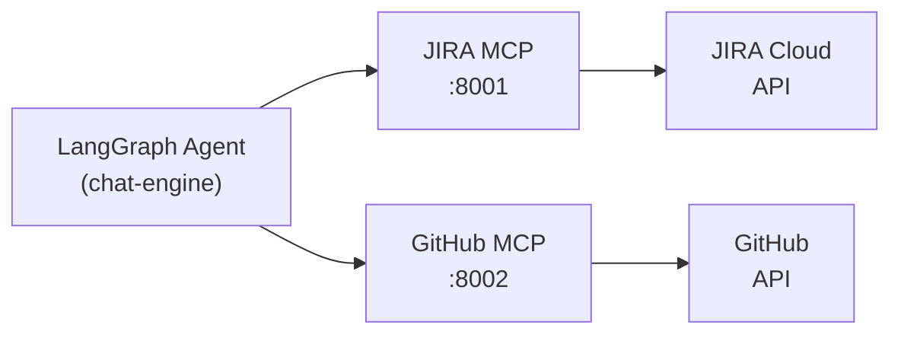

# MCP Servers — JIRA and GitHub

> **Level:** Intermediate
> **Pre-reading:** [00 · Demo Overview](00-overview.md) · [05.01 · MCP Protocol](../05.01-mcp-protocol.md)

This document covers the two MCP (Model Context Protocol) servers that sit between the LangGraph agent and the external APIs: a JIRA MCP server and a GitHub MCP server. Each runs as a sidecar container in the ECS task.

---

## Why MCP Servers?

Instead of the agent calling JIRA/GitHub REST APIs directly, MCP servers:

- Provide a **standardised tool schema** the LLM can discover and call
- Handle auth (Secrets Manager) **outside** the LLM context window
- Add **retry logic, rate-limiting, and logging** centrally
- Allow the same agent to work against any JIRA or GitHub instance by swapping the MCP server config

---

## Architecture: Sidecar Pattern



Both MCP servers run as **sidecar containers in the same ECS task** — no network hop, low latency, shared IAM role.

---

## JIRA MCP Server

### Tool Schema

```python
# jira_mcp/server.py
from fastapi import FastAPI
from pydantic import BaseModel
import boto3, json, base64, requests

app = FastAPI(title="JIRA MCP Server")

def get_jira_credentials() -> dict:
    sm = boto3.client('secretsmanager', region_name='us-east-1')
    return json.loads(sm.get_secret_value(SecretId='taskmaster/jira')['SecretString'])

def jira_headers(creds: dict) -> dict:
    auth = base64.b64encode(f"{creds['email']}:{creds['api_token']}".encode()).decode()
    return {"Authorization": f"Basic {auth}", "Accept": "application/json",
            "Content-Type": "application/json"}

# ─── MCP Tool Discovery ────────────────────────────────────────────────────────

@app.get("/tools")
def list_tools():
    return {"tools": [
        {
            "name": "get_ticket",
            "description": "Fetch a JIRA ticket by issue key. Returns summary, description, type, labels, and acceptance criteria.",
            "inputSchema": {
                "type": "object",
                "properties": {
                    "issue_key": {"type": "string", "description": "JIRA issue key, e.g. TASK-101"}
                },
                "required": ["issue_key"]
            }
        },
        {
            "name": "post_comment",
            "description": "Post a comment to a JIRA ticket.",
            "inputSchema": {
                "type": "object",
                "properties": {
                    "issue_key": {"type": "string"},
                    "comment":   {"type": "string", "description": "Plain text comment body"}
                },
                "required": ["issue_key", "comment"]
            }
        },
        {
            "name": "transition_ticket",
            "description": "Move a JIRA ticket to a new status (e.g., In Progress, In Review).",
            "inputSchema": {
                "type": "object",
                "properties": {
                    "issue_key":       {"type": "string"},
                    "target_status":   {"type": "string", "description": "Target status name"}
                },
                "required": ["issue_key", "target_status"]
            }
        }
    ]}

# ─── Tool Invocation ───────────────────────────────────────────────────────────

class ToolCall(BaseModel):
    name: str
    arguments: dict

@app.post("/tools/call")
def call_tool(call: ToolCall):
    creds = get_jira_credentials()
    base_url = creds['base_url']
    
    if call.name == "get_ticket":
        return _get_ticket(base_url, creds, call.arguments['issue_key'])
    elif call.name == "post_comment":
        return _post_comment(base_url, creds, call.arguments['issue_key'], call.arguments['comment'])
    elif call.name == "transition_ticket":
        return _transition_ticket(base_url, creds, call.arguments['issue_key'], call.arguments['target_status'])
    else:
        return {"error": f"Unknown tool: {call.name}"}

def _get_ticket(base_url: str, creds: dict, issue_key: str) -> dict:
    resp = requests.get(
        f"{base_url}/rest/api/3/issue/{issue_key}",
        headers=jira_headers(creds)
    )
    resp.raise_for_status()
    data = resp.json()
    fields = data['fields']
    
    # Extract acceptance criteria from description ADF
    description_text = _extract_adf_text(fields.get('description'))
    ac_lines = [
        line.strip('- ').strip()
        for line in description_text.splitlines()
        if line.strip().startswith('AC')
    ]
    
    return {
        "key": data["key"],
        "summary": fields["summary"],
        "description": description_text,
        "type": fields["issuetype"]["name"],
        "labels": fields.get("labels", []),
        "priority": fields["priority"]["name"],
        "acceptance_criteria": ac_lines,
        "status": fields["status"]["name"]
    }

def _post_comment(base_url: str, creds: dict, issue_key: str, comment: str) -> dict:
    body = {
        "body": {
            "type": "doc", "version": 1,
            "content": [{"type": "paragraph", "content": [{"type": "text", "text": comment}]}]
        }
    }
    resp = requests.post(
        f"{base_url}/rest/api/3/issue/{issue_key}/comment",
        headers=jira_headers(creds),
        json=body
    )
    resp.raise_for_status()
    return {"success": True, "comment_id": resp.json()["id"]}

def _extract_adf_text(adf: dict) -> str:
    if not adf:
        return ""
    texts = []
    def walk(node):
        if node.get('type') == 'text':
            texts.append(node.get('text', ''))
        for child in node.get('content', []):
            walk(child)
    walk(adf)
    return '\n'.join(texts)

def _transition_ticket(base_url: str, creds: dict, issue_key: str, target_status: str) -> dict:
    # Get available transitions
    resp = requests.get(
        f"{base_url}/rest/api/3/issue/{issue_key}/transitions",
        headers=jira_headers(creds)
    )
    transitions = {t['name']: t['id'] for t in resp.json()['transitions']}
    
    if target_status not in transitions:
        return {"error": f"Status '{target_status}' not available. Options: {list(transitions.keys())}"}
    
    requests.post(
        f"{base_url}/rest/api/3/issue/{issue_key}/transitions",
        headers=jira_headers(creds),
        json={"transition": {"id": transitions[target_status]}}
    ).raise_for_status()
    return {"success": True, "new_status": target_status}
```

---

## GitHub MCP Server

### Tool Schema

```python
# github_mcp/server.py
from fastapi import FastAPI
from pydantic import BaseModel
import boto3, json, base64, requests

app = FastAPI(title="GitHub MCP Server")

GITHUB_API = "https://api.github.com"

def get_github_credentials() -> dict:
    sm = boto3.client('secretsmanager', region_name='us-east-1')
    return json.loads(sm.get_secret_value(SecretId='taskmaster/github')['SecretString'])

def gh_headers(token: str) -> dict:
    return {"Authorization": f"Bearer {token}", "Accept": "application/vnd.github+json",
            "X-GitHub-Api-Version": "2022-11-28"}

@app.get("/tools")
def list_tools():
    return {"tools": [
        {
            "name": "create_branch",
            "description": "Create a new Git branch from main.",
            "inputSchema": {
                "type": "object",
                "properties": {
                    "branch_name": {"type": "string", "description": "New branch name, e.g. ai/TASK-101-fix-npe"}
                },
                "required": ["branch_name"]
            }
        },
        {
            "name": "commit_file",
            "description": "Create or update a single file in a branch.",
            "inputSchema": {
                "type": "object",
                "properties": {
                    "branch":          {"type": "string"},
                    "file_path":       {"type": "string", "description": "Relative path from repo root"},
                    "content":         {"type": "string", "description": "Full new file content"},
                    "commit_message":  {"type": "string"}
                },
                "required": ["branch", "file_path", "content", "commit_message"]
            }
        },
        {
            "name": "get_file",
            "description": "Get the current content of a file from a branch.",
            "inputSchema": {
                "type": "object",
                "properties": {
                    "file_path": {"type": "string"},
                    "branch":    {"type": "string", "description": "Branch name (default: main)"}
                },
                "required": ["file_path"]
            }
        },
        {
            "name": "create_pr",
            "description": "Open a Pull Request from a branch to main.",
            "inputSchema": {
                "type": "object",
                "properties": {
                    "branch":  {"type": "string"},
                    "title":   {"type": "string"},
                    "body":    {"type": "string", "description": "PR description in markdown"}
                },
                "required": ["branch", "title", "body"]
            }
        }
    ]}

@app.post("/tools/call")
def call_tool(call: ToolCall):
    creds = get_github_credentials()
    token = creds['token']
    owner = creds['repo_owner']
    repo  = creds['repo_name']
    
    if call.name == "create_branch":
        return _create_branch(token, owner, repo, call.arguments['branch_name'])
    elif call.name == "commit_file":
        return _commit_file(token, owner, repo, **call.arguments)
    elif call.name == "get_file":
        return _get_file(token, owner, repo, call.arguments['file_path'],
                         call.arguments.get('branch', 'main'))
    elif call.name == "create_pr":
        return _create_pr(token, owner, repo, **call.arguments)
    return {"error": f"Unknown tool: {call.name}"}

def _create_branch(token, owner, repo, branch_name):
    headers = gh_headers(token)
    sha = requests.get(f"{GITHUB_API}/repos/{owner}/{repo}/git/ref/heads/main",
                       headers=headers).json()["object"]["sha"]
    requests.post(f"{GITHUB_API}/repos/{owner}/{repo}/git/refs", headers=headers,
                  json={"ref": f"refs/heads/{branch_name}", "sha": sha}).raise_for_status()
    return {"success": True, "branch": branch_name}

def _commit_file(token, owner, repo, branch, file_path, content, commit_message):
    headers = gh_headers(token)
    resp = requests.get(f"{GITHUB_API}/repos/{owner}/{repo}/contents/{file_path}",
                        headers=headers, params={"ref": branch})
    sha = resp.json().get("sha") if resp.status_code == 200 else None
    payload = {"message": commit_message,
               "content": base64.b64encode(content.encode()).decode(),
               "branch": branch}
    if sha:
        payload["sha"] = sha
    result = requests.put(f"{GITHUB_API}/repos/{owner}/{repo}/contents/{file_path}",
                          headers=headers, json=payload)
    result.raise_for_status()
    return {"success": True, "commit_sha": result.json()["commit"]["sha"]}

def _get_file(token, owner, repo, file_path, branch):
    headers = gh_headers(token)
    resp = requests.get(f"{GITHUB_API}/repos/{owner}/{repo}/contents/{file_path}",
                        headers=headers, params={"ref": branch})
    resp.raise_for_status()
    content = base64.b64decode(resp.json()["content"]).decode()
    return {"file_path": file_path, "content": content, "sha": resp.json()["sha"]}

def _create_pr(token, owner, repo, branch, title, body):
    headers = gh_headers(token)
    resp = requests.post(f"{GITHUB_API}/repos/{owner}/{repo}/pulls",
                         headers=headers,
                         json={"title": title, "body": body, "head": branch, "base": "main"})
    resp.raise_for_status()
    return {"success": True, "pr_url": resp.json()["html_url"], "pr_number": resp.json()["number"]}
```

---

## MCP Client in the Agent

```python
# agent/mcp_clients.py
import requests

class MCPClient:
    def __init__(self, base_url: str):
        self.base_url = base_url
    
    def call_tool(self, tool_name: str, arguments: dict) -> dict:
        resp = requests.post(f"{self.base_url}/tools/call",
                             json={"name": tool_name, "arguments": arguments},
                             timeout=30)
        resp.raise_for_status()
        return resp.json()

jira_mcp_client = MCPClient("http://localhost:8001")
github_mcp_client = MCPClient("http://localhost:8002")
```

---

## Dockerfile for MCP Servers

```dockerfile
# Dockerfile.jira-mcp
FROM python:3.11-slim
WORKDIR /app
COPY jira_mcp/requirements.txt .
RUN pip install -r requirements.txt
COPY jira_mcp/ .
CMD ["uvicorn", "server:app", "--host", "0.0.0.0", "--port", "8001"]
```

```
# jira_mcp/requirements.txt
fastapi==0.111.0
uvicorn==0.30.1
boto3==1.34.0
requests==2.31.0
pydantic==2.7.0
```

Build and push:

```bash
# Login to ECR
aws ecr get-login-password --region us-east-1 | \
  docker login --username AWS --password-stdin ACCOUNT_ID.dkr.ecr.us-east-1.amazonaws.com

# Build + push JIRA MCP
docker build -f Dockerfile.jira-mcp -t ACCOUNT_ID.dkr.ecr.us-east-1.amazonaws.com/taskmaster-jira-mcp:latest .
docker push ACCOUNT_ID.dkr.ecr.us-east-1.amazonaws.com/taskmaster-jira-mcp:latest

# Build + push GitHub MCP
docker build -f Dockerfile.github-mcp -t ACCOUNT_ID.dkr.ecr.us-east-1.amazonaws.com/taskmaster-github-mcp:latest .
docker push ACCOUNT_ID.dkr.ecr.us-east-1.amazonaws.com/taskmaster-github-mcp:latest
```

---

## Tool Invocation Log (Example)

```
[JIRA MCP] GET /tools/call  {"name": "get_ticket", "arguments": {"issue_key": "TASK-101"}}
[JIRA MCP] → 200 {"key": "TASK-101", "summary": "Fix NPE in TaskService...", "type": "Bug"}

[GitHub MCP] POST /tools/call  {"name": "create_branch", "arguments": {"branch_name": "ai/TASK-101-fix-npe"}}
[GitHub MCP] → 200 {"success": true, "branch": "ai/TASK-101-fix-npe"}

[GitHub MCP] POST /tools/call  {"name": "commit_file", "arguments": {...}}
[GitHub MCP] → 200 {"success": true, "commit_sha": "abc123"}

[GitHub MCP] POST /tools/call  {"name": "create_pr", "arguments": {...}}
[GitHub MCP] → 200 {"success": true, "pr_url": "https://github.com/.../pull/17"}

[JIRA MCP] POST /tools/call  {"name": "post_comment", "arguments": {"issue_key": "TASK-101", "comment": "🤖 PR created: ..."}}
[JIRA MCP] → 200 {"success": true, "comment_id": "10045"}
```

---

??? question "Could the agent call JIRA and GitHub APIs directly without MCP servers?"
    Yes. MCP servers are an abstraction layer, not a hard requirement. For a quick local demo you can inline the API calls in the agent. MCP servers become valuable when multiple agents share the same tools, or when you want to swap integrations (e.g., replace JIRA with Linear) without touching agent code.

??? question "Why run MCP servers as sidecars rather than standalone services?"
    Sidecars share the same ECS task lifecycle — they start and stop together. Network communication is localhost, which has near-zero latency and no egress costs. For production, you'd promote them to standalone services with auto-scaling independent of the agent.

??? question "How are credentials kept out of the LLM context window?"
    The agent passes only `issue_key` or `branch_name` to the MCP server tool call. The MCP server fetches the actual API token from Secrets Manager at runtime — the LLM never sees the credential.

--8<-- "_abbreviations.md"

