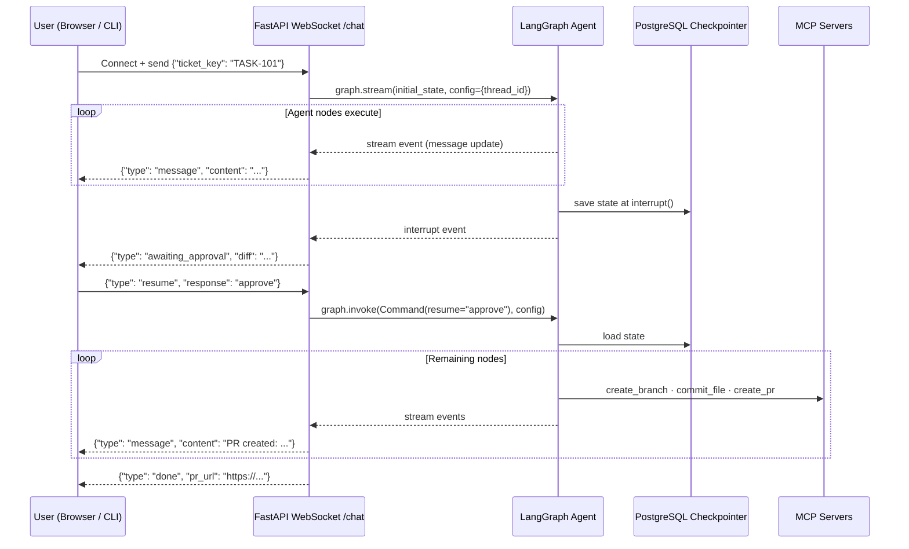

# Chat Engine — FastAPI + LangGraph

> **Level:** Intermediate
> **Pre-reading:** [06 · LangGraph Agent](06-langgraph-agent.md) · [09 · HITL Design](09-hitl-design.md)

This document covers the FastAPI-based chat engine that serves as the user-facing interface to the LangGraph agent. It manages WebSocket sessions, streams agent responses, and handles human-in-the-loop resume calls.

---

## Chat Engine Architecture



---

## FastAPI Application

```python
# chat_engine/main.py
from fastapi import FastAPI, WebSocket, WebSocketDisconnect, HTTPException
from fastapi.middleware.cors import CORSMiddleware
from pydantic import BaseModel
import asyncio
import json
import uuid
import logging
from langgraph.types import Command
from agent.graph import build_agent_graph
from agent.state import AgentState

app = FastAPI(title="TaskMaster Chat Engine")
logger = logging.getLogger(__name__)

app.add_middleware(CORSMiddleware,
    allow_origins=["*"], allow_methods=["*"], allow_headers=["*"])

# Build agent graph once at startup
agent_graph = build_agent_graph()

# In-memory session store (use Redis in production)
active_sessions: dict[str, dict] = {}

# ─── WebSocket Chat Endpoint ───────────────────────────────────────────────────

@app.websocket("/chat")
async def chat_websocket(websocket: WebSocket):
    """Main conversational endpoint. Handles full agent lifecycle over WebSocket."""
    await websocket.accept()
    thread_id = str(uuid.uuid4())
    
    try:
        # Wait for the initial message with ticket key
        raw = await websocket.receive_text()
        initial_msg = json.loads(raw)
        ticket_key = initial_msg.get("ticket_key", "").strip().upper()
        
        if not ticket_key:
            await websocket.send_json({"type": "error", "message": "Please provide a JIRA ticket key."})
            return
        
        await websocket.send_json({
            "type": "system",
            "message": f"🤖 Starting agent for **{ticket_key}**...",
            "thread_id": thread_id
        })
        
        # Store session
        active_sessions[thread_id] = {
            "ticket_key": ticket_key,
            "websocket": websocket,
            "status": "running"
        }
        
        # Run the agent — stream events back to the client
        initial_state = AgentState(
            ticket_key=ticket_key,
            thread_id=thread_id,
            messages=[],
            iteration_count=0
        )
        
        config = {"configurable": {"thread_id": thread_id}}
        
        async for event in agent_graph.astream_events(initial_state, config, version="v2"):
            await _handle_stream_event(websocket, thread_id, event)
        
        # Agent completed (no interrupt hit, or was resumed and finished)
        active_sessions[thread_id]["status"] = "done"
        final_state = agent_graph.get_state(config)
        
        await websocket.send_json({
            "type": "done",
            "pr_url": final_state.values.get("pr_url"),
            "message": "✅ All done! Check your GitHub repo and JIRA ticket."
        })
    
    except WebSocketDisconnect:
        logger.info(f"Client disconnected: thread_id={thread_id}")
    except Exception as e:
        logger.exception(f"Agent error for thread {thread_id}: {e}")
        await websocket.send_json({"type": "error", "message": f"Agent error: {str(e)}"})
    finally:
        active_sessions.pop(thread_id, None)

async def _handle_stream_event(websocket: WebSocket, thread_id: str, event: dict):
    """Translate LangGraph stream events into WebSocket messages."""
    kind = event.get("event")
    
    if kind == "on_chain_start":
        node = event["name"]
        await websocket.send_json({"type": "node_start", "node": node})
    
    elif kind == "on_chain_end":
        # Check for new messages in state
        output = event.get("data", {}).get("output", {})
        messages = output.get("messages", [])
        for msg in messages[-1:]:  # send the latest message only
            await websocket.send_json({
                "type": "message",
                "content": msg.content if hasattr(msg, 'content') else str(msg)
            })
    
    elif kind == "on_custom_event" and event.get("name") == "interrupt":
        # HITL interrupt — surface the diff to the user
        data = event.get("data", {})
        active_sessions[thread_id]["status"] = "awaiting_approval"
        await websocket.send_json({
            "type": "awaiting_approval",
            "prompt": data.get("prompt"),
            "diff_summary": data.get("diff_summary"),
            "ticket_key": data.get("ticket_key")
        })

# ─── Resume Endpoint (after HITL approval) ────────────────────────────────────

class ResumeRequest(BaseModel):
    response: str  # "approve", "reject", or feedback text

@app.post("/threads/{thread_id}/resume")
async def resume_thread(thread_id: str, body: ResumeRequest):
    """Resume a paused agent thread with the user's approval decision."""
    session = active_sessions.get(thread_id)
    if not session:
        raise HTTPException(404, detail=f"Thread {thread_id} not found or already completed")
    
    if session["status"] != "awaiting_approval":
        raise HTTPException(400, detail=f"Thread {thread_id} is not awaiting approval (status: {session['status']})")
    
    config = {"configurable": {"thread_id": thread_id}}
    websocket: WebSocket = session["websocket"]
    
    session["status"] = "running"
    await websocket.send_json({
        "type": "system",
        "message": f"▶️ Resuming with: **{body.response}**"
    })
    
    # Resume the graph from the interrupt checkpoint
    async for event in agent_graph.astream_events(
        Command(resume=body.response), config, version="v2"
    ):
        await _handle_stream_event(websocket, thread_id, event)
    
    return {"status": "resumed", "thread_id": thread_id}

# ─── Health and Status Endpoints ──────────────────────────────────────────────

@app.get("/health")
def health():
    return {"status": "ok"}

@app.get("/threads/{thread_id}/status")
def thread_status(thread_id: str):
    config = {"configurable": {"thread_id": thread_id}}
    state = agent_graph.get_state(config)
    session = active_sessions.get(thread_id, {})
    return {
        "thread_id": thread_id,
        "status": session.get("status", "unknown"),
        "current_node": state.next if state else None,
        "ticket_key": state.values.get("ticket_key") if state else None,
        "pr_url": state.values.get("pr_url") if state else None
    }
```

---

## Prompt Templates

```python
# agent/prompts.py

SYSTEM_PROMPT = """You are the TaskMaster AI development agent. You help software teams 
automatically resolve JIRA tickets by reading the ticket, understanding the codebase, 
generating the correct code changes, and creating a Pull Request.

Rules you MUST follow:
1. Only modify files in modules that are relevant to the ticket
2. Never delete existing functionality — only add or fix
3. Always write tests for every change you make
4. Never push directly to main — always create a feature branch
5. Always wait for human approval before creating the PR

When you identify a root cause, explain it clearly in plain English before proposing a fix.
When implementing a story, enumerate each acceptance criterion and confirm it is covered.
"""

MODULE_IDENTIFICATION_PROMPT = """Given a JIRA ticket, identify which modules of the 
TaskMaster project need to change.

Module descriptions:
- taskmaster-core: Domain entities (Task.java), JPA repository, TaskService
- taskmaster-api: REST controllers (TaskController), request/response DTOs
- taskmaster-e2e: Playwright TypeScript E2E tests (runs against live API)

Decision rules:
- Bug in service/domain logic → taskmaster-core only
- New field on entity + exposed via API → taskmaster-core + taskmaster-api + taskmaster-e2e
- Bug in controller/DTO → taskmaster-api only  
- Test-only change → taskmaster-e2e only

Always apply minimum scope. If unsure between one module and two, ask for clarification.
"""
```

---

## Simple CLI Client

For local testing without a browser UI:

```python
#!/usr/bin/env python3
# chat_client.py — terminal chat interface for the TaskMaster agent
import asyncio
import json
import websockets
import sys
import requests

CHAT_ENGINE_URL = "ws://localhost:8080/chat"
RESUME_URL = "http://localhost:8080/threads/{thread_id}/resume"

async def chat(ticket_key: str):
    async with websockets.connect(CHAT_ENGINE_URL) as ws:
        # Send the ticket key
        await ws.send(json.dumps({"ticket_key": ticket_key}))
        thread_id = None
        
        print(f"\n🤖 Agent started for {ticket_key}\n{'─'*60}\n")
        
        while True:
            raw = await ws.recv()
            msg = json.loads(raw)
            msg_type = msg.get("type")
            
            if msg_type == "system":
                thread_id = msg.get("thread_id", thread_id)
                print(f"🔧 {msg['message']}")
            
            elif msg_type == "node_start":
                print(f"\n▶ Running: {msg['node']}", end="", flush=True)
            
            elif msg_type == "message":
                print(f"\n{msg['content']}")
            
            elif msg_type == "awaiting_approval":
                print(f"\n{'═'*60}")
                print(msg.get("diff_summary", msg.get("prompt")))
                print(f"{'═'*60}")
                
                response = input("\n✍️  Your decision (approve / reject / feedback): ").strip()
                
                # Resume via HTTP POST (simulates a separate client action)
                result = requests.post(
                    RESUME_URL.format(thread_id=thread_id),
                    json={"response": response}
                )
                print(f"▶️  Resumed (status: {result.status_code})")
            
            elif msg_type == "done":
                pr_url = msg.get("pr_url", "N/A")
                print(f"\n{'═'*60}")
                print(f"✅ DONE! PR: {pr_url}")
                print(f"{'═'*60}\n")
                break
            
            elif msg_type == "error":
                print(f"\n❌ Error: {msg['message']}")
                break

if __name__ == "__main__":
    ticket = sys.argv[1] if len(sys.argv) > 1 else input("Enter JIRA ticket key: ").strip().upper()
    asyncio.run(chat(ticket))
```

Usage:

```bash
# Terminal 1: start the chat engine
uvicorn main:app --host 0.0.0.0 --port 8080 --reload

# Terminal 2: run the CLI client
python3 chat_client.py TASK-101
```

---

## Dockerfile for the Chat Engine

```dockerfile
FROM python:3.11-slim
WORKDIR /app

COPY requirements.txt .
RUN pip install --no-cache-dir -r requirements.txt

COPY . .

ENV PYTHONUNBUFFERED=1
EXPOSE 8080

CMD ["uvicorn", "main:app", "--host", "0.0.0.0", "--port", "8080", "--workers", "2"]
```

```
# requirements.txt
fastapi==0.111.0
uvicorn[standard]==0.30.1
websockets==12.0
langgraph==0.2.0
langchain-aws==0.1.6
boto3==1.34.0
psycopg2-binary==2.9.9
requests==2.31.0
pydantic==2.7.0
```

---

??? question "Why WebSocket instead of a simple HTTP POST endpoint?"
    The agent runs for 3–15 minutes per ticket with multiple checkpoints and messages. WebSocket enables real-time streaming of each node's progress, including the HITL gate prompt, without the client having to poll. HTTP long-polling works but is less clean.

??? question "How is thread state persisted so the HITL resume works if the server restarts?"
    LangGraph's `PostgresSaver` writes the full `AgentState` to the `checkpoints` table after every node. If the ECS task restarts, the state is reloaded from PostgreSQL on the next resume call using the `thread_id`. The only in-memory state is the active WebSocket connection.

??? question "What happens if the user closes their browser tab while the agent is running?"
    The WebSocket disconnects and `active_sessions[thread_id]` is cleared. The agent state is safely checkpointed in PostgreSQL. The user can reconnect later — hit `GET /threads/{thread_id}/status` to see where the agent paused, then call `/threads/{thread_id}/resume` to continue.

--8<-- "_abbreviations.md"

