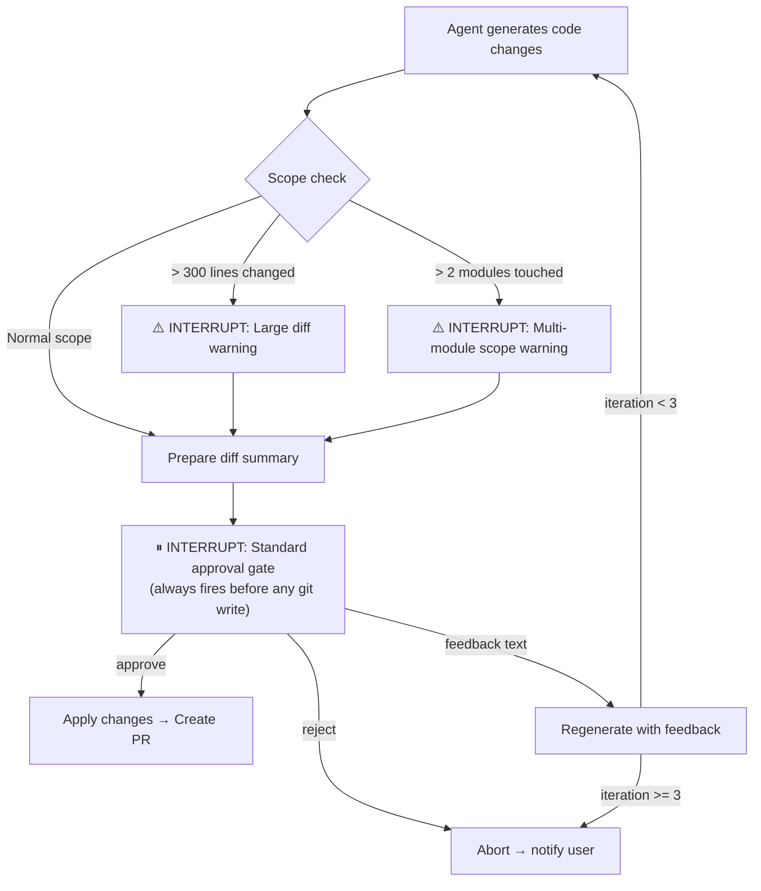

# Human-in-the-Loop (HITL) Design

> **Level:** Intermediate
> **Pre-reading:** [06 · LangGraph Agent](06-langgraph-agent.md) · [08 · Chat Engine](08-chat-engine.md)

This document defines every interrupt trigger, the approval/rejection flow, the feedback loop for revisions, and provides full conversation transcript mockups for both demo tickets.

---

## HITL Principles

| Principle | Implementation |
|---|---|
| Agent proposes, human approves | Every code change requires explicit `approve` before any git operation |
| No stealth automation | Every agent action is surfaced as a chat message |
| Reversible gates | `reject` cancels the run; `feedback` loops back for revision |
| Audit trail | Every approval/rejection stored in PostgreSQL checkpoint |
| Max 3 revision rounds | Infinite loops are hard-capped at iteration 3 → escalate to human |

---

## Interrupt Trigger Conditions

The agent pauses and waits for human input at these points:



---

## Interrupt Message Formats

### Standard Approval Gate

```
═══════════════════════════════════════════════════════════
📋 TASK-101 — Fix NullPointerException in TaskService

Root Cause: TaskService.getSummary() calls task.getAssignee().toUpperCase()
without checking if assignee is null. When a Task has no assignee,
this throws a NullPointerException.

Files to be changed:
  • taskmaster-core/src/main/java/com/demo/taskmaster/core/service/TaskService.java
    → Added null-check: returns "Unassigned" when assignee is null
  
  • taskmaster-core/src/test/java/com/demo/taskmaster/core/service/TaskServiceTest.java
    → Added test: getSummary_whenAssigneeIsNull_returnsUnassigned()

Total: 2 files, ~15 lines changed
Modules affected: taskmaster-core

──────────────────────────────────────────────────────────
Do you approve these changes?
  Type: approve | reject | [your feedback for revision]
═══════════════════════════════════════════════════════════
```

### Large Diff Warning

```
═══════════════════════════════════════════════════════════
⚠️  LARGE DIFF DETECTED — Please review carefully

TASK-102 — Add dueDate field to Task entity

Files to be changed (6 files, ~180 lines):
  • taskmaster-core/src/.../Task.java            (entity field)
  • taskmaster-core/src/.../TaskService.java      (business logic)
  • taskmaster-api/src/.../TaskRequest.java       (DTO field)
  • taskmaster-api/src/.../TaskResponse.java      (DTO field)
  • taskmaster-api/src/.../TaskController.java    (mapping)
  • taskmaster-e2e/tests/task-create.spec.ts      (new E2E test)

Modules affected: taskmaster-core, taskmaster-api, taskmaster-e2e

This is a cross-module change. All acceptance criteria have been mapped:
  ✅ AC1: dueDate field on Task entity (LocalDate)
  ✅ AC2: POST /api/tasks accepts dueDate
  ✅ AC3: GET /api/tasks returns dueDate
  ✅ AC4: dueDate is optional — null for existing tasks
  ✅ AC5: Playwright E2E test for dueDate round-trip

Type: approve | reject | [feedback]
═══════════════════════════════════════════════════════════
```

---

## Full Conversation Transcript: TASK-101 (Bug Fix)

```
USER:  TASK-101

AGENT: 🤖 Starting agent for TASK-101...
       ▶ Running: fetch_ticket
       ✅ Fetched ticket TASK-101: "Fix NullPointerException in TaskService when task has no assignee"

       ▶ Running: classify_ticket
       📋 Classified as Bug — complexity: low

       ▶ Running: identify_modules
       🎯 Modules affected: taskmaster-core
       Reasoning: The NullPointerException is in TaskService.getSummary() which lives 
       in taskmaster-core. No API contract changes are needed — the fix is internal 
       to the service layer.

       ▶ Running: retrieve_context
       🔍 Retrieved 5 relevant code chunks:
       - taskmaster-core/src/.../TaskService.java (similarity: 0.94)
       - taskmaster-core/src/.../Task.java (similarity: 0.88)
       - taskmaster-core/src/.../TaskServiceTest.java (similarity: 0.82)
       - taskmaster-core/src/.../TaskRepository.java (similarity: 0.71)
       - taskmaster-api/src/.../TaskController.java (similarity: 0.63)

       ▶ Running: generate_code_changes
       💡 Generated 1 file change

       ▶ Running: generate_tests
       🧪 Generated 1 test file

       ▶ Running: prepare_diff_summary

═══════════════════════════════════════════════════════════
📋 TASK-101 — Fix NullPointerException in TaskService

Root Cause: TaskService.getSummary() calls task.getAssignee().toUpperCase()
directly without a null check on line 23. When assignee is null, this 
throws a NullPointerException.

Files to be changed:
  • taskmaster-core/src/main/java/.../service/TaskService.java
    → Replace: task.getAssignee().toUpperCase()
    → With:    task.getAssignee() != null ? task.getAssignee().toUpperCase() : "Unassigned"

  • taskmaster-core/src/test/java/.../service/TaskServiceTest.java
    → Added @Test: getSummary_whenAssigneeIsNull_returnsUnassigned

Total: 2 files, ~12 lines changed across 1 module.

Do you approve? (approve / reject / feedback)
═══════════════════════════════════════════════════════════

USER:  approve

AGENT: ▶️ Resuming with: approve
       ▶ Running: apply_changes
       📤 Pushed 2 file(s) to branch ai/TASK-101-fix-npe-taskservice

       ▶ Running: create_pull_request
       🚀 Pull Request created: https://github.com/yourname/taskmaster/pull/17

       ▶ Running: post_jira_comment
       💬 Commented on TASK-101 with PR link

═══════════════════════════════════════════════════════════
✅ DONE!
PR:   https://github.com/yourname/taskmaster/pull/17
JIRA: https://yourname.atlassian.net/browse/TASK-101

CI will run automatically. Review and merge when ready.
═══════════════════════════════════════════════════════════
```

**Total elapsed time: ~4 minutes**

---

## Full Conversation Transcript: TASK-102 (Story)

```
USER:  TASK-102

AGENT: 🤖 Starting agent for TASK-102...
       ▶ Running: fetch_ticket
       ✅ Fetched ticket TASK-102: "Add dueDate field to Task entity and expose via REST API"

       ▶ Running: classify_ticket
       📋 Classified as Story — complexity: medium

       ▶ Running: identify_modules
       🎯 Modules affected: taskmaster-core, taskmaster-api, taskmaster-e2e
       Reasoning: Adding a new field to the Task entity requires changes in all 
       three modules — the entity and service (core), the DTOs and controller (api), 
       and an E2E test to verify the full round-trip (e2e). AC5 explicitly requires 
       a Playwright test.

       ▶ Running: retrieve_context
       🔍 Retrieved 10 relevant code chunks:
       - taskmaster-core/src/.../Task.java (0.95)
       - taskmaster-api/src/.../TaskRequest.java (0.91)
       - taskmaster-api/src/.../TaskResponse.java (0.90)
       - taskmaster-api/src/.../TaskController.java (0.87)
       - taskmaster-e2e/tests/task-create.spec.ts (0.85)
       + 5 more...

       ▶ Running: generate_code_changes
       💡 Generated 5 file changes

       ▶ Running: generate_tests
       🧪 Generated 1 test file (Playwright E2E)

       ▶ Running: prepare_diff_summary

═══════════════════════════════════════════════════════════
✨ TASK-102 — Add dueDate field to Task entity and expose via REST API

Acceptance Criteria Coverage:
  ✅ AC1 → Task.java: added `private LocalDate dueDate;` with getter/setter
  ✅ AC2 → TaskRequest.java: added `dueDate` field + TaskController mapping
  ✅ AC3 → TaskResponse.java: `dueDate` included in GET response
  ✅ AC4 → dueDate is Optional — not annotated @Column(nullable=false)
  ✅ AC5 → task-create.spec.ts: new test verifies dueDate round-trip

Files to be changed (6 files, ~180 lines):
  • taskmaster-core/src/.../model/Task.java
  • taskmaster-core/src/.../service/TaskService.java
  • taskmaster-api/src/.../dto/TaskRequest.java
  • taskmaster-api/src/.../dto/TaskResponse.java
  • taskmaster-api/src/.../controller/TaskController.java
  • taskmaster-e2e/tests/task-create.spec.ts

⚠️  Multi-module change across 3 modules. Please verify scope is correct.

Do you approve? (approve / reject / feedback)
═══════════════════════════════════════════════════════════

USER:  The dueDate should be validated — reject dates in the past.

AGENT: ▶️ Received feedback. Revising... (iteration 2)
       ▶ Running: generate_code_changes
       💡 Revision: added @FutureOrPresent validation annotation to Task.dueDate

       ▶ Running: generate_tests
       🧪 Updated tests to cover past-date rejection (400 Bad Request)

═══════════════════════════════════════════════════════════
✨ TASK-102 — Revised (iteration 2)

Changes updated based on your feedback:
  • Task.java: added @FutureOrPresent on dueDate field
  • TaskRequest.java: validation flows through @Valid in controller
  • TaskServiceTest.java: added test for past date returning 400
  • task-create.spec.ts: added test expecting 400 for past dueDate

All 5 original ACs still satisfied, plus your validation requirement.

Do you approve? (approve / reject / feedback)
═══════════════════════════════════════════════════════════

USER:  approve

AGENT: ▶️ Resuming with: approve
       ▶ Running: apply_changes
       📤 Pushed 6 file(s) to branch ai/TASK-102-add-duedate-field-to-task-entity

       ▶ Running: create_pull_request
       🚀 Pull Request created: https://github.com/yourname/taskmaster/pull/18

       ▶ Running: post_jira_comment
       💬 Commented on TASK-102

═══════════════════════════════════════════════════════════
✅ DONE!
PR:   https://github.com/yourname/taskmaster/pull/18
JIRA: https://yourname.atlassian.net/browse/TASK-102

6 files changed · CI running · Ready for your review.
═══════════════════════════════════════════════════════════
```

**Total elapsed time: ~9 minutes (including one revision cycle)**

---

## Rejection Flow

```
USER:  reject

AGENT: ❌ Change rejected. No files were committed.
       The branch ai/TASK-101-... was not created.
       TASK-101 has been left in its current status.
       
       Type a new ticket key to start again, or describe what you'd like to change.
```

---

??? question "Why show the full diff summary before applying, rather than after?"
    The diff summary is the safety gate. Showing it before any git write means the human sees exactly what will happen before it's irreversible. A PR can be closed after creation, but it's still visible in GitHub history — better to catch problems before the branch is created.

??? question "How is the feedback from the revision round incorporated into the next generation?"
    The user's feedback text is stored in `AgentState.human_feedback`. On the next pass through `generate_code_changes`, the prompt includes: "Previous attempt was rejected with this feedback: {human_feedback}. Incorporate this change in your revised output." The LLM receives the original context plus the critique.

??? question "What if the user's feedback would require changing out-of-scope modules?"
    The `identify_modules` node runs once and sets scope. If feedback implies a scope expansion (e.g., "also update the database migration"), the agent flags this: "Your feedback requires changes in additional modules. Please confirm expanded scope: [modules]." This prevents uncontrolled scope creep in revision rounds.

--8<-- "_abbreviations.md"

