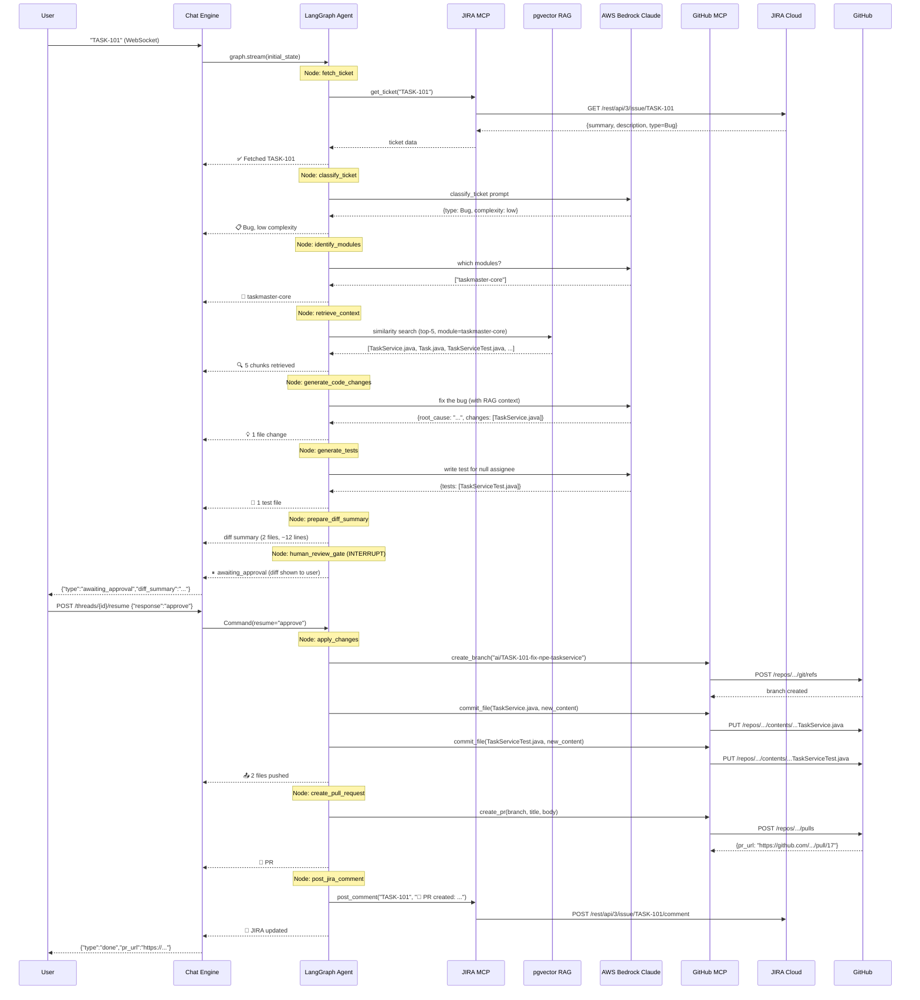
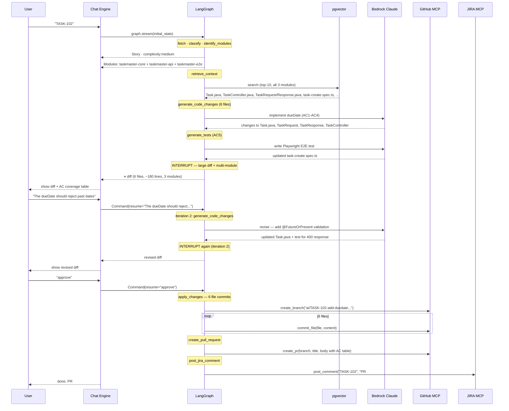

# End-to-End Flow Walkthrough

> **Level:** Intermediate
> **Pre-reading:** [06 · LangGraph Agent](06-langgraph-agent.md) · [09 · HITL Design](09-hitl-design.md)

This document provides complete sequence diagrams and expected outputs for both demo tickets — the bug fix (TASK-101) and the feature story (TASK-102).

---

## TASK-101: Bug Fix Flow (NullPointerException)

### Full Sequence Diagram



### Expected Code Changes for TASK-101

**`taskmaster-core/src/main/java/com/demo/taskmaster/core/service/TaskService.java`**

```diff
-    public String getSummary(Task task) {
-        return task.getTitle() + " assigned to " + task.getAssignee().toUpperCase();
-    }
+    public String getSummary(Task task) {
+        String assignee = task.getAssignee() != null
+                ? task.getAssignee().toUpperCase()
+                : "Unassigned";
+        return task.getTitle() + " assigned to " + assignee;
+    }
```

**`taskmaster-core/src/test/java/com/demo/taskmaster/core/service/TaskServiceTest.java`**

```diff
+    @Test
+    void getSummary_whenAssigneeIsNull_returnsUnassigned() {
+        Task task = new Task();
+        task.setTitle("Fix login");
+        // assignee deliberately not set
+        TaskService service = new TaskService(null);
+        assertThat(service.getSummary(task))
+                .isEqualTo("Fix login assigned to Unassigned");
+    }
```

### Expected PR Output

```markdown
## Summary
> ⚠️ AI-Generated PR — review carefully before merging.

**JIRA Ticket:** [TASK-101](https://yourname.atlassian.net/browse/TASK-101)
**Ticket Type:** Bug

## Root Cause
`TaskService.getSummary()` calls `task.getAssignee().toUpperCase()` directly 
on line 23. When a `Task` has no assignee set, `getAssignee()` returns `null`,
causing a `NullPointerException`. The fix adds a null-check that returns 
`"Unassigned"` as the fallback string.

## Changes Made
- `TaskService.java` — added null-check guard in `getSummary()`
- `TaskServiceTest.java` — added test case for null assignee

## Test Coverage
- [x] Existing test `getSummary_returnsFormattedString` still passes
- [x] New test `getSummary_whenAssigneeIsNull_returnsUnassigned` added
- [x] No API contract changes — taskmaster-api untouched
```

---

## TASK-102: Story Flow (Add dueDate Field)

### Full Sequence Diagram



### Expected Code Changes for TASK-102

**`Task.java`** (core — entity field)

```diff
+import jakarta.validation.constraints.FutureOrPresent;
+import java.time.LocalDate;

 public class Task {
     // ... existing fields ...
+
+    @FutureOrPresent
+    private LocalDate dueDate;
+
+    public LocalDate getDueDate() { return dueDate; }
+    public void setDueDate(LocalDate dueDate) { this.dueDate = dueDate; }
 }
```

**`TaskRequest.java`** (api — DTO)

```diff
+import java.time.LocalDate;
+
 public class TaskRequest {
     private String title;
     private String description;
     private String assignee;
+    private LocalDate dueDate;
+    public LocalDate getDueDate() { return dueDate; }
+    public void setDueDate(LocalDate dueDate) { this.dueDate = dueDate; }
 }
```

**`TaskResponse.java`** (api — DTO)

```diff
+import java.time.LocalDate;
+
 public class TaskResponse {
     private Long id;
     private String title;
     private String assignee;
+    private LocalDate dueDate;
+    public LocalDate getDueDate() { return dueDate; }
+    public void setDueDate(LocalDate dueDate) { this.dueDate = dueDate; }
 }
```

**`TaskController.java`** (api — mapping)

```diff
     @PostMapping
     public ResponseEntity<TaskResponse> createTask(@RequestBody @Valid TaskRequest request) {
         Task task = new Task();
         task.setTitle(request.getTitle());
         task.setDescription(request.getDescription());
         task.setAssignee(request.getAssignee());
+        task.setDueDate(request.getDueDate());
         return ResponseEntity.ok(toResponse(taskService.createTask(task)));
     }

     private TaskResponse toResponse(Task task) {
         TaskResponse resp = new TaskResponse();
         resp.setId(task.getId());
         resp.setTitle(task.getTitle());
         resp.setAssignee(task.getAssignee());
+        resp.setDueDate(task.getDueDate());
         return resp;
     }
```

**`task-create.spec.ts`** (e2e — new test)

```diff
+    test('creates a task with dueDate and retrieves it', async ({ request }) => {
+        const tomorrow = new Date();
+        tomorrow.setDate(tomorrow.getDate() + 1);
+        const dueDateStr = tomorrow.toISOString().split('T')[0]; // YYYY-MM-DD
+
+        const createRes = await request.post('/api/tasks', {
+            data: { title: 'Task with due date', dueDate: dueDateStr }
+        });
+        expect(createRes.status()).toBe(200);
+        const created = await createRes.json();
+        expect(created.dueDate).toBe(dueDateStr);
+
+        const listRes = await request.get('/api/tasks');
+        const tasks = await listRes.json();
+        const found = tasks.find((t: any) => t.id === created.id);
+        expect(found.dueDate).toBe(dueDateStr);
+    });
+
+    test('rejects a task with a past dueDate', async ({ request }) => {
+        const yesterday = new Date();
+        yesterday.setDate(yesterday.getDate() - 1);
+        const pastDateStr = yesterday.toISOString().split('T')[0];
+
+        const res = await request.post('/api/tasks', {
+            data: { title: 'Past due task', dueDate: pastDateStr }
+        });
+        expect(res.status()).toBe(400);
+    });
```

---

## Timing Breakdown

| Phase | TASK-101 (Bug) | TASK-102 (Story) |
|---|---|---|
| Ticket fetch + classify | ~10s | ~10s |
| Module identification | ~8s | ~8s |
| RAG retrieval | ~5s | ~8s |
| Code generation (LLM call) | ~25s | ~45s |
| Test generation | ~20s | ~30s |
| HITL gate (user response) | ~30s (user time) | ~2 min (user reads diff) |
| Revision round (if any) | — | ~50s |
| Branch + commits | ~15s | ~30s |
| PR creation + JIRA comment | ~5s | ~5s |
| **Total (excl. user time)** | **~1.5 min** | **~3 min** |
| **Total (incl. user review)** | **~3–5 min** | **~7–12 min** |

---

??? question "Why does TASK-102 require three modules but TASK-101 only one?"
    TASK-101 is a bug entirely within the service layer — only `TaskService.getSummary()` is broken, and only `taskmaster-core` contains that code. TASK-102 adds a new field that propagates from the database entity through the API layer to the E2E test — every layer of the stack is touched, which is expected for a data model change.

??? question "How does the agent decide the PR title format?"
    The title template is `[{TICKET_KEY}] {ticket_summary}` — matching the branch protection rule patterns at most companies. This makes PRs easy to find from JIRA and vice versa.

??? question "What if CI fails after the PR is created?"
    The agent's job ends at PR creation. CI feedback (red checks on the PR) is visible in GitHub. In a future iteration, the Playwright CI failure webhook would trigger the agent again with the CI error context — see [07.02 · Playwright RCA](../07.02-playwright-rca.md) for that flow.

--8<-- "_abbreviations.md"

