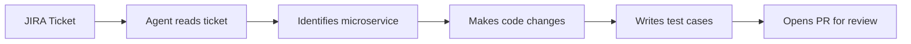
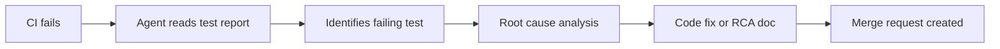
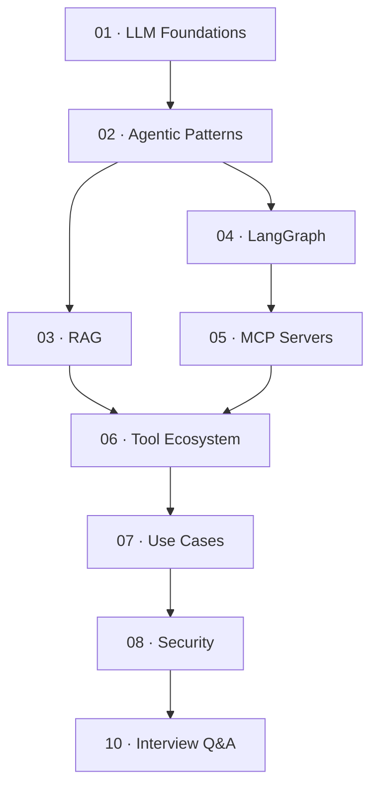

# AI Developer Guide

> **A breadth-first learning portal for modern AI-powered development automation.**  
> Designed for backend developers and architects who understand software engineering and want to learn how AI agents, LLMs, RAG, and orchestration frameworks can automate the software development lifecycle.

---

## What This Guide Covers

Modern AI goes far beyond chatbots. This guide focuses on **agentic AI** — systems where an LLM can reason, plan, call tools, and take multi-step actions with minimal human intervention. The goal is to understand how these systems are designed, what components they use, and where they fit in real-world engineering workflows.

| Domain | Topics Covered |
|:-------|:--------------|
| **LLM Foundations** | How LLMs work, tokens, context windows, embeddings |
| **Agentic Patterns** | ReAct loops, planning, tool use, multi-agent orchestration |
| **RAG** | Retrieval-augmented generation, vector databases, chunking strategies |
| **LangGraph / LangChain** | Stateful agent graphs, chain composition, memory management |
| **MCP Servers** | Model Context Protocol, tool servers, IDE and API integrations |
| **Tool Ecosystem** | GitHub Copilot, OpenAI, Anthropic, LlamaIndex, Weaviate, etc. |
| **Use Cases** | JIRA→PR automation, Playwright RCA, Spring Boot code generation |
| **Security** | Prompt injection, data leakage, guardrails, governance |

---

## The Two Reference Use Cases

These use cases run throughout the guide as practical reference points.

### Case 1 · JIRA Ticket → Pull Request

A chat engine or scheduled trigger reads a JIRA story or bug, understands the acceptance criteria, locates the correct Spring Boot microservice in GitHub, implements the feature or fix, writes unit tests, and raises a PR.

### Case 2 · Playwright Test Failure → RCA + Fix

When a Playwright E2E test fails in CI, an agent reads the failure report, traces the failure to a root cause (UI change, API contract break, flaky selector), either fixes the test or the underlying code, and opens a MR with an RCA document.

---

## Learning Path

Follow sections in order if you're new to agentic AI. Jump to specific sections if you have background knowledge.

| Step | Section | Goal |
|:-----|:--------|:-----|
| 1 | [LLM Foundations](01-foundations.md) | Understand how LLMs reason and generate |
| 2 | [Agentic Patterns](02-agentic-ai.md) | Understand how agents plan and act |
| 3 | [RAG](03-rag.md) | Understand how agents retrieve context |
| 4 | [LangGraph](04-langgraph.md) | Understand how workflows are orchestrated |
| 5 | [MCP Servers](05-mcp-servers.md) | Understand how tools are exposed to agents |
| 6 | [Tool Ecosystem](06-tool-ecosystem.md) | Survey the landscape of available tools |
| 7 | [Use Cases](07-use-cases.md) | See how it all connects in practice |
| 8 | [Security](08-security.md) | Understand risks and mitigations |

---

## Key Architectural Insight

> In agentic AI systems, the LLM is the **reasoning engine**, not the executor.  
> It decides *what* to do. External tools, APIs, and code do the *doing*.  
> The architecture's job is to give the LLM the right context, constrain its actions, and verify its outputs.

---

--8<-- "_abbreviations.md"
